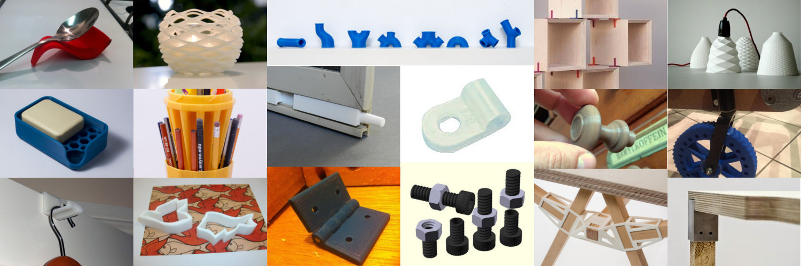
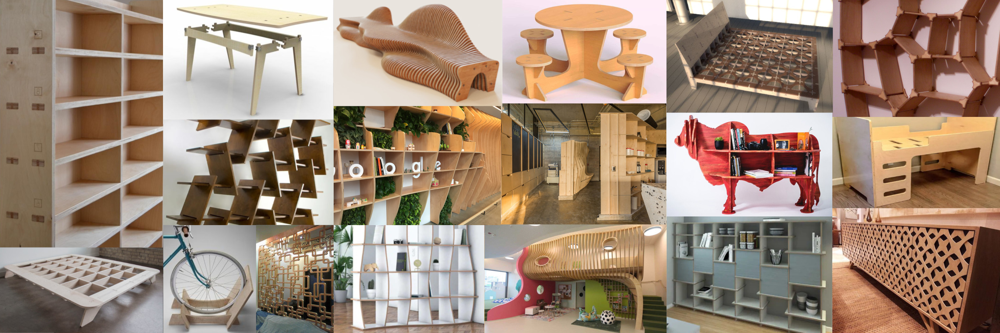
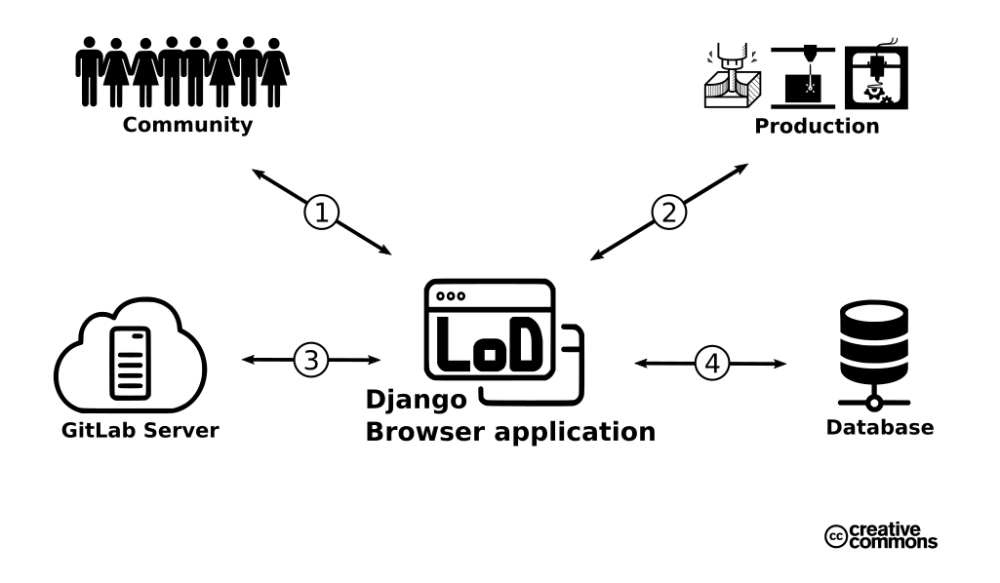

# LoD - Library of Designs

## Overview

LoD is an open-source online database for designs with a focus on interior design, exterior design, household items, garden utensils and house parts. 

This database with connected content is accessible via this webapp created in Django, a Python-based Web Framework. There are 2 basic modes of access. If you sign up by creating an account, you will be able to upload, modify, connect and download designs from the LoD library. Without an account, you still can download your designs.

The designs written in OpenSCAD modeling language can be used for production through the use of its modular and parametric characteristics.

OpenSCAD through its logical structure makes it possible to draw blue prints even without the use of a computer. Printing out this designs into books will create a literal Library of Designs beside this digital representation.

## Purpose

* The LoD supports a sustainable economy through designs for municipal micro or multi-production

* Database of designs stored in OpenSCAD format, which are also stored on paper and from which blue drawings can be created without a computer

* Part of the circular economy by reusing wood and bioplastics with the help of parametric designs

* Interactive digital platform for designers and producers to quickly apply new designs and modifications

* Usability of parametric OpenSCAD designs in professional CAD applications

* Unlike other databases, LoD has the subtractive and additive production mode as two main categories.

* The designs are interlinked, such as a cabinet with different cabinet door knobs to choose from

* The project data structure makes it possible to save the complete content of the LoD on a work computer and use it offline using the Git software

### Main categories

There are only 2 main categories, which represent additive manufacturing on the one hand and subtractive manufacturing on the other.

#### 3D Prints

#### Cutouts

## Concept

**1. Community ↔ Website**

Customers can scroll through designs without an account and view and download them through a 3D representation on the page. Since many designs consist of several individual parts, they are collected as a bunch in .zip format for download. Through a special search option, it is possible to find specific designs or designers. The site also offers tips and videos that make it easier for anyone to modify parametric designs and adjust them as needed.

**2. Production ↔ Website**

Designers and producers need an account to upload their designs and modifications through a form page. The account opens access to an educational section with OpenSCAD design guides and implementation guides for various machines, as well as the procedure with cloning of the LoT and update options to enable offline use in production. Furthermore, a forum for collaborative exchange will be used. An e-mail service informs account owners about new designs.

**3. Website ↔ GitLab Server**

The form page on the django browser app will create a new directory with all uploaded files and images, including the content as markdown files, each time a new design is added. In the case of a design update, the data is exchanged. GitLab provides the information and data requested by the website, such as 3D previews, tutorials and data packages.

**4. Website ↔ Database**

The database serves as the storage of: Account owner profile data Information from the form page Access connections or directory information in the GitLab system

