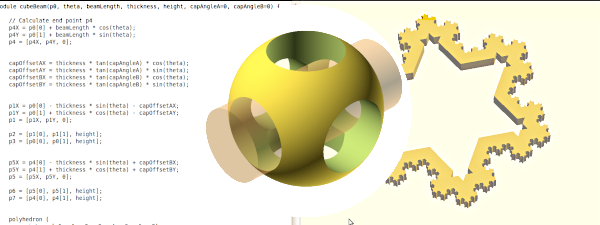

# [CAD for Beginners >> Part 1: OpenSCAD Basics](./index.md)

---

In a sustainable future it is necessary to create shorter cycles for the reuse of materials such as wood and bioplastics. One of the possible cycles is direct recycling by local or home manufacturers. Machines such as 3D printers, CNC milling machines and laser cutters are currently experiencing a rapid technical evolution, so that more and more user-friendly devices will be available in the near future.

OpenSCAD is a script-based open-source CAD program (Computer Aided Design) which, with its very simple syntax, enables anyone interested to create their own designs.

OpenSCAD course part 1 uses examples and group exercises to teach the basics to model your own designs in OpenSCAD. The [syntax](content/files/OpenSCAD_Syntax_A4.pdf) of the modeling language of OpenSCAD fits on an A4 page and is very easy to understand (with a little knowledge of English). The course does not require any programming language skills. the Syntax is so close to human understanding that it doesn't even need a computer to create architectural drawings from it.

ExtraBtn: 
