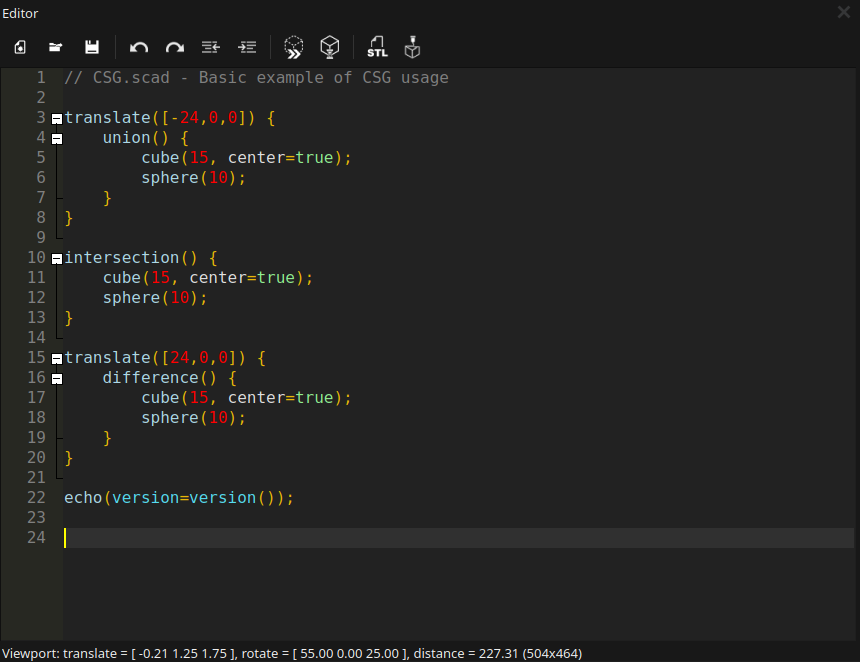
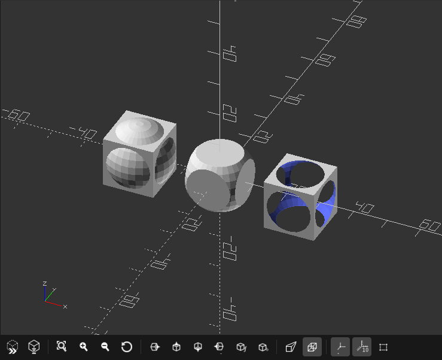
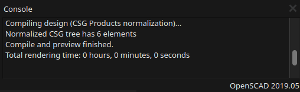

## 2.1. Graphical user interface

The user interface of the OpenSCAD graphical application has 3 main windows: Text Editor, Console Window, and the viewing area/display window.

##### 

---

##### Text Editor

The text editor provides basic editing features like text search & replace **CTRL + F**, including syntax highlighting. Predefined color schemes can be changed via the Preferences dialog.

Text editor symbols (left to right):

1. Create a new file **CTRL + N**
2. Open an existing file **CTRL + O**
3. Save the current file **CTRL + S**
4. Undo the last step (CTRL + Z)
5. Redo the undone (CTRL + SHIFT + Z)
6. Unindent a row or selected block (CTRL + SHIFT + I)
7. Indent a row or selected block (CTRL + I)
8. Execute code in preview mode **F5**
9. Execute code in render mode **F6**
10. Export rendered object (**F6** need to be pressed first) as STL file
11. Send a rendered object directly to a connected printer or to [OctoPrint](http://www.octoprint.org)a print management platform)

##### 

---

##### Preview Area

The 3D port shows a preview or rendered version of the design described in the text editor.

It is possible to easily change perspective and move around the object.

However, in order move the object within the space, you will need to use ***translate()*** or ***rotate()***.

Preview area symbols (left to right):

1. Execute code in preview mode **F5**
2. Execute code in render mode **F6**
3. View all objects created by the code **CTRL + SHIFT + V**
4. Zoom in
5. Zoom out
6. Reset view to offset
7. Jump to right view **CTRL + 7**
8. Jump to top view **CTRL + 4**
9. Jump to bottom view **CTRL + 5**
10. Jump to left view **CTRL + 6**
11. Jump to front view **CTRL + 8**
12. Jump to back view **CTRL + 9**
13. Change to perspective view
14. Change to orthographic view
15. Switch on/off axis **CTRL + 2**
16. Switch on/off scale markers in millimeters
17. Shows wire frame of polygons, that creates the object **CTRL + 1** >> *!Only works in preview mode **F5!***

---

##### Console window

The console view shows important status information, warnings and errors.

##### Orientation in Preview 3D port

To show you, how to move around an object within the 3D view port, lets create our first object and preview it.

1. Enter following code in the text editor:

`sphere(30);`

*Do not forget a semicolon at the end!*

2. Press **F5**

*Now follow the instruction to learn how to move around in the 3D space of the preview port.*

* Move the mouse cursor over the viewing area and press **LMB** (Left Mouse Button) and drag the mouse to rotate in three-dimensional space around the object
* Press **MMB** (Middle Mouse Button) and drag the mouse to zoom towards are away from the object. You also can use the scroll wheel, if you have one.
* Now press the **RMB** (Right Mouse Button) and drag the mouse to shift the view in a two-dimensional way.
* Change the window sizes by moving with the cursor over the edges till the symbol changes, click the **LMB** and drag the window edge

The following characters used in front of a coded row will help your in the designing process, and opens the possibility to highlight or single out a part of the design.

|  |  |
| --- | --- |
| **Character** | **Preview option** |
| \* | Disable the object |
| ! | Shows only this object |
| # | Highlight the object |
| % | Make the object transparent |
|  |  |

##### Exercise:

1. Write 3 lines code: `cylinder(40);`, `sphere(30);`, and `cube(35);` in each row
2. Press **F5**
3. Then add different modifying characters in front of a line
4. Press **F5** again

##### Example:

`sphere(30);`

`cylinder(40);`

`%sphere(30);`

`#cube(35);`

---
