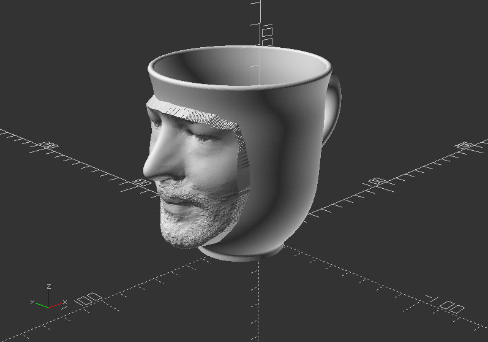
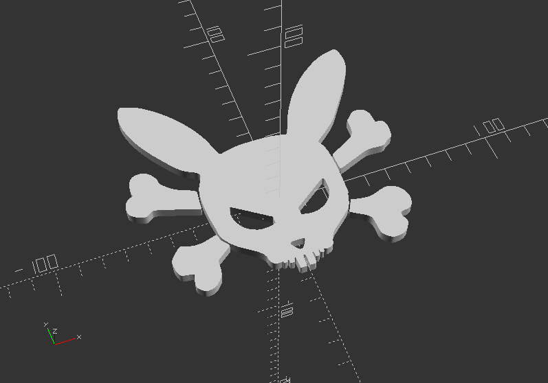
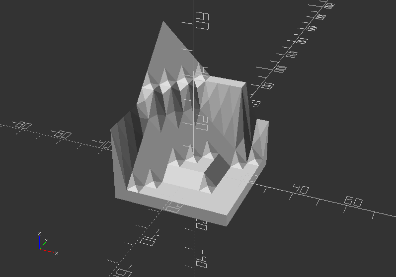
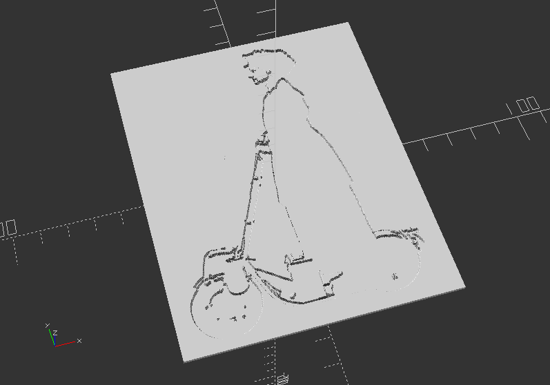

## 2.11. Import

* Import is achieved by the command *import()*
* OpenSCAD supports currently STL, OFF, AMF, and 3MF 3D formats, and DXF, SVG 2D formats
* If you want to import another SCAD file, you need to use *include<filename.scad>* instead
* If you want to import an image, you can use *surface()*
* Parameters of *import()* are:

**file** >> This is the path to the file including filename (String). It is not absolute, but the relative path to the importing script. When using include<> with a script that uses import(), it is relative to the script using include<>

**convexity** >> Only used for optimize visualization in preview mode (Integer)

**layer** >> DXF only, it imports only a particular layer (Integer)

---

##### **surface()**

* Reads Height-map information from text or an image. It can read PNG files
* Parameters of *surface()* are:

**file** >> The path to the file, that contains the height-map data (String)

**center** >>This determines the positioning of the generated object (Boolean - default: false). If true, object is centered in X- and Y-axis. If false, object is placed in the positive quadrant

**invert** >> Inverts how the color value of images is translated to height (Boolean - default: false)

**convexity** >> Convexity parameter specifies the maximum number of front sides, or back sides (Integer). A ray intersecting the object might penetrate. This is only used for better preview, when pressing **F5**, it has no effect on **F6**.

##### Exercise:

**Create your own busines card or other text graphics in 2D. If you want to use a image to the text, use import. After you finished, export it in dxf format!**

---

##### **import()**

*Follow the next steps in order to learn how to import an STL files!*

* Go to your workshop folder (you did save your files in one folder, right!?)
* Create a folder called *files*
* Save following file into your *files* folder >> [PotFace](content/potFace.stl)
* Use following code in your .scad file

`import("files/potFace.stl");`

##### Exercise:

**Import your design! First, export it as stl. Then import it again via import()**

---

##### Import SVG Vector Graphics

Before, download the file [BunnySkull](content/bunnySkull.svg), and save it into the same *files* folder

Import an SVG Format and extrude it into a 3D shape:

`linear_extrude(height=5, center=true, convexity=10)`

`translate([-107, -130, 0]) //It gets the graphic in offset of the coordinate system`

`import("files/bunnySkull.svg");`

Note: you can use [Inkscape](http://www.inkscape.org), another open-source software to create your own graphics in SVG Format

---

##### **surface() - Import Height-map from a height-map text file:**

Again, use this [Link](files/surface.dat) to download the text file of height-map data, and save it into your *files* folder.

`scale(5)`

`rotate([0, 0, -90])`

`surface(file="files/surface.dat", center=true);`

---

##### **Surface - Import Height-map via an image with PNG format**

Download the PNG picture file [here](files/escooter_1920.png), and save it into your *files* folder.

`scale([0.2, 0.2, 0.012])`

`translate([0, 0, 12])`

`surface(file="files/escooter_1920.png", center=true);`

---

