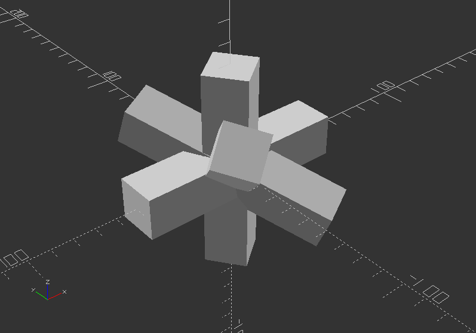
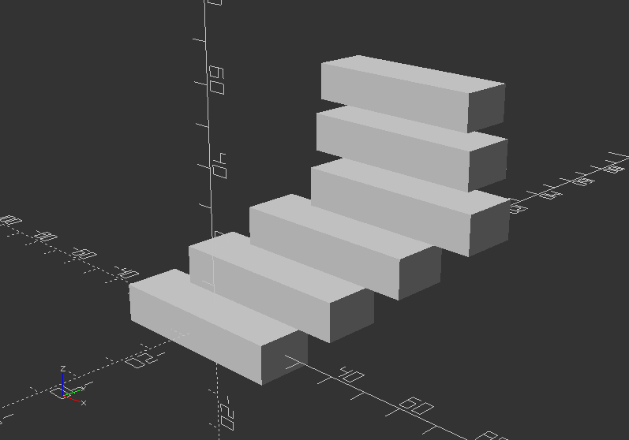
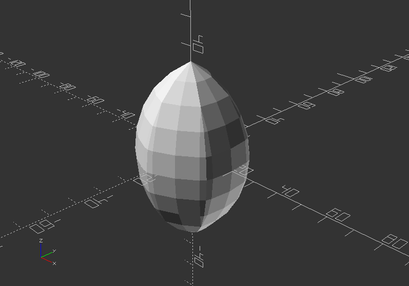
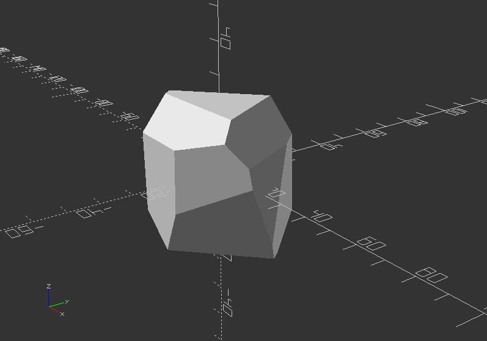

## 2.12. Loops

* Loops are Iterator Functions used as an operator in OpenSCAD (no semicolons)
* A for() loop evaluate each value in a range of vectors, applying it to the following action
* It builds a tree of objects, one branch for each time
* Default syntax of for() is:

*for(variable=[start:incement:end]) {action() object();} or action;*

*for(variable=[start:end]) {action() object();} or action;*

*for(variable=[vector]) {action() object();} or action;*

* Parameters of for() are:

**start** >> Initial value (Integer)

**increment** >> Amount to increase the value (optional Integer - default=1)

**end** >> Stop when next value would be past end

* An intersection\_for() loop iterates over the values in a range of vector and create the intersection of objects created by each pass
* Besides creating separate instances for each pass, the standard for() also groups all these instances
* Creating an implicit union, while intersection\_for() works around the implicit union getting a result.
* By using a combination of the standard for() and intersection() statements
* intersection\_for() loop uses the same parameters then for() loop

---

##### Loops: Iteration over a vector of vectors (rotation):

`for(i=[[0, 0, 0], [10, 20, 300], [200, 40, 57], [20, 88, 57]])` `{`

`rotate(i)`

`cube([100, 20, 20], center=true);`

`}`

---

##### Loops: Iteration over a vector of vectors (translation)

`for(i=[[0, 0, 0], [10, 12, 10], [20, 24, 20], [30, 36, 30], [20, 48, 40], [10, 60, 50]])` `{`

`translate(i)`

`cube([50, 15, 10], center=true);`

`}`

---

##### Intersection loop 1:

##### 

Loop over a range with a cutout of overlapping translated spheres as a result

`intersection_for(n=[1:6])` `{`

`rotate([0, 0, n*60])`

`translate([20, 0, 0])`

`sphere(r=40);`

`}`

---

##### Intersection loop 2:

Loop over a range with a cutout of overlapping rotated blocks as a result

`intersection_for(i=[[0, 0, 0], [10, 20, 300], [200, 40, 57], [20, 88, 57]])` `{`

`rotate(i)`

`cube([200, 40, 40], center=true);`

`}`

---