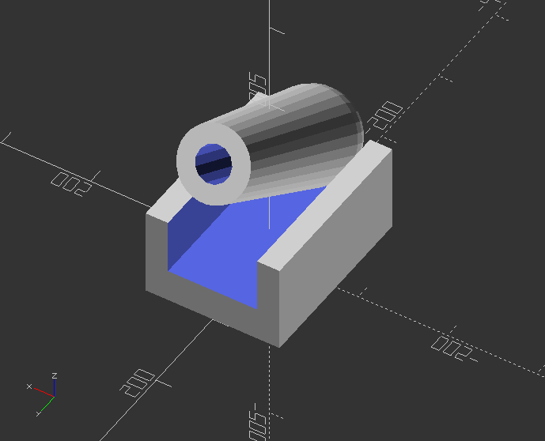
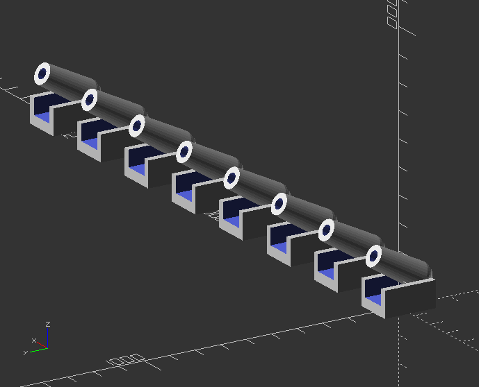

## 2.14. Modules

* Modules can be used to define objects or, using *children()*, define operators
* Once defined, modules are temporarily added to the language, similar to libraries in other languages
* Default usage: *module\_name(parameters) {actions}, where:*

**module\_name** >> is your name for the module. Try to pick something meaningful!  
**parameters** >> Zero or more arguments. They can be assigned as default values and/or variables to be used in calls. Parameter are local, so they will not conflict with external variables with the same name

**actions** >> Nearly any statement valid outside a module can be included within a module, including function definitions, and other modules. Such functions and modules can be called only from within the enclosing module itself.

* The module variables can be externally assigned into a module, but not visa verse
* Modules do not return values to the outside
* Object Modules >> OpenSCAD object modules like 3D primitives are embedded modules, so they are good examples. Object modules need to end with a semicolon ";"
* Operator Modules >> Use of children() allows modules to act as operators applied to any or all the objects within this module instantiation. Operator modules do not need to end with a semicolon
* Children are indexed objects via integers from 0 to children-1
* OpenSCAD sets children to the total number of objects within the scope. Grouped objects are treated as 1
* Syntax use of children():

children(); //all children

children(index); //value or variable to select one child

children([start:step:end]); //select from start to end incremented by step

children([start:end]); //step defaults to 1 or -1

children([vector]); //selection of several children

Modules: Implementing variables that can be changed parametric, so the module call will change objects accordingly:

`ColorBreak=[[0, ""],`

`[20, "lime"], // upper limit of color range`

`[40, "greenyellow"],`

`[60, "yellow"],`

`[75, "LightCoral"],`

`[200, "red"]];`

`Expense=[16, 20, 25, 85, 52, 63, 45];`

`//First we build a color bar, that will be nested into another module`

`module ColorBar(value,period,range)` `{ // 1 color on 1 bar`

`RangeHi = ColorBreak[range][0];`

`RangeLo = ColorBreak[range-1][0];`

`color( ColorBreak[range][1] )`

`translate([10*period,0,RangeLo])`

`if (value > RangeHi) cube([5,2,RangeHi-RangeLo]);`

`else if (value > RangeLo) cube([5,2,value-RangeLo]);`

`}`

Now the module, which is going to be called afterwards. Note, this will use the ColorBar module as parameter:

`module ShowColorBars(values) {`

    for (month = [0:len(values)-1], range = `[1:len(ColorBreak)-1])`

`ColorBar(values[month],month,range);`

`}`

Call the module:

`translate([-30, -20, 0])`

`ShowColorBars(Expense);`

**Now change the values in Expense=[] and press F5 again!**

---

##### **Example of rigged module**

It is not possible to change this object parametric:

`module arrow(){`

`color("Black") cylinder(100, 5, 5);`

`color("Red") cube([40, 5, 30], true);`

`color("Red") cube([5, 40, 30], true);`

`translate([0, 0, 100])`

`color("Red")`

`cylinder(40, 20, 0, true);`

`}`

Call the simple module

`arrow();`

---

##### Create a module

`size=5;`

`angle=30;`

`module cannon(size=10, angle=60) {`

`scale(size)`

`union()` `{`

`rotate([0, 0, 90])`

`translate([0, 0, 10])`

`difference()` `{`

`cube([40, 30, 20], true);`

`translate([0, 0, 5])`

`cube([50, 20, 15], true);`

`}`

`translate([0, -15, 20])`

`rotate([angle-90, 0, 0])`

`difference()` `{`

`union()` `{`

`sphere(10);`

`cylinder(40, 10, 8);`

`}`

`cylinder(41, 4, 4);`

`}`

`}`

`}`

Call the module that has size and angle as variable:

`cannon(size,angle);`

---

##### Modules >> Multiply objects along the x axis

`module linear_array(count,distance) {`

`for(i=[0:1:count-1]) {`

`translate([distance*i, 0, 0])`

`children();`

`}`

`}`

Call the array module:

`linear_array(4, 300)`

`cannon(size, angle);`

**Difficult task: Change the linear\_array to a x,y,z module by using if() loop!**

Use integers to dedicate axis:

`axis=0; //x: 0, y: 1, z: 2`

`module linear_array(axis,count,distance) {`

`//If value is 0, the axis is x`

`if(axis==0) {`

`//Loop it according to count value`

`for(i=[0:1:count-1]) {`

`//Translate children along x`

`translate([distance*i, 0, 0])`

`children();`

`}`

`}`

`//If value is 1, the axis is y`

`if(axis==1) {`

`//Loop it according to count value`

`for(i=[0:1:count-1]) {`

`translate([0, distance*i, 0])`

`children();`

`}`

`}`

`//If value is 2, the axis is z`

`if(axis==2) {`

`//Loop it according to count value`

`for(i=[0:1:count-1]) {`

`translate([0, 0, distance*i])`

`children();`

`}`

`}`

`}`

Call the array module:

`linear_array(0, 8, 300)`

`cannon(size, angle);`

---

