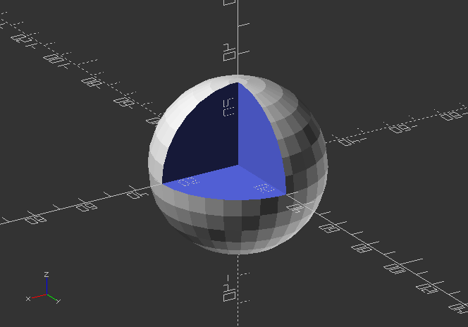
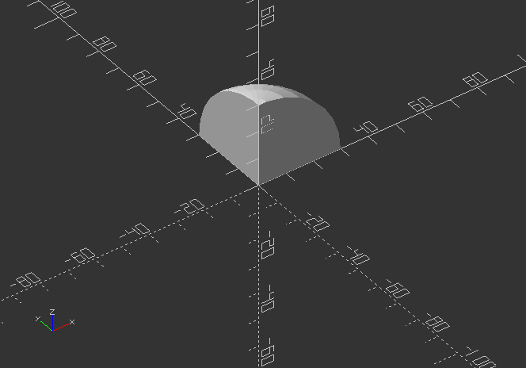
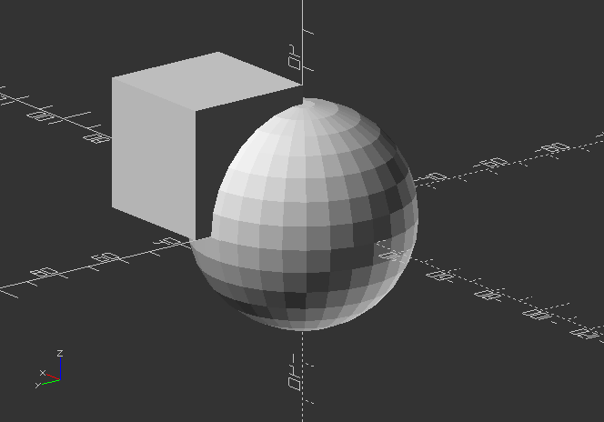

## 2.3. Boolean operations

There are 3 Boolean Operations in OpenSCAD:

*difference()*,

* *intersection()*,
* and *union()*.

**!The chronological order of objects within the operators block is significant!**

*Try the code below and swap the positions of the objects!*

---

##### **difference()**

* creates a shape that cutouts the difference between 2 objects, or an object group.
* it substracts the 2nd object with the 1st object.

`difference() {`

`sphere(30);`

`cube(35);`

`}`

---

##### **intersection()**

* creates a shape from an overlap of 2 objects, or an object group.

`intersection()` `{`

`sphere(30);`

`cube(35);`

`}`

---

##### union()

* creates one shape from the outside shape of 2 or more objects (Zooming inside of the object reveals the difference)

`union() {`

`sphere(30);`

`cube(35);`

`}`

---

