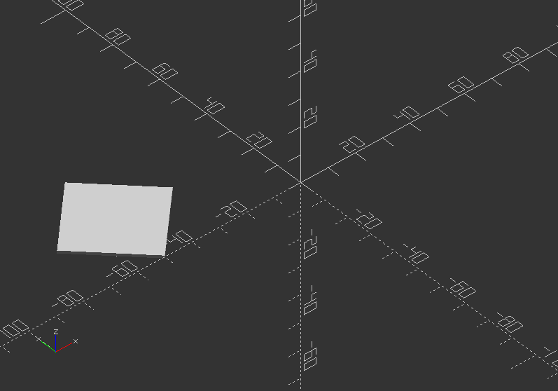

## 2.4. Transformations

OpenSCAD has different functions for different kind of transformations.

Space-orienting transformations are ***rotate()*** for rotation, and ***translate()*** for translation.

Shape-altering transformations are ***scale()*** for scaling, ***mirror()*** for creating mirrored shapes.

Display-altering transformation of shapes is ***color()***.

Shape-forming transformations are ***minkowski()***, ***hull()***, and ***offset()***.

---

##### **translate()**

* Moves the object or a group of objects along a specific vector
* Arguments are optional.
* Syntax usage: *translate(v=[x, y, z]) {...}*

Translate a cube:

`cube(20);`

`translate([20, 0, 0])`

`cube(10);`

`translate([30, 0, 0])`

`cube(5);`


---

##### **rotate()**

* Turns the object or a group of objects around one or more axis of the coordinate system or an arbitrary axis.
* Argument names are optional, if you they are in the specified order.
* Syntax usage: *rotate(a=deg\_a, v=[x, y, z]) {...}*
* Argument a can be a vector, thus ignoring Argument v.
* Argument v sets an arbitrary axis about which the object is rotated.

Rotate a box:

`rotate(a=[0, 180, 0]) cube([20, 50,30]);`

```

```

is the same like below, whereas translate will set the next box beside:

`translate([ 40, 0, 0])`

`rotate(a=180, v=[0, 1, 0]) cube([20, 50, 30]);`


Rotate with a single scalar argument rotates around the Z axis, which is useful for 2D objects:

`translate([-50, 0, 0])`

`rotate(45) square(30);`



The regular use is *rotate([x, y, z])*:

`translate([-20, -40, 0])`

`rotate([45, 45, 0]) cube(20);`


##### 

---

##### **scale()**

* Changes the size of an object using a specified vector.
* The argument name is optional.
* Syntax usage: *scale(v=[x, y, z]) {...}*

Scale an object:

`cube(30); //Default cube`  
`translate([-80, 0, 0]) //Move it aside`  
`scale(2)`  
`cube(30);`  
`translate([50, 0, 0]) //Move it aside`  
`scale([3, 2, 1]) //Scale`  
`cube(30);`


---

##### **mirror()**

* Mirrors an object or group of objects on a plane through the origin.
* The argument is a vector, that activates mirroring using 1, while 0 indicates no action.
* Syntax usage: *mirror([x, y, z]) {...}*

Mirror an object:

`rotate([0, 0, 10]) cube([30, 20, 10]);`

```
 
```

Try different planes:

`mirror([1, 0, 0])`

`translate([10, 0, 0])`

`rotate([0, 0, 10])`

`cube([30, 20, 10]);`


**!There are more transformations, that I will explain later!**

*For now, lets carry on with the next chapter!*

##### 

---

##### **multmatrix()**

* Multiplies the geometry of an object or a group of objects with a given affine transformation matrix.
* One Matrix is 4 x 3 - a vector of 3 row vectors with 4 elements.
* Another Matrix is 4 x 4 - a vector of 4 row vectors, whereas the 4th row is always *[0,0,0,1]*.
* Syntax usage: *multmatrix(m=[...]) {...}*

* Next a breakdown, what you can do with independent elements in the matrix:

|  |  |  |  |
| --- | --- | --- | --- |
| [Scale X] | [Shear X along Y] | [Shear X along Z] | [Translate X] |
| [Shear Y along X] | [Scale Y] | [Shear Y along Z] | [Translate Y] |
| [Shear Z along X] | [Shear Z along Y] | [Scale Z] | [Translate Z] |

* The fourth row is forced to [0,0,0,1] and is therefore not processed by OpenSCAD

Use a 3x4 multimatrix on an object to create a teardrop:

`angle=45;`

`multmatrix(m=[[cos(angle), -sin(angle), 0, 10],`

`[sin(angle), cos(angle), 0, -20],`

`[0, 0, 1, 0],`

`[0, 0, 0, 1]])`

`union() {`

`cylinder(r=10, h=10, center=false);`

`cube(size=[10, 10, 10],center=false);`  
`}`


First build a 4x4 matrix variable, then apply it to multmatrix:

`M=[ [1, 0, 0, 0],`

`[0, 1, 0.7, 30],`

`[0, 0, 1, 0],`

`[0, 0, 0, 1]];`

```
 
```

Now apply the parameter to a matrix:

`multmatrix(M) {`

`union() {`

`cylinder(r=10, h=10, center=false);`

`cube(size=[10, 10, 10],center=false);`

`}`

`}`

``

##### 

---

##### **color()**

* Displays the object in a specific RGB color + Alpha value
* It is only useful in preview mode **F5**, as the color will not be transmitted to the rendered object
* Default alpha value is *1.0* (opaque)
* Syntax usage: *color([r, g, b, a]) {...}*
* r is RED CHANNEL, g is GREEN CHANNEL, b is BLUE CHANNEL
* Each channel holds a value between 0 and 1/[1:255]
* Colors can also be defined by name

Here all color names:

|  |  |
| --- | --- |
| **Category** | **Names** |
| Purples | Lavender, Thistle, Plum, Violet, Orchid, Fuchsia, Magenta, MediumOrchid, MediumPurple, BlueViolet,  DarkViolet, DarkOrchid, DarkMagenta, Purple, Indigo, DarkSlateBlue, SlateBlue, MediumSlateBlue |
| Pinks | Pink, LightPink, HotPink, DeepPink, MediumVioletRed, PaleVioletRed |
| Blues | Aqua, Cyan, LightCyan, PaleTurquoise, Aquamarine, Turquoise, MediumTurquoise, DarkTurquoise,  CadetBlue, SteelBlue, LightSteelBlue,PowderBlue,LightBlue, SkyBlue, LightSkyBlue, DeepSkyBlue,  DodgerBlue, CornflowerBlue, RoyalBlue, Blue, MediumBlue, DarkBlue, Navy, MidnightBlue |
| Reds | IndianRed, LightCoral, Salmon, DarkSalmon, LightSalmon, Red, Crimson, FireBrick, DarkRed |
| Greens | GreenYellow, Chartreuse, LawnGreen, Lime, LimeGreen, PaleGreen, LightGreen, MediumSpringGreen,  SpringGreen, MediumSeaGreen, SeaGreen, ForestGreen, Green, DarkGreen, YellowGreen, OliveDrab,  Olive, DarkOliveGreen, MediumAquamarine, DarkSeaGreen, LightSeaGreen, DarkCyan, Teal |
| Oranges | LightSalmon, Coral, Tomato, OrangeRed, DarkOrange, Orange |
| Yellows | Gold, Yellow, LightYellow, LemonChiffon, LightGoldenrod, Yellow, PapayaWhip, Moccasin, PeachPuff,  PaleGoldenrod, Khaki, DarkKhaki |
| Browns | Cornsilk, BlanchedAlmond, Bisque, NavajoWhite, Wheat, BurlyWood, Tan, RosyBrown, SandyBrown,  Goldenrod, DarkGoldenrod, Peru, Chocolate, SaddleBrown, Sienna, Brown, Maroon |
| Whites | White, Snow, Honeydew, MintCream, Azure, AliceBlue, GhostWhite, WhiteSmoke, Seashell, Beige, OldLace, FloralWhite, Ivory, AntiqueWhite, Linen, LavenderBlush, MistyRose |
| Grays | Gainsboro, LightGrey, Silver, DarkGray, Gray, DimGray, LightSlateGray, SlateGray, DarkSlateGray,  Black |

A third way is using Hex values, which can be give in 4 formants, *#rgb #rgba #rrggbb #rrggbbaa*

Give objects color:

`color("red") translate([-40, 0, 0]) cube(20);`

`color([0,1,0]) translate([-10, 0, 0]) cube(20);`

`color("#0000ff") translate([20, 0, 0]) cube(20);`


Try to add some alpha:

`color([1, 1, 1, 0.3]) translate([-50, -10, 0]) cube([100, 40, 40]);`


---

##### **offset()**

* Creates a new 2D interior or exterior outline
* There are 2 modes of operation, radial and offset
* Offset creates an outline with fixed surrounding, while radial behaves like a surrounding circle
* Outlines can be given an optional chamfer
* Offset is useful to make thin walls
* Parameters are:

**r**>> Amount to offset the polygon. When negative, the polygon is turn inward. It specifies the radius of the circle in radius mode.

**delta**>> Distance between original and offset polygon line. Negative places it inward. It is used for the offset mode.

**chamfer** >> Boolean (default: false). Dedicates if edges are cutoff (charmfered).

Build a little vase:

`linear_extrude(height=60, twist=90, slices=60) {`  
`difference() {`  
`offset(r=10) {`  
`square(20, center=true):`  
`}`  
`offset(r=8) {`  
`square(20, center=true);`  
`}`  
`}`  
`}`


---

##### **minkowski()**

* Displays the minkowski sum of child nodes
* It is useful to create round corners for boxes or flat bodies (spheres or cylinders)
* Minkowski is very computational expensive, so you CPU can go very busy with it
* Syntax usage: *minkowski() {...}*

Minkowski example:

`minkowski() {`

`sphere(10);`

`cube([80, 60, 30]);`

`}`


---

##### **hull()**

* Displays the convex hull of objects
* It can create new shapes by creating a group of objects, that can connected via hull to one mesh
* Syntax usage: *hull() {...}*

##### 

Table leg with hull():

`$fn=80;`

`hull() {`

`cylinder(h=0.01, d=3, $fn=$fn);`

`translate([0, 20, 80])`

`cylinder(h=0.01, d=10, $fn=$fn);`

`}`


##### 

---

##### Exercise:

Try to create a bottom for the vase, either with hull() or minkowski()!

`hull()` `{`

`translate([11, 11, 0])`

`cylinder(h=2, d=16);`

`translate([-11, 11, 0])`

`cylinder(h=2, d=16);`

`translate([11, -11, 0])`

`cylinder(h=2, d=16);`

`translate([-11, -11, 0])`

`cylinder(h=2, d=16);`

`}`


##### 

##### Exercise for minkowski():

`minkowski() {`

`translate([0, 0, 1])`

`cube([22, 22, 2], center=true);`

`cylinder(h=2, d=16);`

`}`


---

