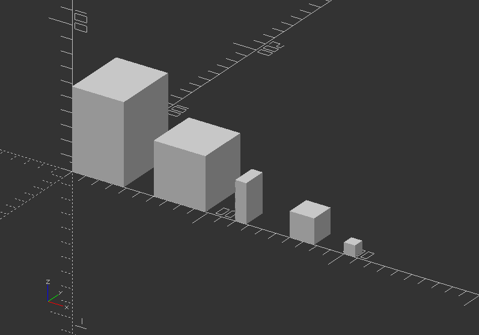
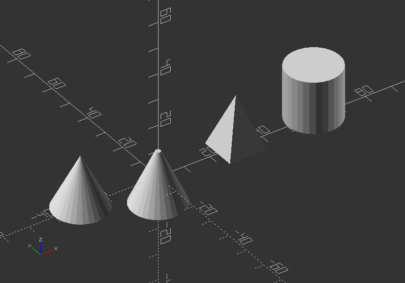

## 2.5. 3D Primitives

There are three basic 3D primitives in OpenSCAD namely *cube()*, *sphere()*, and *cylinder()*.

---

##### **cube()**

* Creates a cube at the origin of the coordinate system, but place the cube in its first octane
* The template syntax for cube:

*cube(size=x,center=true/false);*

or

*cube(size=[x,y,z],center=true/false);*

* Using center=true will match the cubes origin with the origin of the coordinate system
* To apply different sizes for each plane along an axis, squared brackets are used -> *[x,y,z]*
* Equivalent code:

`cube(size=8);`

`cube(18);`

`cube([8, 18, 28]);`

`size=38;`

`cube(size);`

`size=[38, 48, 58];`

`cube(size);`

**Try following code below to understand offset() combined with translate()**

`translate([-60, 0, 0])`

`cube(30); //cube with squared sizes all around`

`cube(30, center=true); //squared cube with center in offset 0,0,0 of the coordinate system`

`translate([30, 0, 0])`

`cube([30, 50, 80]); //cube with different sizes in x, y, and z`

**Now try this code version with translate() to position all versions side-by-side!**

`translate([200, 0, 0])`

`cube(size=8);`

`translate([160, 0, 0])`

`cube(18);`

`translate([120, 0, 0])`

`cube([8, 18, 28]);`

`size1=38;`

`translate([60, 0, 0])`

`cube(size1);`

`size2=[38, 48, 58];`

`translate([0, 0, 0])`

`cube(size2);`

---

##### **sphere()**

* Creates a sphere at the origin of the coordinate system.
* Parameter are:

**r**>> Radius, while r is not needed to assigned as the decimal automatically is addressed to radius

**d** >> Diameter of the sphere

**$fa** >> Fragment angle in degrees

**$fs** >> Fragment size in mm

**$fn** >> Resolution of shape through numbers of faces

* Default values of *sphere()* parameters yields:

`sphere(r=10, $fn=0, $fa=12, $fs=1);`

`radius=5; //parametric value describing radius, change it to 1, 5, 10`

`$fn=20; //parametric value describing resolution, change it to 4,10, 40, 80`

`translate([0, 0, radius]) //move it up by radius`

`sphere(radius, $fn=$fn); //create sphere with assigned radius`

##### Exercise:

* Create 2 variables called radius and $fn, and apply it to a sphere. Then preview the changes!

`translate([60, 0, 0])`

`sphere(10);`

`translate([30, 0, 0])`

`sphere(r=20, $fn=3);`

`translate([0, 0, 0])`

`sphere(r=10, $fa=50);`

`translate([-30, 0, 0])`

`sphere(r=8, $fs=3);`

`translate([-65, 0, 0])`

`sphere(r=15, $fn=200);`

---

##### **cylinder()**

* Creates a cylinder at the origin of the coordinate system, while the pivot of the cylinder is the bottom
* Using center=true will offset the cylinder in the center of the shape, including on the Z axis
* The parameter naming are optional, but need to be used in the correct order
* So it is appropriate to use the parameter names to define cylinder shape
* Parameter:

**h** >> Height of the cylinder or cone

**r** >> Radius of cylinder - r1=r2=r

**r1** >> Radius bottom of cone

**r2** >> Radius, top of cone

**d** >> Diameter of cylinder - r1=r2=d/2

**d1** >> Diameter, bottom of cone - r1=d2/2\*

**d2** >> Diameter, top of cone - r2=d2/2\*

**center** >> Offset boolean with *false* as default, *true*

**$fa** >> Minimum angle (in degrees) of each fragment

**$fs** >> Minimum circumferential length of each fragment

**$fn** >> Fixed number of fragments in 360 degrees

* If you use one parameter name in this list: h, r, r1, r2, d1, d2, you will need to name all further used parameters
* $fa, $fs, $fn always need to be named (universal, not only with cylinder)
* Using cylinder to make holes in a shape need to have a high $fn resolution and slightly bigger, than the wanted size.

`cylinder(d=20, h=8);`

Showcase of circumscribed holes:

`color([1, 1, 0])cylinder(h=20, d=20, $fn=80);`

`color([1, 0, 0]) cylinder(h=25, d=20, $fn=8);`

`color([0, 1, 0]) cylinder(h=15, d=21.7, $fn=8); //This is a circumscribed hole`

##### Exercise:

**Create a cylinder, a pyramid and a cone!**

`cylinder(20, 10, center=true); //Not using the parameter names: First number = d, second number = r1, rest remains default (r2=1)`

`translate([-30, 0, 0])`

`cylinder(20, r1=10, r2=0); //Using the parameter name r will dedicate the same number to top and bottom`

`translate([30, 0, 0])`

`rotate([0, 0, 45])`

`cylinder(h=20, r1=10, r2=0, $fn=4); //A cylinder using all parameters`

`translate([60, 0, 0])`

`cylinder(h=20, d=20); //A cylinder using all parameters`

---

##### **polyhedron()**

* is an advanced and therefore most general primitive solid
* it can create any regular or irregular shape including shapes with concave and convex features
* this is only mentioned here to complete the list of 3D solids. We will not use this shape at all.
* There are many ways to do shapes by combining basic shapes (see the code below)

If it is not possible to create a shape in other ways, polyhedron() can achieve it

Polyhedrons contain points and faces >> *polyhedron(points[[x,y,z],...],faces=[[p1,p2,p3],...],convexity=N);*

You can use different methods in your design to achieve the same results.

Here an example:

`polyhedron(points=[[0, -10, 60], [0, 10, 60], [0, 10, 0], [0, -10 ,0], [60, -10, 60], [60, 10, 60]],`

`faces=[[0, 3, 2], [0, 2, 1], [3, 0, 4], [1, 2, 5], [0, 5, 4], [0, 1, 5], [5, 2, 4], [4, 2, 3]]);`

`//Or 2 cubes and intersection`

`translate([0, -60, 0])`

`difference()` `{`

`rotate([0, 0, -90])`

`cube([20, 60, 60]);`

`rotate([-45, 0, -90])`

`cube([20, 60, 100]);`

`}`

##### Exercise:

**Create a piece of furniture like a table, chair, lamp or something like that!**

***Use transformations and 3D shapes you just learned!***

---
