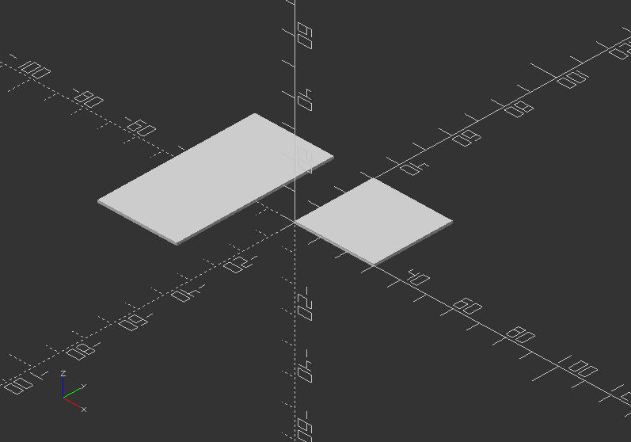
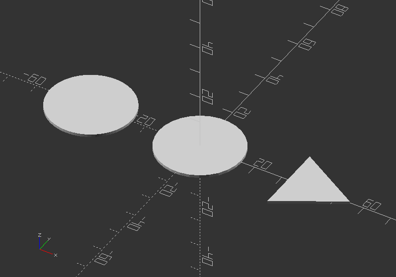
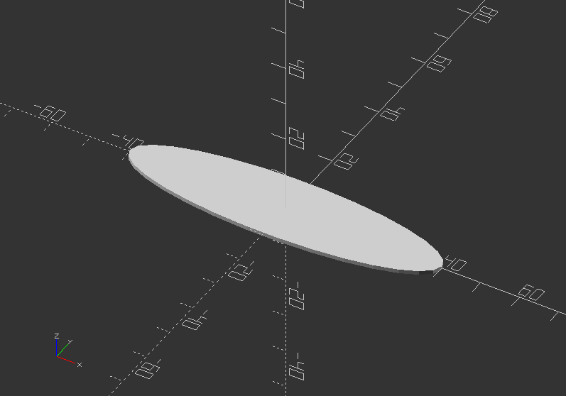
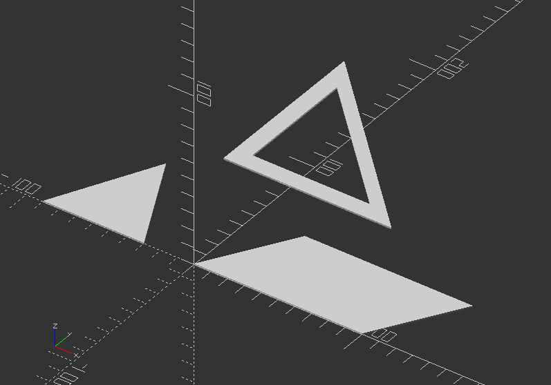

## 2.6. 2D Primitives

* 2D primitives can be used to be transformed to 3D objects via extrusion (offset example)
* Although infinitely thin, they are previewed and rendered with 1 mm thickness
* There are 4 different 2D primitives in OpenSCAD: *square()*, *circle()*, and *polygon()*

---

##### **square()**

* Creates a square or rectangle in the first quadrant
* When parameter center=true, the square will be placed on the origin
* Syntax usage:

*square(size,center);*

or

*square([size x, size y],center);*

or both without *center*

* Parameters are:

size >> single value for a square, two values in a vector for a rectangle

center >> Boolean (Default: false), will center object in [0,0] of coordinate system if true

Here a basic example:

`square(30);`

`translate([-30, 0, 0])`

`square([30, 60], center=true);`

---

##### **circle()**

* Creates a circle around the origin
* All parameters, except r, must be named
* Syntax usage: *circle(r=radius|d=diameter);*
* Parameters are:

**r** >> Circle radius, naming is not necessary

**d** >> Circle diameter

**$fa** >> Minimum angle of each fragment

**$fs** >> Minimum circumferential length of each fragment

**$fn** >> Number of fragments in 360 degrees

A simple example:

`circle(15);`

`translate([-40, 0, 0])`

`circle(d=30, $fn=80);`

`translate([40, 0, 0])`

`circle(d=30, $fn=3); //Experiment with $fn to create more regular polygons`

An ellipse can be created with *scale() circle();*

`scale([2, 0.5])`

`circle(20);`

---

##### **polygon()**

* Creates a multiple sided shape from a list of x,y coordinates
* This is the most powerful 2D object, including shapes with convex and concave edges.
* It is also possible to place holes within the shape.
* Syntax usage: *polygon(points=[[x,y],...],paths=[[p1,p2,p3..],...], convexity = N);*
* Parameters are:

**points** >> A list of x,y points of the polygon (Points are indexed from 0 to n-1)

**paths** >> All points are used in order listed

**single vector** >> Order to traverse the points. May in different order with all or part

**multiple vectors** >> Creates primary and secondary shapes (like difference). Secondary shapes may be wholly and partially within primary shape

**convexity** >> Integer number of "inward" curves, i.e. expected path crosses through polygon

Here an example:

`polygon(points=[[0, 0], [100, 0], [130, 50], [30, 50]]);`

`translate([-60, 0, 0])`

`polygon([[-30, 0], [0, 60], [30, 0]]);`

`translate([-40, 80, 0])`

`polygon(points=[[0, 0], [100, 0], [0, 100], [10, 10], [80, 10], [10, 80]], paths=[[0, 1, 2], [3,4,5]], convexity=10);`

---
