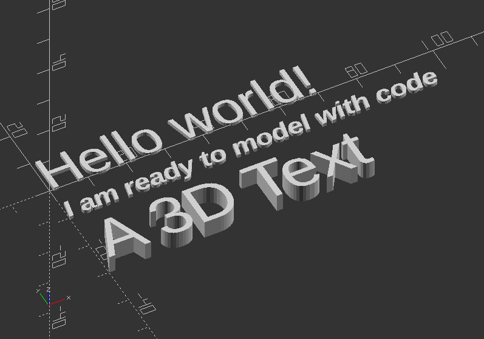

## 2.7. Text

* Creates text as a 2D geometric object.
* It uses fonts installed on the local system or a provided as separate font file
* Syntax usage: *text(string);*
* Parameters are:

**text** >> The text to generate (String)

**size** >>  It determine height over baseline (Decimal - default: 10)

font >> It is not the name of the font file, but the logical name: Help -> Font List (String)

halign >> Horizontal alignment for the text *"left" "center" "right"* (String - default: "left")

valign >> Vertical alignment for text *"top" "center" "baseline" "bottom"* (String - default: baseline)

spacing >> Decrease/increase character spacing, the greater the further apart (Decimal - default: 1)

direction >> Direction of text flow "ltr" (left-to-right), "rtl", "ttb", "btt" (String - default: "ltr")

language >> Language of the text (String - default: en)

script >> Script of language (String - default: "latin")

$fn >> Subdivision of curved path segments provided by freetype

* Use *linear\_extrude(size\_z) text(string)* to create 3D text.

Text: Experiment with text parameters:

`text("Hello world!");`

`translate([0, -10, 0])`

`text("I am ready to model with code", size=5,font="Liberation Sans:style=Bold Italic");`

`translate([0, -30, 0])`

`linear_extrude(5)`

`text("A 3D Text", size=12, font="Liberation Sans");`

---
