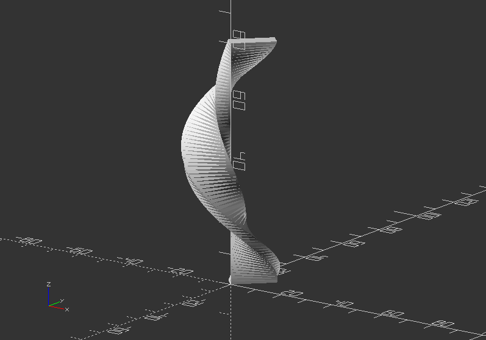
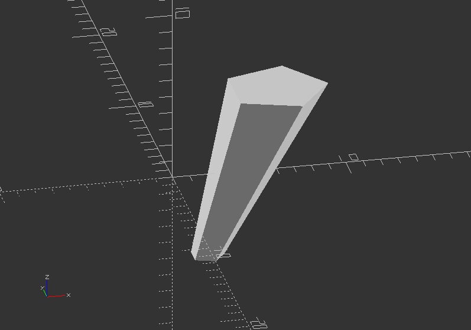
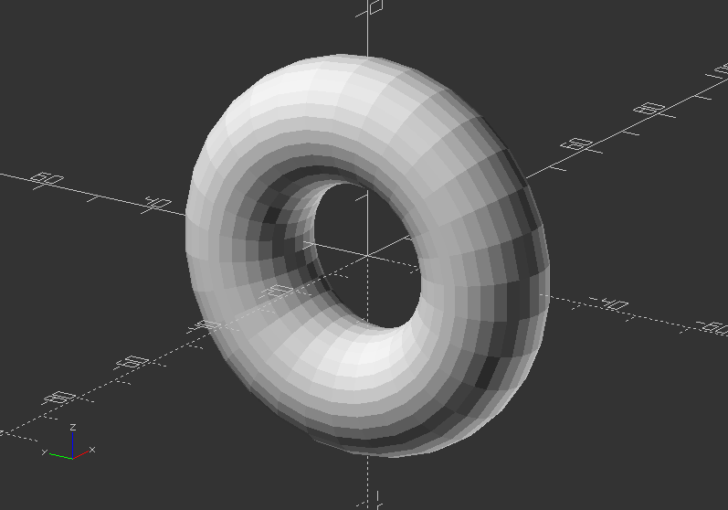
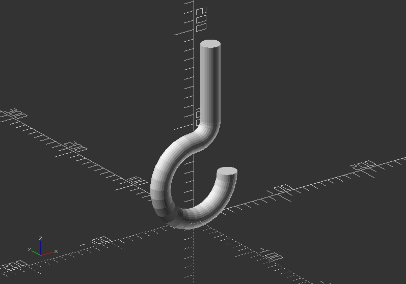
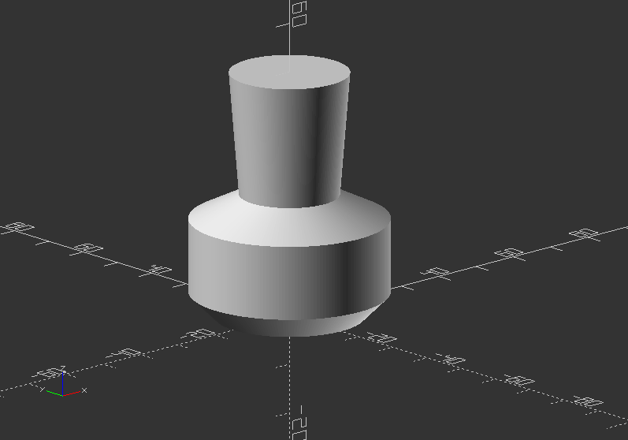
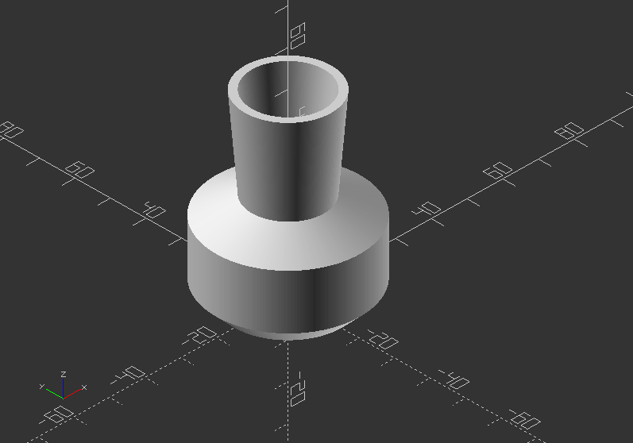

## 2.8. Extrusion

##### **linear_extrude()**

* A process of creating an object with fixed cross-sectional profile
* There are 2 commands to create 3D shapes from a 2D shape: *linear_extrude()*
* This operation takes a 2D object as input and generates a 3D object as a result
* The shape of x and y will be projected upwards along the z axis.
* If you use transformations to change the object, then its transformed version will be extruded.
* Syntax usage: *linear_extrude(height, center, convexity, twist, slices, scale, $fn) {...}*
* Parameters are:

**height** >> z value for resulting 3D object >> It must be positive

**twist** >> Number of degrees, that the shape will twist throughout its extrusion. Positive value twists clockwise, negative value turns around anti-clockwise

**center** >> If center is true, the extruded object will be centered in the z axis of origin

**slices** >> Number of intermediate points along the Z-axis of the extrusion. Its Default increases with twist value

**scale** >> Scales the 2d shape to this value over the height of the extrusion (scalar or vector)

**$fn** >> Increases resolution resulting in higher smoothness

Linear extrusion 1:

`linear_extrude(80, twist=360, slices=80)` `{`

`rotate(45)`

`scale([1.5, 0.5])`

`square(10);`

`}`

Linear extrusion 2:

`linear_extrude(height=10, center=true, convexity=10, scale=3)`

`translate([2, 0, 0])`

`circle(r=1);`

---

##### **rotate_extrude()**

* Like using a potter wheel, rotational extrusion spins a 2D shape around the Z-axis
* It has rotational symmetry
* The 2D shape must lie entirely on the left or right side of the Y-axis in order to work
* Syntax Usage: *rotate_extrude(angle,convexity) {...}*
* Parameters are:

**angle** >> Specifies number of degrees to sweep, starting at positive x (Integer - default: 360). Negative angle sweeps clockwise

**convexity** >> If the extrusion fails for a non-trivial 2D shape, try a value like 10 (recommended)

**$fa** >> Minimum angle of each fragment

**$fs** >> Minimum circumferential length of each fragment

**$fn** >> Fixed number of fragments in 360 degrees

Rotational extrusion 1 - Create a Donut:

`rotate([0, 90, 0])`

`rotate_extrude(convexity=10)`

`translate([22, 0, 0]) //Change the y number`

`circle(r=10);`

Rotational extrusion 2 - Create a hook:

`translate([0, 0, 100])`

`rotate([-90, 0, 0])`

`union()` `{`

`translate([0, 60, 0])`

`rotate_extrude(angle=270, convexity=10)`

`translate([40, 0])`

`circle(10);`

`rotate_extrude(angle=90, convexity=10)`

`translate([20, 0]) circle(10);`

`translate([20, 0, 0])`

`rotate([90, 0, 0])`

`cylinder(h=80, r=10);`

`}`

Extruding a polygon:

`rotate_extrude($fn=200) polygon(points=[[0, 0], [15, 0], [20, 5], [20, 20], [10, 25], [12, 50], [0, 50]]);`

**Change the code to make a real vase design out of it!**

Solution:

`rotate_extrude($fn=200) polygon(points=[[0, 0], [15, 0], [20, 5], [20, 20], [10, 25], [12, 50], [10, 50], [5, 5]]);`

---
