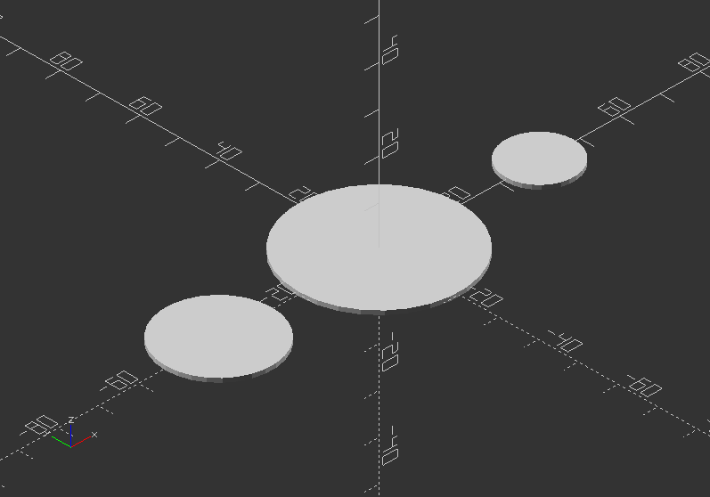

## 2.9. Projection

##### **projection()**

* Creates a 2D drawing from a 3D model
* It is projecting a 3D object to the x,y plane with z=0
* The parameter:

cut >> If *cut=true*, only the points with z=0 are considered for the 2D shape. If *cut=false*, points above and below are considered as well.

* To do a particular cutout, the parameter needs to be true >> translate and rotate it in position.
* Is necessary to export objects in DXF Format or SVG Format.

Example:

`projection(cut=true) translate([-40, 0, 15]) sphere(20);`

`projection(cut=false) sphere(20);`

`projection(cut=true) translate([40, 0, 18]) sphere(20);`

Without projection:

With projection:

---
