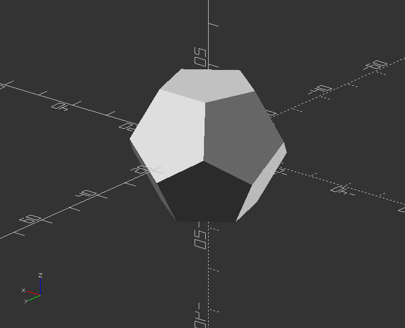
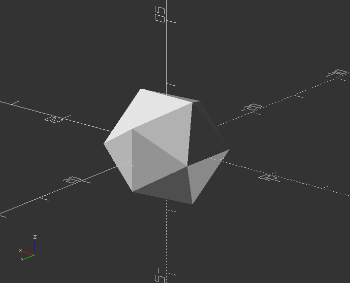
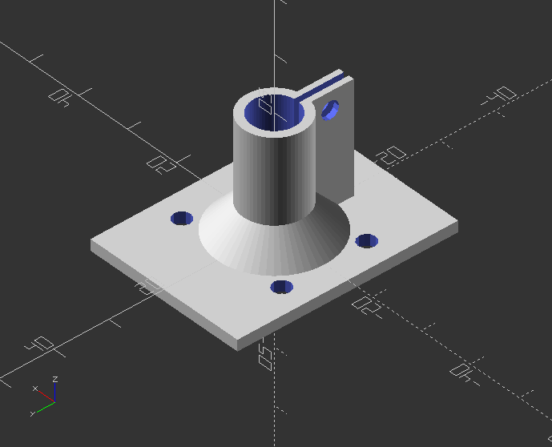
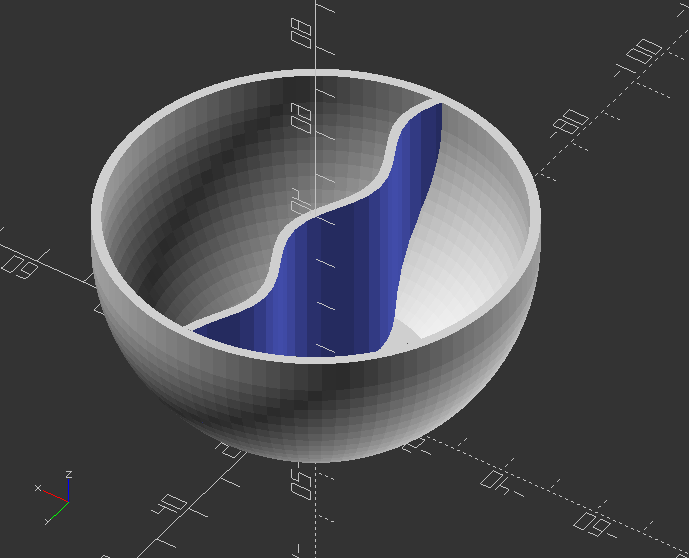
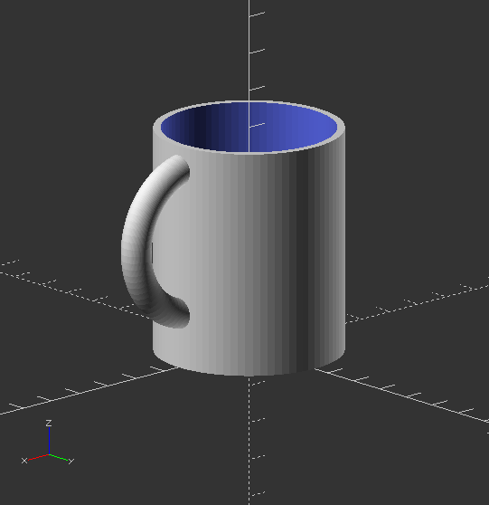

## 3.1. 3D Shapes

##### **Dodecahedron by intersection 6 boxes**

`module dodecahedron(height) {`

`scale([height, height, height]) { //Scale by height parameter`

`intersection() {`

`cube([2, 2, 1], center=true); //Make a cube`

`intersection_for(i=[0:4]) { //Loop i from 0 to 4, and intersect results`

`rotate([0, 0, 72*i]) //Rotate object below 72*i degrees around Z axis`

`rotate([116.565, 0, 0]) //Rotate object below 116.565 degree around X axis`

`cube([2, 2, 1], center=true);`

`}`

`}`

`}`

`}`

Now create a Dodecahedron:

`dodecahedron(30);`

---

##### **Icosahedron by intersection of 3 golden-ratio rectangles**

`module icosahedron(size) {`

`phi=0.5*(sqrt(5)+1); //The Golden Ratio`

`st=size/10000; //Microscopic sheet thickness`

`hull() {`

`cube([size*phi, size,st], true); //First rectangle`

`rotate([90, 90, 0]) cube([size*phi, size, st], true); //Second rectangle`

`rotate([90, 0, 90]) cube([size*phi, size, st], true); //Third rectangle`

`}`

`}`

Now create a Icosahedron from the module:

`size=10;`

`icosahedron(size);`

---

##### **Create a shaft bracket**

`fn = 60; //Circle resolution`

`eps = 0.03; //Small number`

`slop = 0.2; //Printer slop: shrinkage of ID of a hole`

`//Basic values of bracket platform`

`bp_width = 30; //Bracket platform width`

`bp_length = 40; //Bracket platform length`

`bp_thickness = 2; //Bracket platform thickness`

`screw_size = 3.0 + slop; //Diameter of mounting screw hole`

`//Basic values of shaft`

`shaft_diameter = 8.0+slop; //Shaft diameter`

`shaft_thickness = 1.5; //Shaft collar thickness`

`//Basic values of bracket clamp`

`bc_area = 2; //Thickness of bracket clamp area`

`bc_length = 20; //Length of bracket clamp area`

`bc_width = screw_size*2.8; //Clamping block width`

`bc_height = bc_length; //Clamping block height`

`bc_thickness = 3; //Clamping block thickness`

`//Basic values of bracket clamp`

`notch_width = 1; //Width of notch in bracket clamp`

`notch_length = 15; //Bracket notch length`

`bf_height = 5; //Bracket angled flange height`

`//Other variables`

`bcol = shaft_diameter+2*shaft_thickness; //Bracket collar OD`

`shaft_length = bc_length + eps*2; //Shaft length for cutout`

`//Module that creates bracket`

`module bracket() {`

`difference() {`

`union() {`

`translate([-bp_width/2, -bp_length/2, 0]) cube([bp_width, bp_length, bp_thickness]); //Flat platform-top`

`translate([0, 0, -bc_length]) cylinder(r = bcol/2, h=bc_length, $fn=fn); //Outer round clamp`

`rotate([180, 0, 0]) cylinder(r1=(bp_width+bcol)/4, r2=bcol/2, h=bf_height, $fn=fn); //Flange`

`translate([-bc_thickness/2, shaft_diameter/2, -bc_length]) cube([bc_thickness, bc_width, bc_height]); //Shaft clamp block`

`}`

`translate([bp_width/2 - 1.5*screw_size, bp_length/2 - 1.5*shaft_diameter, -(eps)])`

`cylinder(r=screw_size/2, h=bp_thickness+2*eps, $fn=12); //Mounting hole`

`translate([bp_width/2 - 1.5*screw_size, -bp_length/2 + 1.5*shaft_diameter, -(eps)])`

`cylinder(r=screw_size/2, h=bp_thickness+2*eps, $fn=12); //Mounting hole`

`translate([-bp_width/2 + 1.5*screw_size, bp_length/2 - 1.5*shaft_diameter, -(eps)])`

`cylinder(r=screw_size/2, h=bp_thickness+2*eps, $fn=12); //Mounting hole`

`translate([-bp_width/2 + 1.5*screw_size, -bp_length/2 + 1.5*shaft_diameter, -(eps)])`

`cylinder(r=screw_size/2, h=bp_thickness+2*eps, $fn=12); //Mounting hole`

`//translate([-notch_width/2, -(bcol+eps)/2, -(bc_area+eps)]) //Notch both sides`

`translate([-notch_width/2, 0, -(bc_length+eps)]) //Notch one side only`

`cube([notch_width, bcol+bc_height+2*eps, notch_length]); //Notch cutout in cylinder`

`translate([0, 0, eps-shaft_length]) cylinder(r = shaft_diameter/2, h=shaft_length, $fn=fn); //Hole for shaft`

`translate([-bc_width/2, bcol/2 + screw_size, -bc_length+screw_size])`

`rotate([0, 90, 0])` `cylinder(r=screw_size/2, h=bc_width+2*eps, $fn=12); //Hole in shaft clamp block`

`//translate([0, 0,-25]) color("red") cube([50, 50, 50]); //DEBUG cutaway`

`}`

`}`

Rotated bracket call:

`rotate([180, 0, 0]) bracket();`

---

##### **Create a simple bowl**

`//Initiate basic variables with values`

`resolution=20;`

`diameter=80;`

`depth=40;`

`middle_wall=true; //for cerial that doesnt get soggy`

`flat_bottom=5;`

`wall_thickness=2;`

`middle_resolution=3;`

`middle_wave=10;`

`$fn = resolution;`

`//Create module for bowl`

`module bowl() {`

`hull() {`

`translate([0, 0, diameter/2-flat_bottom]) sphere(d=diameter);`

`translate([0, 0, depth]) sphere(d=diameter);`

`}`

`}`

`//Negative form to make bowl hollow`

`module taken_bowl() {`

`intersection() {`

`scale([(diameter/(diameter+(wall_thickness*2))), (diameter/(diameter+(wall_thickness*2))), 1]) bowl();`

`translate([0, 0, wall_thickness]) cylinder(d=diameter, h=depth);`

`}`

`}`

`//Make the bowl hollow`

`intersection() {`

`difference() {`

`bowl();`

`taken_bowl();`

`}`

`cylinder(d=diameter, h=depth);`

`}`

`//If true, add a separation wall`

`if(middle_wall == true) {`

`intersection() {`

`taken_bowl();`

`middle_sine(depth);`

`}`

`}`

`//Separation wall in bowl`

`module middle_sine(depth) {`

`r = 0;`

`h = 0;`

`w = depth;`

`// amplitude`

`s = 3;`

`step = middle_resolution;`

`// cycles`

`c= middle_wave;`

`// small number`

`e=0.02;`

`module sinwave(w) {`

`for(a=[0:step:diameter-step]) {`

`hull() {`

`translate([r-w, a, -2*s])`

`cube([2*w, e, 2*s+s*sin(c*a)]);`

`translate([r-w,a+step, -2*s])`

`cube([2*w, e, 2*s+s*sin(c*(a+step))]);`

`}`

`}`

`}`

`translate([0, -diameter/2, 0])`

`rotate([0, 90, 0])`

`difference() {`

`sinwave(w);`

`translate([0, 0, -wall_thickness]) sinwave(w=w*2);`

`}`

`}`

---

##### **Create simple mug**

`//Basic variables with assigned values`

`diameter=50;`

`height=60;`

`wall_thickness=2;`

`handle_thickness=8;`

`front_icon="";`

`front_icon_size=30;`

`icon_depth=5;`

`bottom_icon="";`

`icon_size=25;`

`resolution=10;`

`bottom_thickness=5;`

`hand_size=20;`

`handle=true;`

`handle_height=-2;`

`handle_resolution=5;`

`$fn= resolution;`

`//Module for positive shape of mug`

`module mug_added(diameter, height, hand_size, height, handle_thickness, handle_height, handle_resolution) {`

`cylinder(d=diameter, h=height);`

`if(handle == true) {`

`handle(hand_size, height, handle_thickness, handle_height, handle_resolution);`

`}`

`}`

`//Module for negative cutout of mug inside`

`module mug_taken(diameter, height, wall_thickness, bottom_thickness) {`

`translate([0, 0, bottom_thickness]) cylinder(d=diameter-(wall_thickness*2), h=height);`

`}`

`//Module for mug handle`

`module handle(hand_size, height, handle_thickness, handle_height, handle_resolution) {`

`$fn = handle_resolution;`

`translate([hand_size, 0, (height-hand_size-(handle_thickness/2)+handle_height)])`

`rotate([90, 0, 0])`

`rotate_extrude() {`

`translate([hand_size, 0, 0]) circle(d=handle_thickness);`

`}`

`}`

`//Module to assemble mug with no text`

`module mug_no_text(diameter, height, hand_size, height, handle_thickness, handle_height, handle_resolution) {`

`difference() {`

`mug_added(diameter, height, hand_size, height, handle_thickness, handle_height, handle_resolution);`

`mug_taken(diameter, height, wall_thickness, bottom_thickness);`

`}`

`}`

Create mug:

`difference() {`

`mug_no_text(diameter, height, hand_size, height, handle_thickness, handle_height, handle_resolution);`

`scale([-1, 1, 1])`

`translate([0, -diameter/2+icon_depth/2, height/2])`

`rotate([90, 0, 0])`

`linear_extrude(height=bottom_thickness/2) {`

`text(text=bottom_icon, font="fontawesome", size=icon_size, halign="center", valign="center");`

`}`

`}`

`intersection() {`

`difference() {`

`translate([0, 0, height/2])`

`rotate([90, 0, 0])`

`linear_extrude(height = diameter) {`

`text(text=front_icon, font="fontawesome", size=front_icon_size, halign="center", valign="center");`

`}`

`mug_taken(diameter, height, wall_thickness, bottom_thickness);`

`}`

`mug_added(diameter=diameter+icon_depth, height, hand_size, height, hasndle_thickness, handle_height, handle_resolution);`

`}`

---