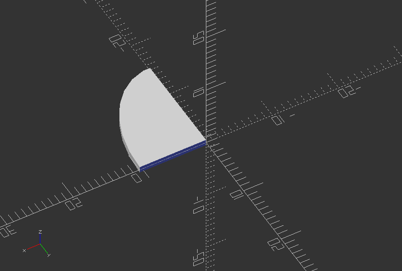
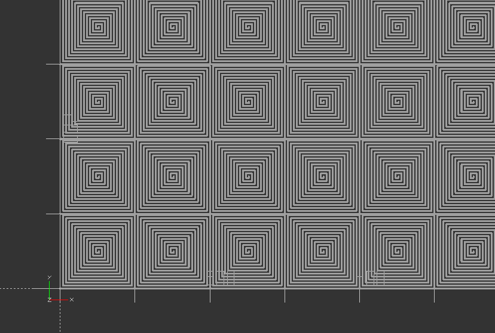
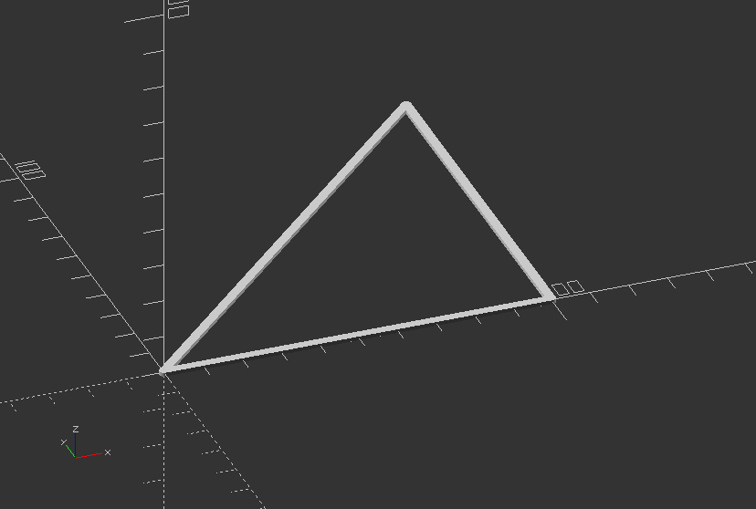
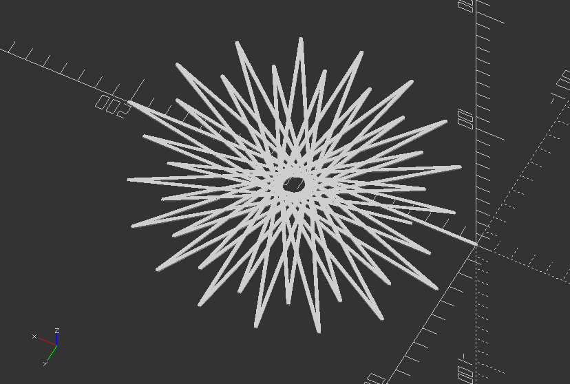
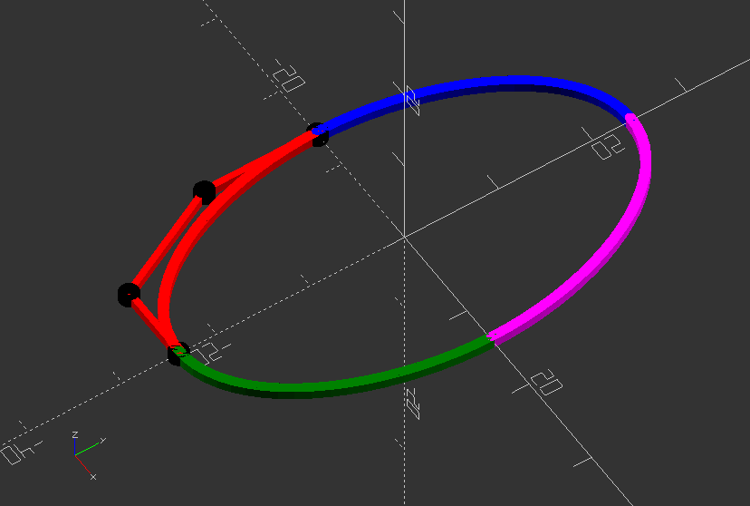
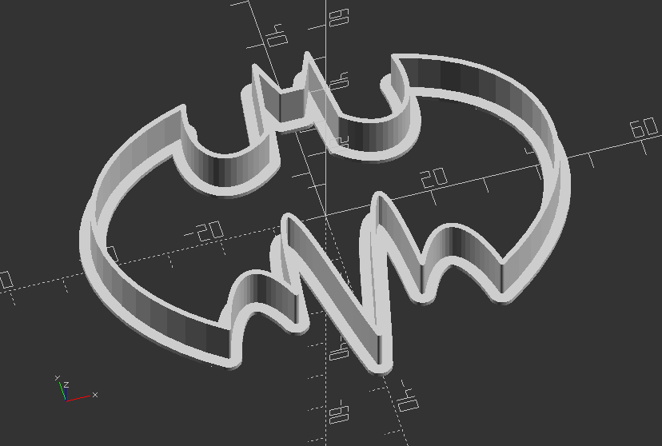

## 3.2. 2D Shapes

##### **Create an extruded ngon ring shapes**

`height=3; //Height of z extrusion`

`outerSize=20; //Outer diameter`

`innerSize=18; //Inner diameter`

`corners=6;`

`module ngonRing(innerSize, outerSize, height, corners) {`

`linear_extrude(height)`

`difference() {`

`circle(outerSize, $fn=corners);`

`circle(innerSize, $fn=corners);`

`}`

`}`

`ngonRing(innerSize, outerSize, height, corners);`

---

##### **Create a complex round shape**

`function circle(radius) = [for(phi=[0:1:720])[radius*cos(phi/2), radius*sin(phi)]];`

`color("red") polygon(circle(20));`

---

##### **Create a rounded square**

`size=[20, 20]; //Dedicated by x and y position`

`radius=5; //Dedicated smoothness of rounded edge`

`module roundedSquare(size, r=radius) {`

`minkowski() {`

`square([size[0]-radius*2, size[1]-radius*2], center=true);`

`circle(r=radius);`

`}`

`}`

`roundedSquare(size, r=radius);`

---

##### **Create a ngon, a 2D shape with variable of n sides and a customized radius**

`sides = 8;`

`radius = 20;`

`// The orientation might change with the implementation of circle...`

`module ngon(sides, radius, center=false){`

`rotate([0, 0, 360/sides/2]) circle(r=radius, $fn=sides);`

`}`

`ngon(sides, radius, center=false);`

---

##### **Create an ellipse, that can be quartered**

`width=20; //Size in x`

`height=30; //Size in y`

`numQuarters=1; //1-4 for each quarter`

`module ellipse(width, height) {`

`scale([1, height/width, 1]) circle(r=width/2);`

`}`

`module ellipsePart(width,height,numQuarters) {`

`o = 1; //slight overlap to fix a bug`

`difference() {`

`ellipse(width,height);`

`if(numQuarters <= 3)`

`translate([0-width/2-o, 0-height/2-o, 0]) square([width/2+o, height/2+o]);`

`if(numQuarters <= 2)`

`translate([0-width/2-o, -o, 0]) square([width/2+o, height/2+o*2]);`

`if(numQuarters < 2)`

`translate([-o, 0, 0]) square([width/2+o*2, height/2+o]);`

`}`

`}`

`ellipsePart(width, height, numQuarters);`

---

##### **Create a turtle spiral shape**

`function turtle(x, y, angle) = [[x, y], angle];`

`//The forward function results in moving the turtle over distance where the new x and y position of the turtle are calculated of the turtle (turtle[1]) remains the same`

`function forward(turtle, length) = turtle(turtle[0][0] + length * cos(turtle[1]), turtle[0][1] + length * sin(turtle[1]), turtle[1]);`

`//The turn function results in a new orientation of the turtle where angle is added to the old orientation to determine the new orientation. The position of the turtle remains the same.`

`function turn(turtle, angle) = [turtle[0], turtle[1] + angle];`

`//The move_the_turtle module recursive moves along a path that is determined by length, angle and lines length and angle may change in the recursive module lines determines the number of lines drawn by the turtle.`

`module move_the_turtle(turtle, length, angle, lines, line_width){`

`if ( lines > 0 ) {`

`new_turtle_forwarded = forward(turtle,length);`

`line(turtle[0],new_turtle_forwarded[0],line_width);`

`new_turtle_turned = turn(new_turtle_forwarded,angle);`

`move_the_turtle(new_turtle_turned, length-2, angle, lines-1, line_width);`

`}`

`}`

Create a turtle t using the modules above with start in the origin with angle 0 degrees:

`t1 = turtle(0, 0, 0);`

`linear_extrude(height=2.5)`

`for (i=[0:7]) {`

`for (j=[0:7]) {`

`translate([length*i, length*j, 0]) move_the_turtle(t1,length, 90, 50, line_width);`

`}`

`}`

Create a triangle with the modules above:

`t2 = forward(t1, length);`

`line(t1[0], t2[0], line_width);`

`t3 = forward(turn(t2, 90), length);`

`line(t2[0], t3[0], line_width);`

`t4 = forward(turn(t3,135), sqrt(2)*length);`

`line(t3[0], t4[0], line_width);`

Create a turtle start with the modules above:

`move_the_turtle(t1, 200, 170, 36, 1);`

---

##### **Polyline: Demonstration of symmetrical poly (cubic) beziers**

`//The four black dots are the control points of the red bezier. The complete control the shape of the figure. The four beziers are connected with each other though their end points.`

`$fn=50;`

`//Intersection points on the x- and y-axis determine the position of the end points on these axis. Change these values to model the curve.`

`x_intersection = -14;`

`y_intersection = -24;`

`//The points of bezier1 are brought on the straight line to ensure that all curves are tangent.`

`bezier1=[[0,y_intersection],[-8,y_intersection],[x_intersection,-12],[x_intersection,0]];`

`//w determines the width of the line (thickness of the surface)`

`w = 0.5; //[0.5:3]`

`//deltat determines the stepsize of the 'running variable' t.`

`//The smaller the step the smoother the curve`

`deltat = 0.05;`

`//Cubic bezier function`

`function cubic_bezier(points) = [for (t=[0:deltat:1+deltat]) pow(1-t,3)*points[0]+3*pow((1-t),2)*t*points[1]+3*(1-t)*pow(t,2)*points[2]+pow(t,3)*points[3]];`

`//Module of the polyline`

`module line(p1, p2, w) {`

`hull() {`

`translate(p1) circle(r=w, $fn=20);`

`translate(p2) circle(r=w, $fn=20);`

`}`

`}`

`//Using the, slightly modified, polyline module from JustinSDK (thanks Justin Lin). See his documentation here: https://openhome.cc/eGossip/OpenSCAD/Polyline.html. It's good reading.`

`module polyline(points, index, w) {`

`if(index < len(points)) {`

`line(points[index - 1], points[index], w);`

`polyline(points, index + 1, w);`

`}`

`}`

`//This module make the help-lines and the control points visible`

`module control_points(bezier1) {`

`color("red") polyline(bezier1, 1, w/1.5);`

`for (i=[0:len(bezier1)-1] ) {`

`color("black") translate(bezier1[i]) circle(r=1);`

`}`

`}`

`//Create four beziers just by using the mirror function of OpenSCAD all beziers are given a`

`//different color to separate them.`

`control_points(bezier1);`

`//Use hull to make a closed shape`

`//hull(){`

`union() {`

`color("red") polyline(cubic_bezier(bezier1),1,w);`

`color("blue") mirror([0, 1, 0]) polyline(cubic_bezier(bezier1), 1, w);`

`color("green") mirror([1, 0, 0]) polyline(cubic_bezier(bezier1), 1, w);`

`color("magenta") mirror([0, 1, 0]) mirror([1, 0, 0]) polyline(cubic_bezier(bezier1), 1, w);`

`}`

`//}`

---

##### **Polyline: Create a Batman cookie cutter**

`//Increase the default surface resolution`

`$fn=50;`

`//Creates lists of points used as line and control points for bezier curves`

`poly1 = [[0, 22], [2, 22], [5, 29], [7, 14]];`

`bezier1 = [poly1[3], [15, 7], [23, 12], [20, 24]];`

`bezier2 = [bezier1[3], [50, 16], [50, -10], [26, -26]];`

`bezier3 = [bezier2[3], [23, -14], [17, -11], [12, -22]];`

`bezier4 = [bezier3[3], [9, 16], [5, -18], [0, -35]];`

`//w determines the width of the line (thickness of the surface)`

`w = 0.5; //[0.5:3]`

`//deltat determines the stepsize of the 'running variable' t. The smaller the step the smoother the curve`

`deltat = 0.05;`

`function cubic_bezier(points) = [for (t=[0:deltat:1+deltat]) pow(1-t,3)*points[0]+3*pow((1-t),2)*t*points[1]+3*(1-t)*pow(t,2)*points[2]+pow(t,3)*points[3]];`

`//Module that creates a line from`

`module line(p1, p2, w) {`

`hull() {`

`translate(p1) circle(r=w, $fn=20);`

`translate(p2) circle(r=w, $fn=20);`

`}`

`}`

`//This module make the help-lines and the control points visible`

`module control_points(bezier1) {`

`color("red") polyline(bezier1, 1, w/1.5);`

`for (i=[0:len(bezier1)-1] ) {`

`color("black") translate(bezier1[i]) circle(r=1);`

`}`

`}`

`/*Using the, slightly modified, poyline module from JustinSDK (thanks Justin Lin). See his documentation here: https://openhome.cc/eGossip/OpenSCAD/Polyline.html. It's good read. */`

`module polyline(points, index, w) {`

`if(index < len(points)) {`

`line(points[index - 1], points[index], w);`

`polyline(points, index+1, w);`

`}`

`}`

`//Module that creates one half of the shape`

`module half_bat() {`

`polyline(poly1, 1, w);`

`color("red") polyline(cubic_bezier(bezier1), 1, w);`

`color("blue") polyline(cubic_bezier(bezier2), 1, w);`

`color("magenta") polyline(cubic_bezier(bezier3), 1, w);`

`color("green") polyline(cubic_bezier(bezier4), 1, w);`

`}`

`//Module that mirrors the half into a full shape`

`module bat_logo() {`

`half_bat();`

`mirror([1, 0, 0]) half_bat();`

`}`

`//Uncomment to visualize all control points of bezier curve`

`//control_points(bezier1);`

`//control_points(bezier2);`

`//control_points(bezier3);`

`//control_points(bezier4);`

`//Create the cutter out of 2 shapes`

`union() {`

`//Create on bat logo with extruded 1 mm thickness and an offset width of 2`

`translate([0, 0, 0])`

`linear_extrude(1)`

`offset(2)`

`bat_logo();`

`//Extrude another bat logo with 1 mm width and 10 mm height/thickness`

`linear_extrude(10)`

`bat_logo();`

`}`

---
