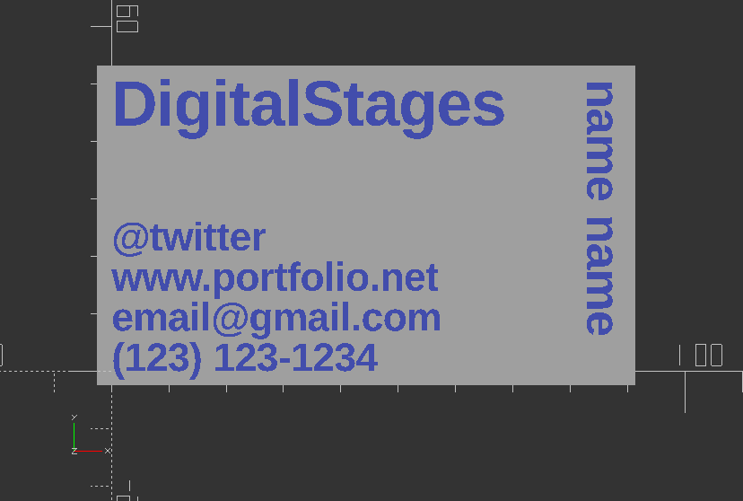
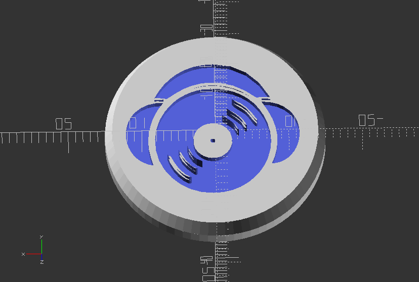
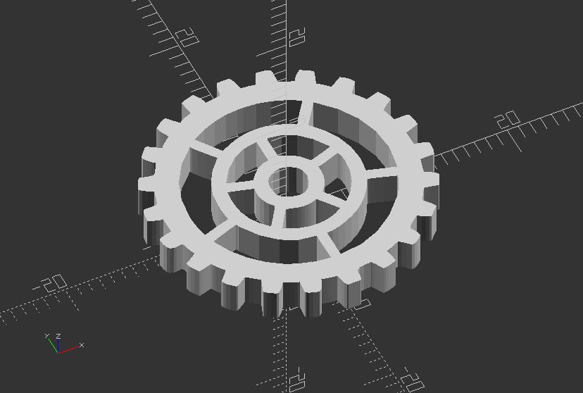

## 3.3. Text

##### **Build a Business card**

`//This is the size of a normal card, but padding will be added to the sides and height if set`

`card_width = 88.9;`

`card_height = 50.8;`

`card_thickness = .5;`

`padding_sides = 5;`

`padding_height = 5;`

`//Font and fonts thickness`

`text_thickness = 1;`

`font = "Liberation Sans:style=Bold";`

`//Text for name`

`name = "name name";`

`name_text_size = 6;`

`name_taken = "true";`

`//Text for contact details`

`twitter = "@twitter";`

`website = "www.portfolio.net";`

`email = "email@gmail.com";`

`phone = "(123) 123-1234";`

`contact_font_size= 5;`

`contact_info_taken = "true";`

`//Order of info`

`order_twitter = 3;`

`order_google = 2;`

`order_email = 1;`

`order_phone = 0;`

`spacing = 2;`

`//Text for company name`

`company_name = "DigitalStages";`

`company_name_font_size = 8;`

`company_name_taken = "true";`

`//Module for base of card`

`module base() {`

`translate([-padding_sides/2, -padding_height/2, 0]) cube([card_width+padding_sides, card_height+padding_height, card_thickness]);`

`}`

`//Module for Company name`

`module company() {`

`translate([0, card_height-company_name_font_size, text_thickness/2]) {`

`linear_extrude(text_thickness) text(company_name, font=font , size=company_name_font_size);`

`}`

`}`

`//Module for Name`

`module name() {`

`translate([card_width-name_text_size, card_height, text_thickness/2]) {`

`linear_extrude(text_thickness) rotate([0, 0, -90]) text(name, font=font , size=name_text_size);`

`}`

`}`

`//Module for Twitter Details`

`module twitter() {`

`translate([0, order_twitter*contact_font_size+(spacing*order_twitter), text_thickness/2]) {`

`linear_extrude(text_thickness) text(twitter, font=font , size=contact_font_size);`

`}`

`}`

`//Module for Website`

`module website() {`

`translate([0, order_google*contact_font_size+(spacing*order_google), text_thickness/2]) {`

`linear_extrude(text_thickness) text(website, font=font , size=contact_font_size);`

`}`

`}`

`//Module for Email`

`module email() {`

`translate([0, order_email*contact_font_size+(spacing*order_email), text_thickness/2]) {`

`linear_extrude(text_thickness) text(email, font=font , size=contact_font_size);`

`}`

`}`

`//Phone`

`module phone() {`

`translate([0, order_phone*contact_font_size+(spacing*order_phone), text_thickness/2]) {`

`linear_extrude(text_thickness) text(phone, font=font , size=contact_font_size);`

`}`

`}`

`//Module for Contact block`

`module contact_info() {`

`twitter();`

`website();`

`email();`

`phone();`

`}`

`difference() {`

`base();`

`translate([0,0,-card_thickness]) union() {`

`contact_info();`

`company();`

`name();`

`}`

`}`

`//company name taken`

`if (company_name_taken=="false") {`

`translate([0, 0, -card_thickness]) company();`

`}`

`//contact info taken`

`if (name_taken=="false") {`

`translate([0, 0, -card_thickness]) name();`

`}`

`//name taken`

`if (contact_info_taken=="false") {`

`translate([0, 0, -card_thickness]) contact_info();`

`}`

---

##### **Use icon font to create a nice buttons for your jacket**

Keep in mind, you need to install the font [DJ Icons](files/DJIcons.ttf) on your system first, or use Font Importer script in files!

`font="DJ Icons";`

`string="k";`

`size=20;`

`cutIn=1;`

`transX=0;`

`transY=0;`

`union() {`

`difference() {`

`//Create basic button`

`union() {`

`translate([0,0,2])`

`cylinder(h=2,d=30,$fn=80);`

`cylinder(h=2,d1=28,d2=30,$fn=80);`

`}`

`//Use text with icon font an cutout extruded text graphic with difference`

`translate([transX,transY,-1])`

`linear_extrude(cutIn+1)`

`text(string,font=font,size=size,halign="center",valign="center");`

`}`

`//Create stitch hole`

`translate([0,0,5])`

`rotate([0,90,0])`

`difference() {`

`cylinder(h=4,d=5,center=true,$fn=20);`

`cylinder(h=5,d=2.5,center=true,$fn=20);`

`}`

`}`

---

##### **Use icon font to create a gear elements**

Keep in mind, you need to install the font [Gear Icons](files/GearsIcons.otf) on your system first, or use Font Importer script in files!\*

`font="Gears Icons";`

`string="n";`

`size=25;`

`height=3;`

`linear_extrude(height)`

`text(string, font=font, size=size, halign="center", valign="center");`

---