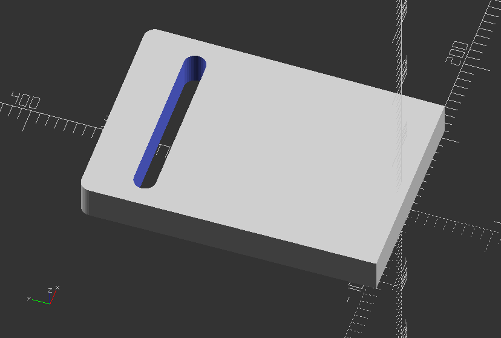
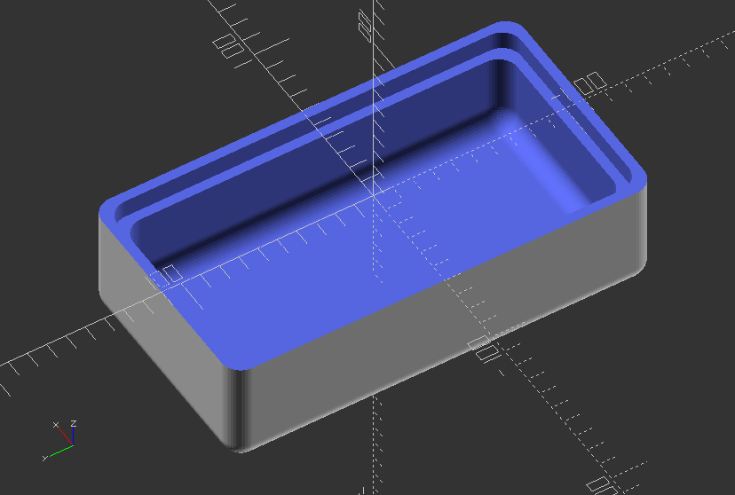

## 3.4. Transformation

##### **Use hull to create a simple slot**

`//Simple slot with hull`

`difference() {`

`hull() {`

`translate([100, 0, 20])`

`cube([20, 20, 40], center=true);`

`translate([-100, 0, 20])`

`cube([20, 20, 40], center=true);`

`translate([100, 300, 20])`

`cylinder(h=40, r=12, center=true);`

`translate([-100, 300, 20])`

`cylinder(h=40, r=12, center=true);`

`}`

`hull() {`

`translate([80, 250, 20])`

`cylinder(h=40, r=12, center=true);`

`translate([-80, 250, 20])`

`cylinder(h=40,r=12, center=true);`

`}`

`}`

---

##### **Use minkowski to create an enclosure**

`$fn=50;`

`difference() {`

`minkowski() {`

`cube([100,200,100], center=true);`

`sphere(10);`

`}`

`//Chop off the top`

`translate([0,0,50]) cube([130,230,100], center=true);`

`//Hollow inside`

`minkowski() {`

`cube([80,180,80], center=true);`

`sphere(10);`

`}`

`translate([0,0,-10]) {`

`linear_extrude(100) {`

`minkowski() {`

`square([90,190], center=true);`

`circle(10);`

`}`

`}`

`}`

`}`

---
