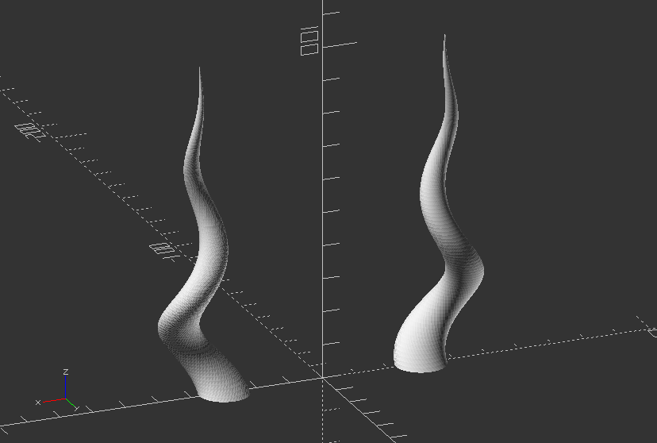
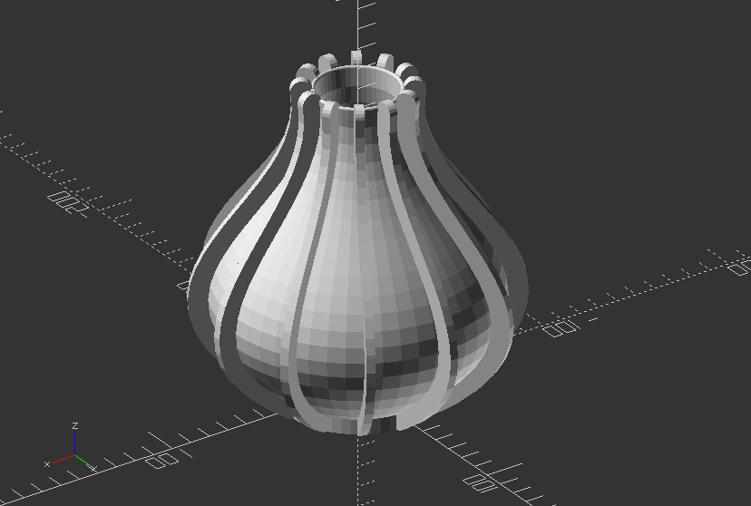
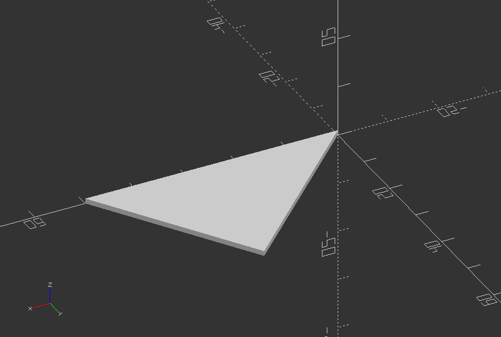

## 3.5. Extrusion

##### **Create twisted horns**

`//Create horns out ouf a twisted translated circle`

`module horn(height=100,radius=30,twist=720,$fn=50) {`

`radius=radius/4;`

`translate([-radius, 0]) //Translate only in 2D`

`linear_extrude(height=height, twist=twist, scale=0, $fn=$fn)`

`translate([radius, 0]) //Translate only in 2D`

`circle(r=radius);`

`}`

`//Now create 2 horn, while one is mirrored, thus creating symmetrical pair`

`translate([30, 0])`

`mirror([1, 0, 0])`

`horn();`

`translate([-30, 0])`

`horn();`

---

##### **Create vase through rotational extrusion**

`//radius determines the size of the base of the vase`

`radius = 30;`

`//three points (p0, p1, p2) needed to create the quadratic Bezier curve`

`//four points (p0, p1, p2, p3) needed to create the cubic Bezier curve`

`p0 = [radius,0];`

`//as an exercise increment the y value of p1 (e.g in steps of 3)`

`p1 = [120,60];`

`p2 = [10,90];`

`p3 = [20,150];`

`//w determines the width of the line (thickness of the surface)`

`w = 5; //[0.5:3]`

`//deltat determines the stepsize of the 'running variable' t. The smaller the step the smoother the curve`

`deltat = 0.05;`

`//Create function for bezier curves`

`function bezier(p0, p1, p2) = [for (t=[0:deltat:1+deltat]) pow(1-t, 2)*p0+2*(1-t)*t*p1+pow(t, 2)*p2];`

`function cubic_bezier(p0, p1, p2, p3) = [for (t=[0:deltat:1+deltat]) pow(1-t, 3)*p0+3*pow((1-t), 2)*t*p1+3*(1-t)*pow(t, 2)*p2+pow(t, 3)*p3];`

`//Create module for polyline`

`module line(p1, p2, w) {`

`hull() {`

`translate(p1) circle(r=w, $fn=20);`

`translate(p2) circle(r=w, $fn=20);`

`}`

`}`

/\*using the, slightly modified, polyline module from JustinSDK (thanks Justin Lin). See his documentation here: <https://openhome.cc/eGossip/OpenSCAD/Polyline.html>. It's good reading. \*/

`module polyline(points, index, w) {`

`if(index < len(points)) {`

`line(points[index - 1], points[index], w);`

`polyline(points, index + 1, w);`

`}`

`}`

`//Now create the actual profile shape`

`for (i=[1:30:360]) {`

`rotate([0, 0, i])`

`rotate([90, 0, 0])`

`linear_extrude(4)`

`translate([w, 0, 0])`

`polyline(cubic_bezier(p0, p1, p2, p3), 1, w);`

`}`

`//uncomment lines below to create a vase`

`translate([0, 0, -5]) cylinder(r=radius+w, h=9, $fn=50);`

`rotate_extrude($fn=50)`

`//polyline(bezier(p0, p1, p2), 1, w);`

`polyline(cubic_bezier(p0, p1, p2, p3), 1, 1);`

---

##### **Create a simple triangular prism**

`module triangle_prism(b, d, h, ht, sc) {`

`linear_extrude(height=ht, scale=sc)`

`polygon(points=[[0, 0], [b, 0], [d, h]]);`

`}`

`triangle_prism(50, 30, 30, 1, 1);`

---
