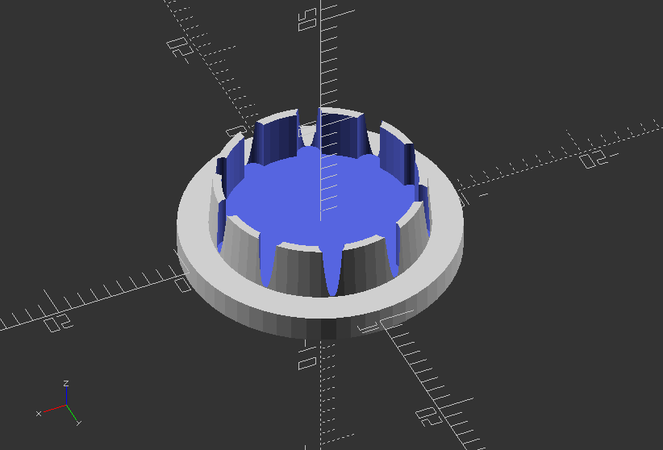

## 3.6. Modules

#### **Object Modules**

---

##### **Recursive Module: Create a simple tree**

`module simple_tree(size, dna, n) {`

`if (n > 0) {`

`// trunk`

`color("brown")`

`cylinder(r1=size/10, r2=size/12, h=size, $fn=24);`

`// branches`

`translate([0,  0,  size])`

`for(bd = dna) {`

`angx = bd[0];`

`angz = bd[1];`

`scal = bd[2];`

`rotate([angx, 0, angz])`

`simple_tree(scal*size, dna, n-1);`

`}`

`}`

`else // leaves`

`color("green")`

`scale([1, 1, 3])`

`translate([0,  0,  size/6])`

`rotate([90, 0, 0])`

`cylinder(r=size/6, h=size/10);`

`}`

`// dna is a list of branching data bd of the tree:`

`//bd[0] - inclination of the branch`

`//bd[1] - Z rotation angle of the branch`

`//bd[2] - relative scale of the branch`

`dna = [ [12, 80, 0.85], [55,0, 0.6], [62, 125, 0.6], [57, -125, 0.6] ];`

Module call:

`simple_tree(50, dna, 5);`

---

##### **Object Module: Create a little mug**

`module mug(width, height, bottom_thickness=2, wall_thickness=5) {`

`r_of_inside=width/2-wall_thickness;`

`difference() {`

`translate([0, 0, height/2])`

`intersection() {`

`cube([width, width, height], center=true);`

`scale([1, 1,  height/width])`

`sphere(width/2 * sqrt(2));`

`}`

`translate([0,0,bottom_thickness])`

`cylinder(r=r_of_inside, h=height+0.1);`

`}`

`}`

Call the mug module:

`mug(30, 60);`

---

##### **Object Module: Create a compression cover**

`//outer dia of rod to create cap ID`

`rod_od = 20.0;`

`//thickness of cap in mm (each side)`

`rod_id = 15.6;`

`//height of cap in mm`

`cap_high = 2.0;`

`//tapper of opening in mm`

`cap_tapper = 0.3;`

`//cuts in lip for compression`

`cuts = 10.0;`

`main_module();`

`module main_module() { //create module`

`difference() {`

`union() { //start union`

`//create base cap`

`translate ([0,0,0])`

`rotate ([0,0,0])`

`cylinder(cap_high, (rod_od)/2, (rod_od)/2, $fn=60, true);`

`//create tappered plug`

`translate ([0, 0, (cap_high*1.5)]) rotate ([0, 0, 0]) cylinder(cap_high*2, (rod_id)/2, (rod_id-(cap_tapper*2))/2, $fn=60, true);`

`} //end union`

`//start subtraction of difference`

`// create opening for compression`

`translate ([0,0,(cap_high*1.5)+0.1 ]) rotate ([0,0,0]) cylinder(cap_high*2,(rod_id-(cap_tapper*6))/2, (rod_id-(cap_tapper*6))/2, $fn=60, true);`

`//create pattern for compression lip`

`for (i=[0360/cuts):360]) {`

`//theta is degrees set by for loop from 0 to 360 (degrees)`

`theta=i;`

`//this sets the x axis point based on the COS of the theta`

`x = 0+((rod_id/2)-((cap_tapper*3)))*cos(theta);`

`//this sets the y axis point based on the sin of the theta`

`y = 0+((rod_id/2)-((cap_tapper*3)))*sin(theta);`

`//this creates the circle or other object at the x,y point`

`translate([x, y, ((cap_high*1.5) +.1)]) cylinder(cap_high*2, (cap_tapper*6)/2, (cap_tapper*6)/2, $fn=60, true);`

`}//end for loop for circle creation`

`} //end difference`

`}//end module`

---

##### **Object Module: Create keyholes for screws**

`module keyhole_mount(thickness, screw_size=3, head_size=6) {`

`union() {`

`//Keyhole cutout`

`translate([0, 0, -0.1])`

`{`

`linear_extrude(thickness) {`

`hull() {`

`//circle(screw_size/2, $fn=25);`

`//translate([head_size, 0]) circle(screw_size/2, $fn=25);`

`}`

`translate([head_size, 0]) circle(head_size/2, $fn=25);`

`}`

`}`

`//Detent`

`translate([0, 0, thickness/2])`

`{`

`linear_extrude(thickness) {`

`hull() {`

`circle(head_size/2+head_size/8, $fn=25);`

`translate([head_size, 0]) circle(head_size/2+head_size/8, $fn=25);`

`}`

`translate([head_size, 0]) circle(head_size/2, $fn=25);`

`}`

`}`

`}`

`}`

`//Now implement the keyhole_mount into a board`

`difference()` `{`

`cube([50, 200, 2]);`

`translate([15, 20, 0]) keyhole_mount(2);`

`translate([15, 180, 0]) keyhole_mount(2);`

`}`

---

#### **Operational Modules**

---

##### **Operational Module: Linear array in one direction >> x: 0, y: 1, z: 2**

`module linear_array(axis, count, distance) {`

`if(axis==0) {`

`for(i=[0:1:count-1]) {`

`translate([distance*i,0,0])`

`children();`

`}`

`}`

`if(axis==1) {`

`for(i=[0:1:count-1]) {`

`translate([0,distance*i,0])`

`children();`

`}`

`}`

`if(axis==2) {`

`for(i=[0:1:count-1]) {`

`translate([0,0,distance*i])`

`children();`

`}`

`}`

`}`

`//Move some spheres into z - axis`

`linear_array(2, 5, 40) sphere(20);`

---

##### **Operational Module: Linear array n all 3 dimensions, use 1 on one axis to make it rectangular**

`module cubic_array(x, y, z, distance_x, distance_y, distance_z) {`

`for(i=[0:1:x-1]) {`

`for(j=[0:1:y-1]) {`

`for(k=[0:1:z-1]) {`

`translate([distance_x*i, distance_y*j, distance_z*k])`

`children();`

`}`

`}`

`}`

`}`

`//Implement a cube of cubes`

`cubic_array(10, 10, 10, 20, 20, 20) cube(17);`

---

##### **Operational Module: Rotational array that uses center=true/false to change the tilt of each object around the circle**

`//Use axis to set the axis of circulation >> x: 0, y: 1, z: 2 - whereas z axis has a bug to be solved`

`module polar_array(radius, count, axis) {`

`for(i=[0:360/count:360]) {`

`if(axis==0) {`

`rotate([i, 0, 0])`

`translate([0, radius, 0])`

`children();`

`}`

`if(axis==1) {`

`rotate([0, i, 0])`

`translate([radius, 0, 0])`

`children();`

`}`

`if(axis==2) {`

`rotate([90, 0, i])`

`translate([ 0, 0, radius])`

`children();`

`}`

`}`

`}`

`//Revolve it!`

`polar_array(80, 20, 0) cylinder(h=20, r=10, center=true, $fn=30);`

---

