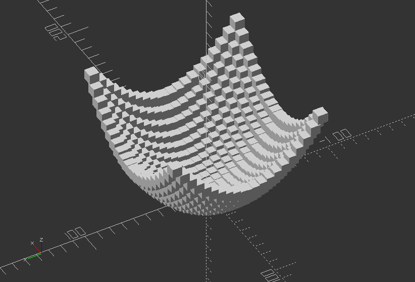
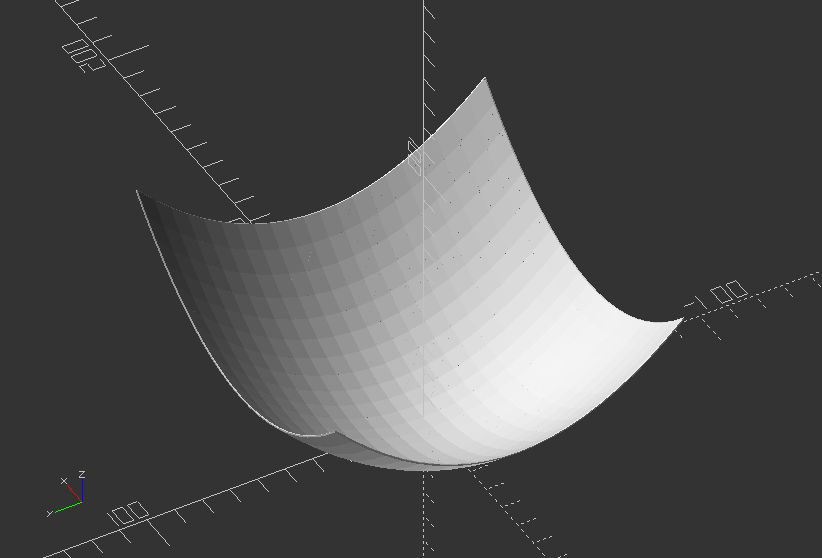
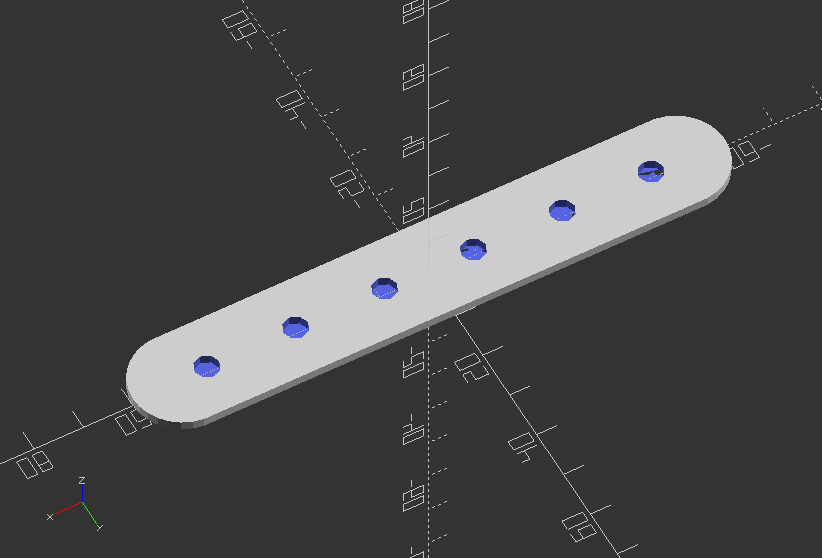

## 3.7. Loops

##### **Wave model 1 >> Creating wavy design with cubes by using a function**

`cube_size=2;`

`h_div=20;`

`step=0.1;`

`to=15;`

`//Function that takes x and y steps in and get step for z out`

`function f(p, q) = (p * p + q * q) / h_div;`

`//Loop through each cube and position it according to the resulting x, y, z values`

`scale(4)`

`for(a=[-1:step:1], b=[-1:step:1]) {`

`x=a*to;`

`y=b*to;`

`translate([x,y,f(x,y)])`

`cube(cube_size, center=true);`

`}`

---

##### **Wave model 2 >> Creating wavy design with cubes by using a function**

`h_div=30;`

`step=0.1;`

`to=15;`

`//Function that takes x and y steps in and get step for z out`

`function f(p,q) = (p * p + q * q) / h_div;`

`//Loop through each cube and position it according to the resulting x,y,z values`

`scale(4)`

`for(a=[-1:step:1], b=[-1:step:1]) {`

`//Create x and y values via for() loop index`

`x = a * to;`

`y = b * to;`

`//x plus step`

`xps = (a + step) * to;`

`//y plus step`

`yps = (b + step) * to;`

`//Create a lower triangle from the cubes via hull transformation`

`hull() {`

`//now create a cube and move it to the resulting position`

`//(x, y)`

`translate([x, y, f(x, y)])`

`cube(size=step, center=true);`

`//(x, y + step)`

`translate([x, yps, f(x, yps)])`

`cube(size=step, center=true);`

`//(x+step,y)`

`translate([xps, y, f(xps, y)])`

`cube(size=step, center=true);`

`}`

`//Create the upper triangle from the cubes via hull transformation`

`hull() {`

`//now create a cube and move it to the resulting position`

`//(x, y)`

`translate([xps, yps, f(xps, yps)])`

`cube(size=step, center=true);`

`//(x, y + step)`

`translate([x, yps, f(x, yps)])`

`cube(size=step, center=true);`

`//(x + step, y)`

`translate([xps, y, f(xps, y)])`

`cube(size=step, center=true);`

`}`

`}`

---

##### **Loops: Create a slot with drill holes**

`width=20;`

`length=100;`

`height=2;`

`hole_size=5;`

`hole_dist=18;`

`module holeySlot(width, height, length, hole_size, hole_dist) {`

`difference() {`

`hull() {`

`for(i=[-length/2, length/2])`

`translate([i, 0, 0]) cylinder(d=width, h=height);`

`}`

`for(j=[-length/2+width/4:hole_dist:length/2-width/4])`

`translate([j,0,0]) cylinder(d=hole_size, h=20);`

`}`

`}`

`holeySlot(width, height, length, hole_size, hole_dist);`

---
