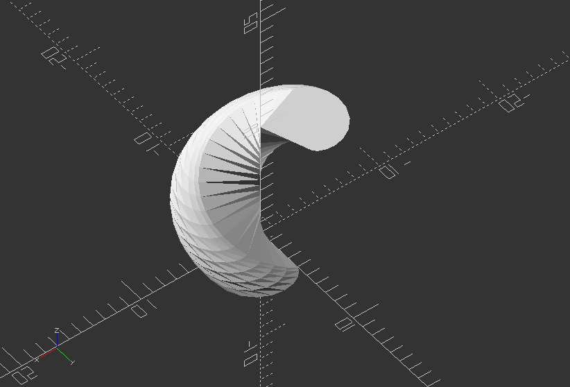

## 3.8. Math

##### **Math: Create mathematical knots**

`//Random point`

`p0 = [-4, 0, 50];`

`p1 = [2, 7, 4];`

`p2 = [6, 12, 8];`

`p3 = [8, 24, 26];`

`p4 = [10, 12, -12];`

`//Create a vector list from random points`

`points = [p0, p1, p2, p3, p4];`

`//Radius of the knot`

`w = 18;`

`//Well it's pi (or at least an approximation, what can I say.`

`pi = 3.1418;`

`//Constant to convert degrees to radians`

`//See functions sinr(x) and cosr(x)`

`m = 180/pi;`

`//Line module draws a 3D line from p1 to p2`

`module line(p1, p2, w) {`

`hull() {`

`translate(p1) sphere(r=w,$fn=20);`

`translate(p2) sphere(r=w,$fn=20);`

`}`

`}`

`//Polyline is a recursive module that to draw lines between all points in de list of points.`

`module poly3Dline(points, index, w) {`

`if(index < len(points)) {`

`//color([(index/90)%1,(index/45)%1,(index/30)%1]) //change color`

`line(points[index - 1], points[index], w);`

`poly3Dline(points, index + 1, w);`

`}`

`}`

`//Convert sine function from degrees to radians`

`function sinr(x) = sin(m * x);`

`//Convert cosine function from degrees to radians`

`function cosr(x) = cos(m * x);`

`//Knot created by Paul Bourke (knot 4) where beta runs between 0 and pi`

`//Please note that Paul Bourke formula's are in radians`

`function paulBourkeKnot(beta) = let (r = 100 * (0.8 + 1.6 * sinr(6 * beta)), theta = 2 * beta, phi = 0.6 * pi * sinr(12 * beta), x = r * cosr(phi) * cosr(theta), y = r * cosr(phi) * sinr(theta), z = r * sinr(phi) [x,y,z];`

`//The simplest non-trivial knot the Trefoil knot`

`function trefoilKnot(t) = let (x = sin(t) + 2 * sin(2*t), y = cos(t) - 2 * cos(2*t), z = -sin(3*t)) [x,y,z];`

`//The figure-eight knot`

`function figureEightKnot(t) = let (x = (2 + cos(2*t)) * cos(3*t), y = (2 + cos(2*t)) * sin(3*t), z = -sin(4*t)) [x,y,z];`

`//Uncomment function below to get the points for the trefoilKnot`

`function collectKnotPoints() = [for (i = [0:2:360]) 30 *trefoilKnot(i)];`

`//Uncomment function below to get the points for the figureEightKnot`

`//function collectKnotPoints() = [for (i = [0:2:360]) 30 * figureEightKnot(i)];`

`//Uncomment this function to generates point for the Paul Bourke Knot (knot 4)`

`//function collectKnotPoints() = [for (i = [0:pi/400:pi+pi/400]) paulBourkeKnot(i)];`

`poly3Dline(collectKnotPoints(), 1, w);`

---

##### **Math: Create several shape (explained below) with mathematical basic functions provided by OpenSCAD**

`// An EPITROCHOID is a curve traced by a point fixed at a distance "d" to the center of a circle of radius "r" as the circle rolls outside another circle of radius "R".`

`// An HYPOTROCHOID is a curve traced by a point fixed at a distance "d" to the center of a circle of radius "r" as the circle rolls inside another circle of radius "R".`

`// An EPICYCLOID is an epitrochoid with d = r.`

`// An HYPOCYCLOID is an hypotrochoid with d = r.`

`// See http://en.wikipedia.org/wiki/Epitrochoid and http://en.wikipedia.org/wiki/Hypotrochoid`

`// Beware the polar forms of the equations on Wikipedia...`

`// They are correct, but theta is measured to the center of the small disk!!`

`// There are several different methods for extruding. The best are probably the ones using linear extrude.`

`//===========================================`

`// Demo - draws one of each, plus some little wheels and sticks.`

`// Fun stuff to try:`

`// Animate, try FPS = 5 and Steps = 200`

`// R = 2, r = 1, d = 0.2`

`// R = 4, r = 1, d = 1`

`// R = 2, r = 1, d = 0.5`

`// What happens when you make d > r ??`

`// What happens when d < 0 ??`

`// What happens when r < 0 ??`

`//===========================================`

`//Set basic variables for all examples - Uncomment these for every example`

`$fn = 30;`

`thickness = 10;`

`R = 4;`

`r = 1;`

`d = 1;`

`n = 60; // number of wedge segments`

`alpha = 360*$t;`

`p = 16;`

`rb = 30;`

`twist = 250;`

`Create module for an Epitrochoid:`

`module epitrochoid(R, r, d, n, thickness) {`

`dth = 360/n;`

`for ( i = [0:n-1] ) {`

`polyhedron(points = [[0,0,0],`

`[(R+r)*cos(dth*i) - d*cos((R+r)/r*dth*i), (R+r)*sin(dth*i) - d*sin((R+r)/r*dth*i), 0],`

`[(R+r)*cos(dth*(i+1)) - d*cos((R+r)/r*dth*(i+1)), (R+r)*sin(dth*(i+1)) - d*sin((R+r)/r*dth*(i+1)), 0],`

`[0,0,thickness],`

`[(R+r)*cos(dth*i) - d*cos((R+r)/r*dth*i), (R+r)*sin(dth*i) - d*sin((R+r)/r*dth*i), thickness],`

`[(R+r)*cos(dth*(i+1)) - d*cos((R+r)/r*dth*(i+1)), (R+r)*sin(dth*(i+1)) - d*sin((R+r)/r*dth*(i+1)), thickness]],`

`faces = [[0, 2, 1], [0, 1, 3], [3, 1, 4], [3, 4, 5], [0, 3, 2], [2, 3, 5], [1, 2, 4], [2, 5, 4]]);`

`}`

`}`

`epitrochoid(R, r, d, n, thickness);`

---

##### **Create module for a Hypotrochoid:**

`module hypotrochoid(R, r, d, n, thickness) {`

`dth = 360/n;`

`for ( i = [0:n-1] ) {`

`polyhedron(points = [[0, 0, 0],`

`[(R-r)*cos(dth*i) + d*cos((R-r)/r*dth*i), (R-r)*sin(dth*i) - d*sin((R-r)/r*dth*i), 0],`

`[(R-r)*cos(dth*(i+1)) + d*cos((R-r)/r*dth*(i+1)), (R-r)*sin(dth*(i+1)) - d*sin((R-r)/r*dth*(i+1)), 0],`

`[0, 0, thickness],`

`[(R-r)*cos(dth*i) + d*cos((R-r)/r*dth*i), (R-r)*sin(dth*i) - d*sin((R-r)/r*dth*i), thickness],`

`[(R-r)*cos(dth*(i+1)) + d*cos((R-r)/r*dth*(i+1)), (R-r)*sin(dth*(i+1)) - d*sin((R-r)/r*dth*(i+1)), thickness]],`

`faces = [[0, 2, 1], [0, 1, 3], [3, 1, 4], [3, 4, 5], [0, 3, 2], [2, 3, 5], [1, 2, 4], [2, 5, 4]]);`

`}`

`}`

`hypotrochoid(R, r, d, n, thickness);`

---

##### **Create module for an Epitrochoid Wedge with Bore**

`module epitrochoidWBore(R, r, d, n, p, thickness, rb) {`

`dth = 360/n;`

`union() {`

`for ( i = [0:p-1] ) {`

`polyhedron(points = [[rb*cos(dth*i), rb*sin(dth*i),0],`

`[(R+r)*cos(dth*i) - d*cos((R+r)/r*dth*i), (R+r)*sin(dth*i) - d*sin((R+r)/r*dth*i), 0],`

`[(R+r)*cos(dth*(i+1)) - d*cos((R+r)/r*dth*(i+1)), (R+r)*sin(dth*(i+1)) - d*sin((R+r)/r*dth*(i+1)), 0],`

`[rb*cos(dth*(i+1)), rb*sin(dth*(i+1)), 0],`

`[rb*cos(dth*i), rb*sin(dth*i), thickness],`

`[(R+r)*cos(dth*i) - d*cos((R+r)/r*dth*i), (R+r)*sin(dth*i) - d*sin((R+r)/r*dth*i), thickness],`

`[(R+r)*cos(dth*(i+1)) - d*cos((R+r)/r*dth*(i+1)), (R+r)*sin(dth*(i+1)) - d*sin((R+r)/r*dth*(i+1)), thickness],`

`[rb*cos(dth*(i+1)), rb*sin(dth*(i+1)), thickness]],`

`faces = [[0, 1, 4], [4, 1, 5], [1, 2, 5], [5, 2, 6], [2, 3, 7], [7, 6, 2], [3, 0, 4], [4, 7, 3], [4, 5, 7], [7, 5, 6], [0, 3, 1], [1, 3, 2]]);`

`}`

`}`

`}`

`epitrochoidWBore(R, r, d, n, p, thickness, rb);`

---

##### **Create module for an Epitrochoid Wedge with Bore, Linear Extrude**

`module epitrochoidWBoreLinear(R, r, d, n, p, thickness, rb, twist) {`

`dth = 360/n;`

`linear_extrude(height = thickness, convexity = 10, twist = twist) {`

`union() {`

`for ( i = [0:p-1] ) {`

`polygon(points = [[rb*cos(dth*i), rb*sin(dth*i)],`

`[(R+r)*cos(dth*i) - d*cos((R+r)/r*dth*i), (R+r)*sin(dth*i) - d*sin((R+r)/r*dth*i)],`

`[(R+r)*cos(dth*(i+1)) - d*cos((R+r)/r*dth*(i+1)), (R+r)*sin(dth*(i+1)) - d*sin((R+r)/r*dth*(i+1))],`

`[rb*cos(dth*(i+1)), rb*sin(dth*(i+1))]],`

`paths = [[0, 1, 2, 3]], convexity = 10);`

`}`

`}`

`}`

`}`

`epitrochoidWBoreLinear(R, r, d, n, p, thickness, rb, twist);`

---

##### **Create module for an Epitrochoid Wedge, Linear Extrude**

`module epitrochoidLinear(R, r, d, n, p, thickness, twist) {`

`dth = 360/n;`

`linear_extrude(height = thickness, convexity = 10, twist = twist) {`

`union() {`

`for ( i = [0:p-1] ) {`

`polygon(points = [[0, 0],`

`[(R+r)*cos(dth*i) - d*cos((R+r)/r*dth*i), (R+r)*sin(dth*i) - d*sin((R+r)/r*dth*i)],`

`[(R+r)*cos(dth*(i+1)) - d*cos((R+r)/r*dth*(i+1)), (R+r)*sin(dth*(i+1)) - d*sin((R+r)/r*dth*(i+1))]],`

`paths = [[0, 1, 2]], convexity = 10);`

`}`

`}`

`}`

`}`

`epitrochoidLinear(R, r, d, n, p, thickness, twist);`

---

##### **Create module for a Hypotrochoid Wedge with Bore**

`module hypotrochoidWBore(R, r, d, n, p, thickness, rb) {`

`dth = 360/n;`

`union() {`

`for ( i = [0:p-1] ) {`

`polyhedron(points = [[rb*cos(dth*i), rb*sin(dth*i),0],`

`[(R-r)*cos(dth*i) + d*cos((R-r)/r*dth*i), (R-r)*sin(dth*i) - d*sin((R-r)/r*dth*i), 0],`

`[(R-r)*cos(dth*(i+1)) + d*cos((R-r)/r*dth*(i+1)), (R-r)*sin(dth*(i+1)) - d*sin((R-r)/r*dth*(i+1)), 0],`

`[rb*cos(dth*(i+1)), rb*sin(dth*(i+1)), 0],`

`[rb*cos(dth*i), rb*sin(dth*i), thickness],`

`[(R-r)*cos(dth*i) + d*cos((R-r)/r*dth*i), (R-r)*sin(dth*i) - d*sin((R-r)/r*dth*i), thickness],`

`[(R-r)*cos(dth*(i+1)) + d*cos((R-r)/r*dth*(i+1)), (R-r)*sin(dth*(i+1)) - d*sin((R-r)/r*dth*(i+1)), thickness],`

`[rb*cos(dth*(i+1)), rb*sin(dth*(i+1)), thickness]],`

`faces = [[0, 1, 4], [4, 1, 5], [1, 2, 5], [5, 2, 6], [2, 3, 7], [7, 6, 2], [3, 0, 4], [4, 7, 3], [4, 5, 7], [7, 5, 6], [0, 3, 1], [1, 3, 2]]);`

`}`

`}`

`}`

`hypotrochoidWBore(R, r, d, n, p, thickness, rb);`

---

##### **Create a Hypotrochoid Wedge with Bore, Linear Extrude**

`module hypotrochoidWBoreLinear(R, r, d, n, p, thickness, rb, twist) {`

`dth = 360/n;`

`linear_extrude(height = thickness, convexity = 10, twist = twist) {`

`union() {`

`for ( i = [0:p-1] ) {`

`polygon(points = [[rb*cos(dth*i), rb*sin(dth*i)],`

`[(R-r)*cos(dth*i) + d*cos((R-r)/r*dth*i), (R-r)*sin(dth*i) - d*sin((R-r)/r*dth*i)],`

`[(R-r)*cos(dth*(i+1)) + d*cos((R-r)/r*dth*(i+1)), (R-r)*sin(dth*(i+1)) - d*sin((R-r)/r*dth*(i+1))],`

`[rb*cos(dth*(i+1)), rb*sin(dth*(i+1))]],`

`paths = [[0, 1, 2, 3]], convexity = 10);`

`}`

`}`

`}`

`}`

`hypotrochoidWBoreLinear(R, r, d, n, p, thickness, rb, twist);`

---

##### **Create a Hypotrochoid Wedge**

`module hypotrochoidLinear(R, r, d, n, p, thickness, twist) {`

`dth = 360/n;`

`linear_extrude(height = thickness, convexity = 10, twist = twist) {`

`union() {`

`for ( i = [0:p-1] ) {`

`polygon(points = [[0, 0],`

`[(R-r)*cos(dth*i) + d*cos((R-r)/r*dth*i), (R-r)*sin(dth*i) - d*sin((R-r)/r*dth*i)],`

`[(R-r)*cos(dth*(i+1)) + d*cos((R-r)/r*dth*(i+1)), (R-r)*sin(dth*(i+1)) - d*sin((R-r)/r*dth*(i+1))]],`

`paths = [[0, 1, 2]], convexity = 10);`

`}`

`}`

`}`

`}`

`hypotrochoidLinear(R, r, d, n, p, thickness, twist);`

---
