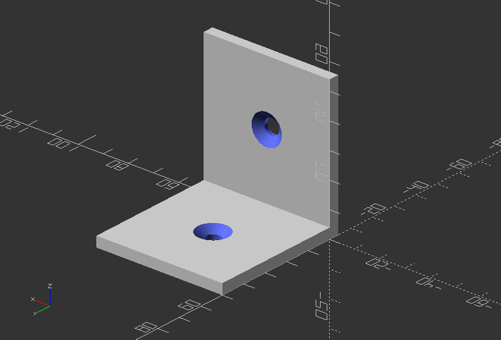

## 3.9. Variables

##### **Plate / Bracket: Parametric design for furniture**

`//Module for single plate`

`module plate(width, length, thickness, screw_size, head_size) {`

`difference() {`

`cube([width, length, thickness]);`

`translate([width/2, length/2, 0])`

`cylinder(h=thickness, r=screw_size, $fn=30);`

`translate([width/2, length/2, thickness-4])`

`cylinder(h=4, r1=1, r2=head_size, $fn=30);`

`}`

`}`

`//Module for bracket`

`module bracket(length, width, thickness, screw_size, head_size) {`

`plate(width, length, thickness, screw_size, head_size);`

`translate([width,-thickness,thickness])`

`rotate([90, 0, 180])`

`plate(width, length, thickness, screw_size, head_size);`

`translate([0, -thickness, 0])`

`cube([width, thickness, thickness]);`

`}`

`//Call the plate object`

`bracket(50, 50, 4, 3, 6);`

---
