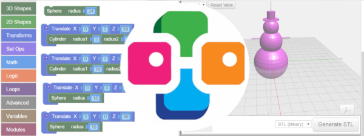

# [CAD for Kids >> BlocksCAD](./index.md)

---

BlocksCAD4Kids is a course that teaches children and/or teachers how to create 3D models with BlocksCAD. BlocksCAD uses visual building blocks or puzzle pieces, which are modified and put together as elements. These blocks generate the code in the background that creates the 3D models.

The course can be hold in English or German. Taking into account the current level of knowledge of the children. The course leader will provide questions and translations into German or respectively into English, if necessary so that the children can follow the course content.

ExtraBtn: [BlocksCAD Editor](https://www.blockscad3d.com/editor/)
