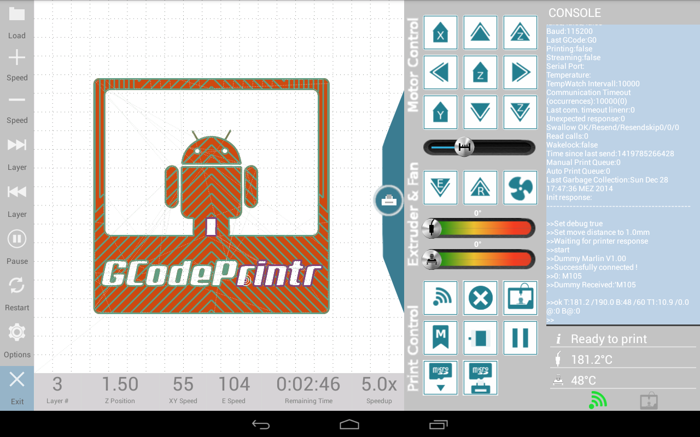

### 1. Preparation

##### **BlocksCAD**

There is not much preparation necessary to prepare for this course.

**BlocksCAD Offline:** ***Menu >> Education >> BlocksCAD***

One simple way is using the Online version of BlocksCAD. The browser you are going to use needs WebGL support. Simply test the online version by dragging a sphere onto the workspace and press "RENDER". The sphere then should appear in the 3D preview.

**[BlocksCAD Online](https://www.blockscad3d.com/editor/)**

**[Source Code on Github](https://github.com/einsteinsworkshop/blockscad)**

---

##### **3D Printer**

In case you already have a 3D printer and/or you want to learn how to prepare your 3D models to be printed. You definitely need to slice your 3D models into layers according to your printers settings.

A controlling software is not necessary, if you use a sd card to transfer the sliced model file .gcode directly to the printer. Most printer can handle it through their in-built software.

**You will find more about this topic in Section 5.**

---

##### **Software for PC - Linux, Windows, Mac**

There is one free open-source slicer software installed on this Moodle Server Distro:

***Menu >> Education >> Prusa Slicer***

*Furthermore, there is an open-source software installed to control 3D printer via usb :*

***Menu >> Education >> Pronterface***

Otherwise, you can download and install both software here, if you want to use another Distro:

**[Prusa Slicer](http://www.prusa3d.com/page/prusaslicer_424/)**

and here:

**[Pronterface](https://www.pronterface.com/)**

***Prusa Slicer***

***Pronterface***

One simple way of slicing your models, that does not need any installation, is Online GCODE slicer **[kiri:moto - Free to use](https://grid.space/kiri/)**. **However, this software is only available with Internet access!**

Go to the site, upload your .stl file you exported from BlocksCAD, enter the details of your printer and slice it into .gcode format. This file you can then upload to your printer directly or with a printer control software.

---

##### **Software for Android**

There is no proper slicing software for Android at the moment, so [kiri:moto](https://grid.space/kiri/) is still the best guess of getting your models sliced for your printer.

***Unfortunately, you will need internet connection in order to use it!***

However there is a cheap and well done 3D printer controlling software for Android. If you use an usb adaptor, you will be able to connect your 3D printer directly to your Android Tablet and control the 3D printer.

Adapter:

The recommended control software:

**[GCodePrintr](http://play.google.com/store/apps/details?id=de.dietzm.gcodesimulatorprinter&hl=en_US&gl=US)**

