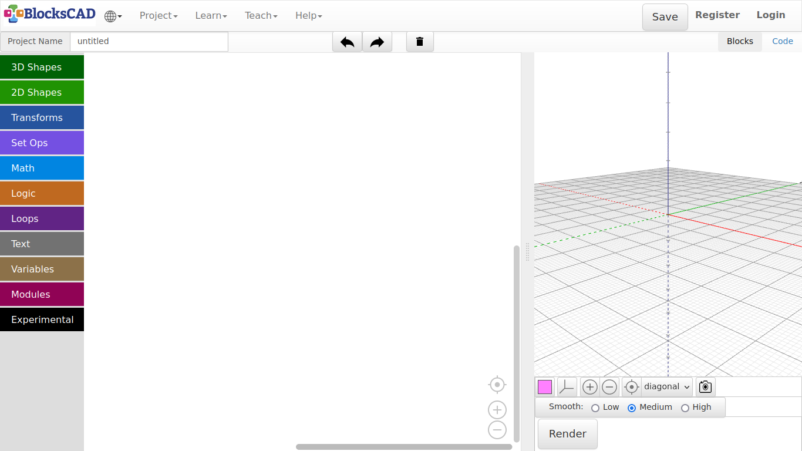
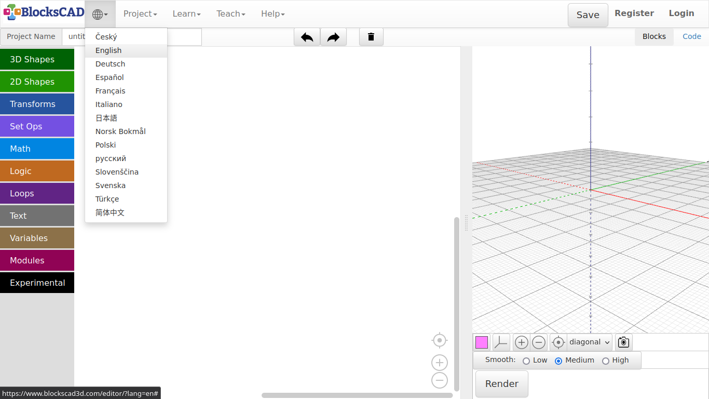
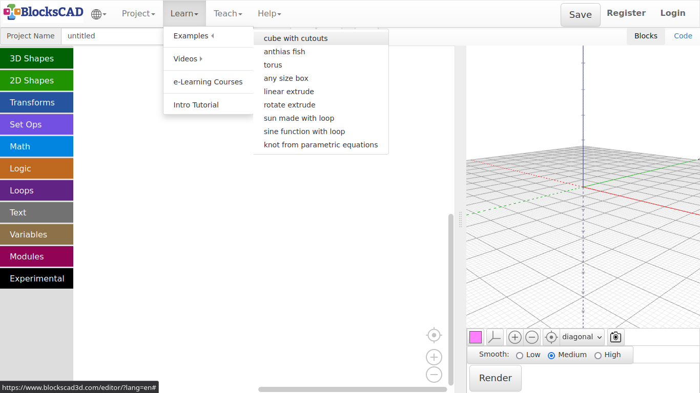
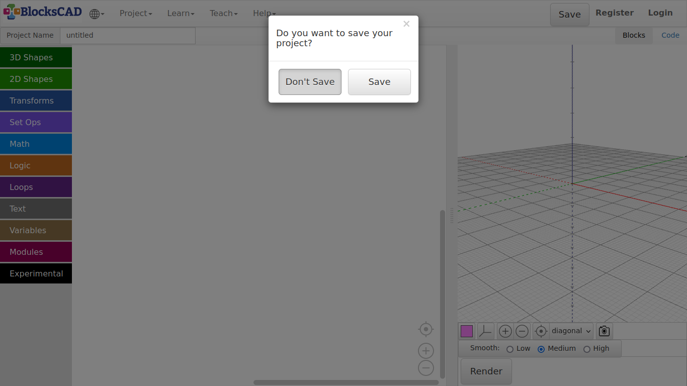
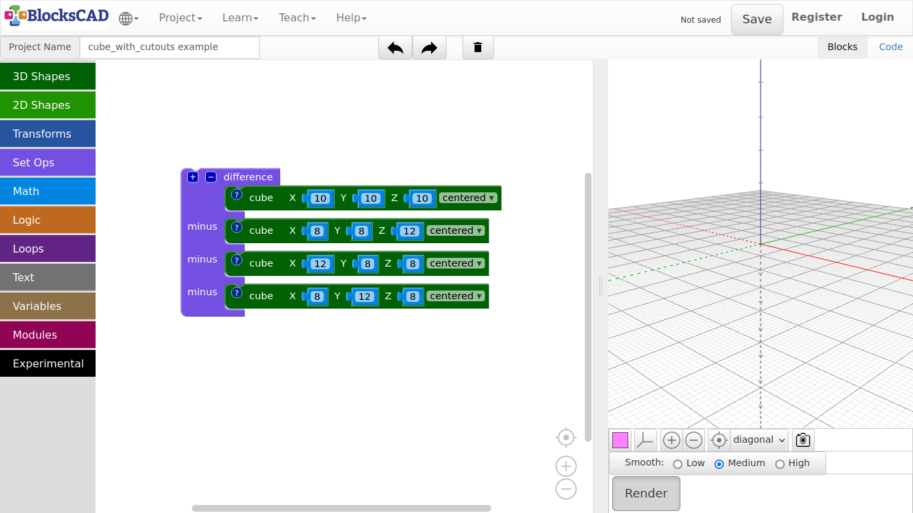
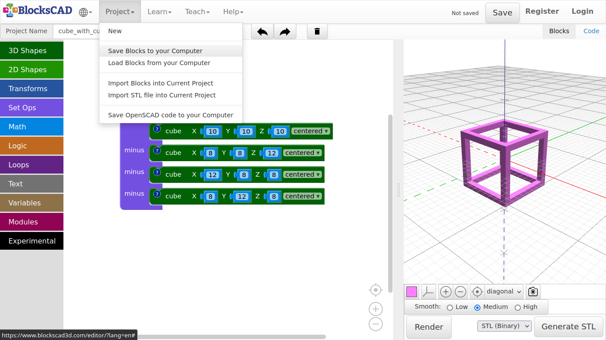
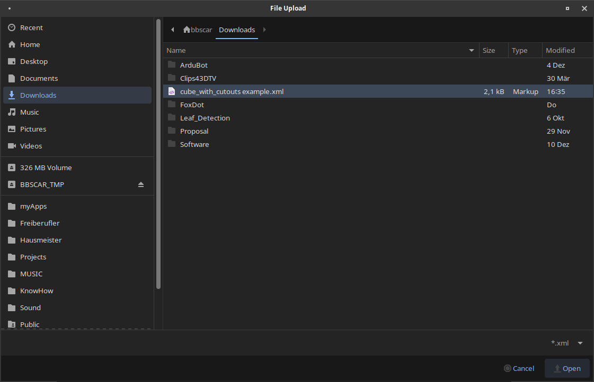
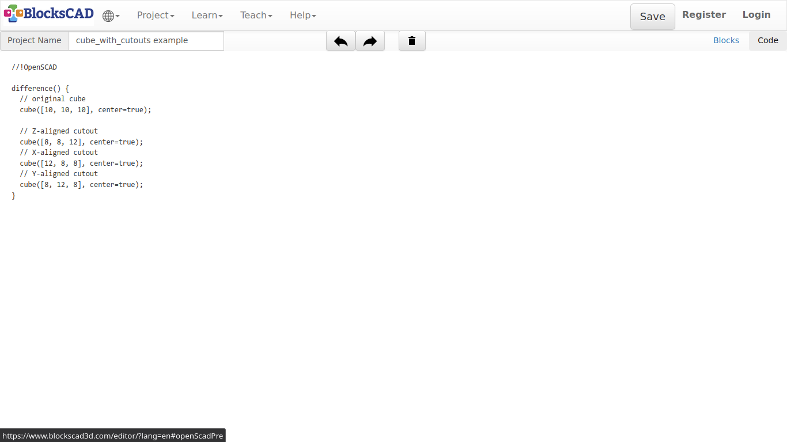
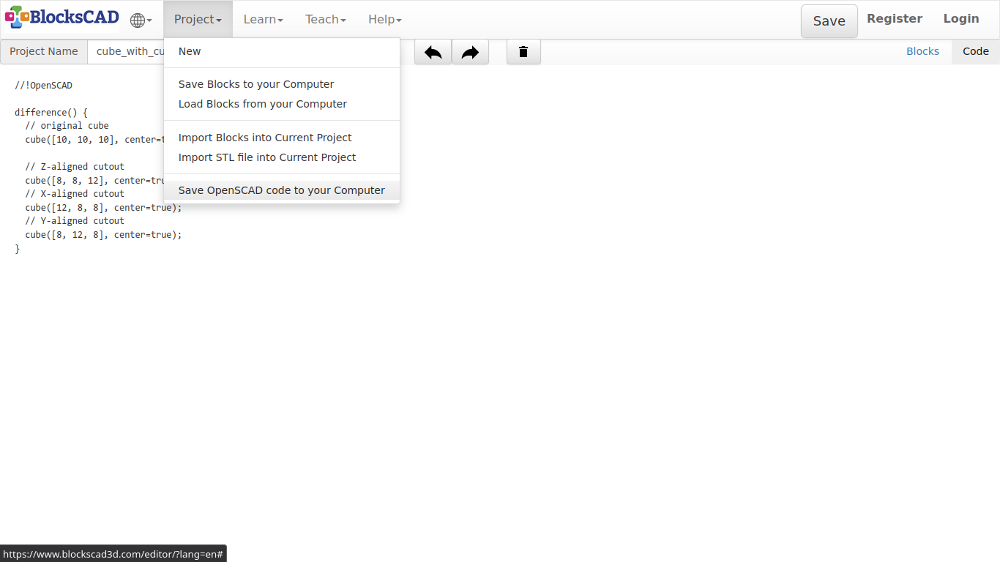
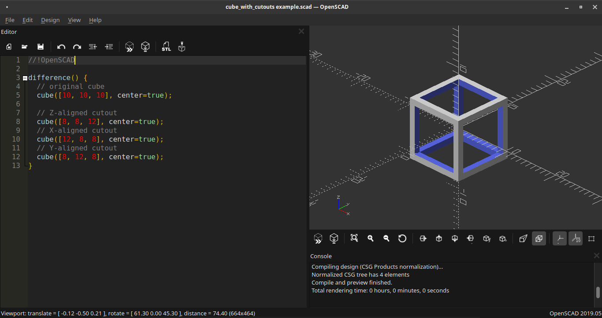

## 2.4. How does BlocksCAD work?

BlocksCAD is a web-browser application, that does not need to be installed on your computer. There is an offline version available that needs a simple web-server script to run in order to create 3D/2D text in BlocksCAD. The graphical interface of BlocksCAD is fairly simple, so lets get through it.

---

**Header**

The header is the main menu with several subsections. I will only mention the section we are going to use.

* Wired sphere >> Change language
* Projects >> Create new project, save and open files with different formats
* Learn >> Examples, tutorials and videos
* Project Name >> Give your current project a name (Default: untitled)
* Left Arrow Icon >> Undo
* Right Arrow Icon >> Redo
* Trashcan Icon >> Delete workspace
* **Blocks | Code** >> Switch between blocks editor and OpenSCAD code view

---

##### **Left Panel**

This panel is the blocks menu, which has several subsections. A Block contains a certain functions, that generates the represented OpenSCAD code.

* 3D Shapes >> Basic 3d primitives
* 2D Shapes >> Basic 2d primitives
* Transforms >> Transform embedded shapes
* Set Ops >> Boolean operators
* Math >> Mathematical operators
* Logic >> Conditional operators
* Loops >> Loop block
* Text >> 3D and 2D Text related blocks
* Variables >> Variable blocks for parametric designs
* Modules >> Blocks to create modules

---

##### **Center Panel**

The center panel is basically the workspace. You drag in and combine all block on in this place. If you want to erase blocks, just drag it far to the Left out of the window, or press Del.

* Icon Pointer >> Centers the view of the workspace
* Icon + >> Zooms in
* Icon - >> Zooms out

***You can use the Left Mouse Button to pan, 2 finger gesture to zoom, and the Right Mouse Button to open a sub menu.** **Use the finger to pan, the scrolling wheel to zoom in and out, and hold the finger for 2-3 second to open a sub menu.***

---

##### **Right Panel**

This is the 3D view port to see the generated 3D objects. The changes appears, after the button \*Render\* is pressed.

***You can use the Left Mouse Button to rotate, the scrolling wheel (or middle mouse button) to zoom in and out, and the Right Mouse Button to pan. Use the finger to pan, the scrolling wheel to zoom in and out, and hold the finger for 2-3 second to open a sub menu.***

* Colored Square >> Change the color, with which your object is previewed
* 3 lines Icon >> Switches on/off Grid view
* Icon + >> Zooms in
* Icon - >> Zooms out
* Icon Pointer >> Centers the view of the workspace
* Render >> Creates a preview version of everything on the workspace
* Generate STL >> Exports preview as a 3D Mesh in .stl format

***Lets try things out, so you learn the basic workflow in BlocksCAD:***

Change a language using the selection under wired sphere icon (Default: English)

Try the first example under **Learn >> Examples >> cube with cutouts**

If BlocksCAD ask, if you want to save the previous code, press **Don't Save.**

Press **Render** in the right panel to see, what the code is doing

Save the blocks on your workplace **Project >> Save Blocks to your Computer**

Now reopen your saved project **Projects >> Load Blocks from Computer**

As you can see, it saved it with the Project Name. Select it and press **Open**

Now press **Code** on right side of the header panel **Blocks | Code**. You will see the actual code, that is created by the blocks.

Now press **Blocks**, then press **Projects >> Save OpenSCAD code to your Computer** to export the code you have seen to your computer.

As you probably do not have OpenSCAD installed yet, check out the image to see, how it will look like in OpenSCAD.

Menu >> Education >> OpenSCAD

**OpenSCAD**

If you want to export the rendered preview as an object, press in the right panel **Generate STL**.

***Do not forget to name your project first!***

The exported STL file is relevant, if you want to continue and print it with a 3D printer, CNC Router or Laser cutter.

---