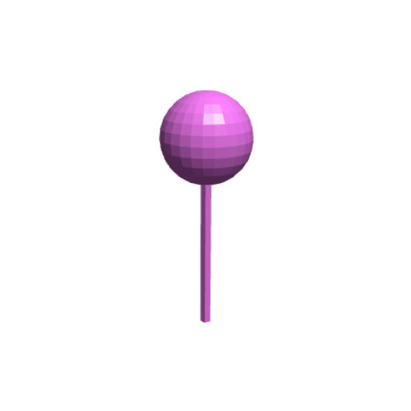
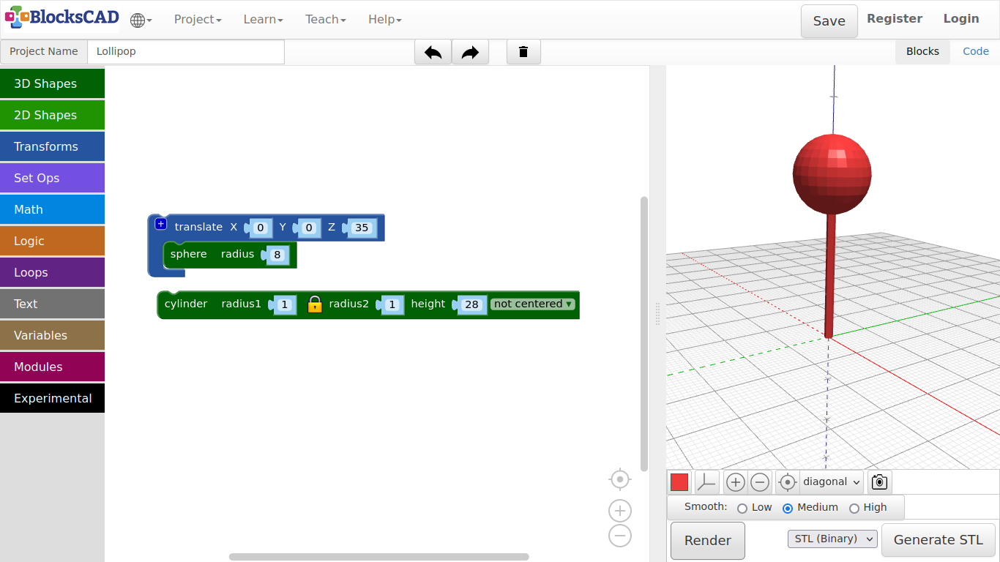

## 3.1. Lollipop

1. Start wit a new project by pressing **Projects >> New**

2. Drag and drop a **sphere** from **3D Shapes** into our workspace.

3. Press **Render** and change your point of view by clicking LMB and move mouse around.

4. If your object is out of sight, use the pointer icon to get it back.

**The sphere shows 10, which means 10 mm or 1 cm radius. The diameter of the sphere is therefore?...2 cm or 20 mm.**

5. Change the number of the **sphere** to ***30*** and render again.

**Now the sphere is 6 cm in diameter.**

***But hold on, how can I see the difference?***

**To see the difference, lets put a second sphere aside. But first, in order to move the sphere as aside, we need another piece called.**

6. Drag a **translate** block into the workspace. You will find it in **Transforms**.

7. Now enter ***50*** into the first cell with the name **X**.

8. Now drag another **sphere** from the **3D Shapes** menu, and plug it into the translate slot. Press **Render** again!

**See! The new sphere is now created 50 mm aside our first sphere, alongside the red line. The red line is the x axis, the green line is the y axis and the blue line is the z axis.**

***Change the numbers in translate and see how the sphere is moving around with the changes you made. Do not forget to press "Render".***

9. Delete the first sphere by clicking on it and drag it left out of the scene, or press Delete key, while keeping the sphere within the translate block.

10. Now enter new values to **translate** as follows: ***X = 0, Y = 0, Z = 35***.

11. Change the **sphere** radius to ***8*** millimeter.

12. Now drag and drop another **cylinder** block from **3D Shapes** onto your workspace.

13. Enter the number ***1*** for **radius1** and ***28*** for **height**.

14. Press **Render** again.

***A voila, a lollipop!***

15. Name your project as ***Lollipop*** under **Project Name:**.

16. Save your project under **Project >> Save Blocks to your computer**.

---

