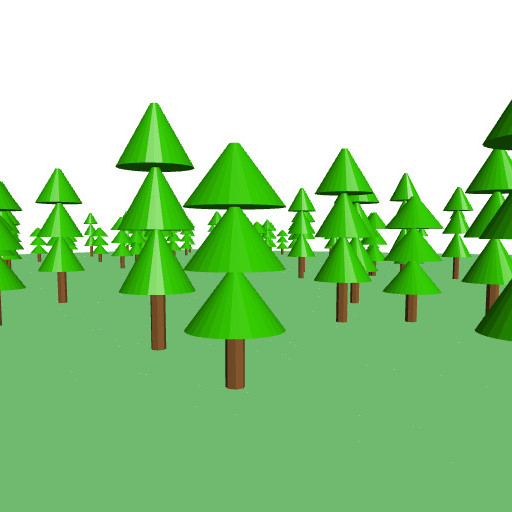

## 3.10. Forest

**Now we will use the module "Pine Tree", we created in the last tutorial to create a forest.**

1. Open a new project and name it ***Forest***.

**Next we will import our tree module.**

2. Go to **Project >> Import blocks into Current Project**, select **PineTree.xml** and click **Open**.

**As we did not do not have the module presenting block on our workspace, pressing Render should show nothing. Lets build the forest ground.**

3. Drag and drop one **cube** from **3D Shapes**, and one **color** from **Transforms**.

4. Change the values of **cube** to ***X = 1000, Y = 1000, Z = 1, centered***, and plug it into **color**.

5. Now choose the color for your ground by changing it in **color**. I choose a light green.

6. Press **Render**.

**This is the place we are going to spread a hundred trees randomly. The floor is 1000 from side to side, the random generator will distribute the tree within 800 of both sides.**

***Lets create 100 trees randomly distributes across the ground!***

7. Drag and drop one **count with** from **Loops**, one **translate** from **Transforms**, two **random integer** from **Math**, and **PineTree** from **Modules**.

8. Plug in the **PineTree** block into **translate**.

9. Plug in one **random integer** to **X** of **translate**, and one **random integer** to **Y** of **translate**.

10. Change the values of both **random integer** to ***from: -400, to: 400***.

11. Plug in the **translate** block with **PineTree** into **count with**.

**Each time you plug in a new "count with" the index will change. It always starts with "i", then "j", "k", so on. You also can use your own name or variable. We stick with "j" for now.**

12. Change the value **to** in **count with** to ***100***, as we want to build 100 trees.

13. Press **Render**.

***Be patient!** **This is quite some task for BlocksCAD.***

**There is your forest! But all the trees have the same height.**

***Lets create some more variety!***

**For that, we need to modify our module.**

14. Press on the gear icon of the **to Pine Tree** block.

15. Drag n drop **input name** on the left into **inputs** on the right.

16. Rename the input to ***height***.

**Now check your module block in "count with j".**

***Can you see the new slot called "height"?***

**But this is not the only new thing, that got created.**

17. Drag and drop three **height** from **Variables**, and one **random integer** from **Math** onto your workspace.

18. Now plug in all three **height** blocks in your **to PineTree** module. Two for each **height** value of the two **cylinder**, and one under **translate** instead of ***10*** in **i x 10**.

19. Plug the **random integer** block into the new slot of the module representing block **PineTree** as **height** input.

20. Change the values of **random integer** to ***from: 10, to: 18***.

21. Press **Render**.

***Again, be patient, it will take a while!***

---

##### **Exercise:**

***Import the house, pavilion, umbrella, and your own modules into the scene and create an image from your modeled "House in the woods" scene. Move the camera into a nice position and press the camera icon in the 3D viewer to save the image.***

*Tip:*

* Reduce the random integer area and tree counts, so you have a free area on the floor.
* Drag and drop translate, rotate, and scale accordingly to move your modules and objects around
* Disable the representing "Pine Tree" block to avoid the long render times. ***Can you remember how?***

**Select the block and press the right mouse button or hold your finger till the Pop-up menu appears. Press on "Disable Block". Do the same thing to enable it again. The choice will be "Enable Block".**

---
