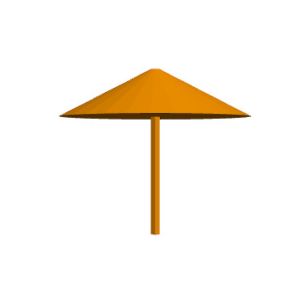
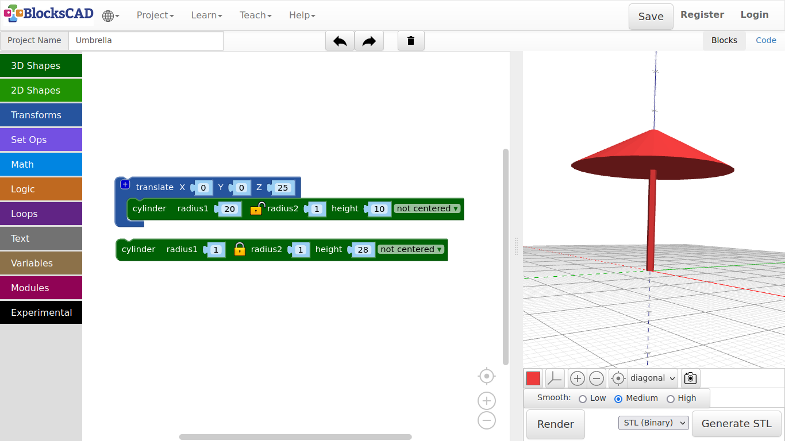
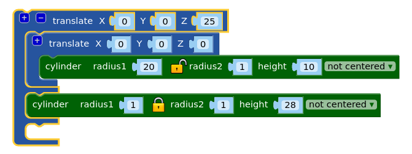

## 3.2. Umbrella

1. Open your Lollipop project under **Project >> Open Blocks from your computer**

2. Change the name of this project to ***Umbrella*** under **Project Name:**

3. Now click on the **sphere** and move it out of the workspace.

4. Keep the **translate** block.

5. Now drag another **cylinder** from **3D Shapes** into the scene and plug it into **translate**, and press **Render**.

***Can you see the space between the 2 cylinders?***

6. Lets change it by entering the height of the first cylinder to the **translate** module ***Z = 25***.

7. Press **Render**.

***Ok, now lets make an umbrella out of it!***

**The cylinder block has radius1 and radius2 for the bottom circle and the top circle. The value of radius2 is bound to radius1 by default. The lock icon between the 2 values represent this connection.**

8. Press the little lock icon to unlock the connection between **radius1** and **radius2** of the **cylinder** block, that is plugged into the **translate** block.

9. Change the value of **radius1** to ***20***, and **radius2** to ***1***.

10. Press **Render** again!

**Now we’ve got it! There is our umbrella.**

9. Save the project under **Project >> Save Blocks to your computer**.

***Exercise:***

**Try all different 3D shapes, change the values and use translate to move them around in space! Let us see, what you can make of it!**

*Tip: You can plug translate blocks into each other, and press \*+\* to add more slots for objects. This way you can group objects together and move all at once!*

---
