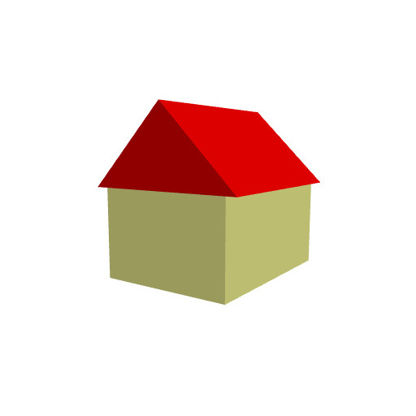
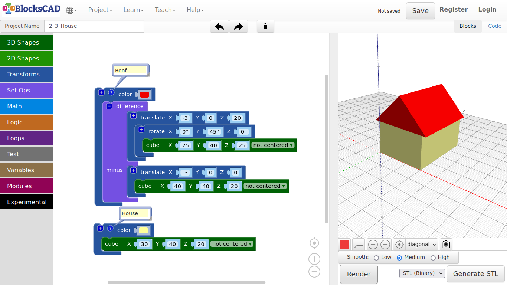
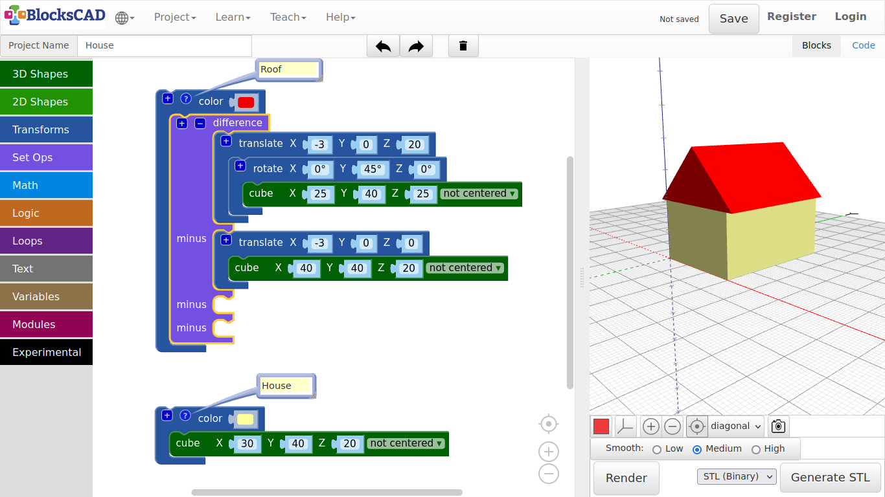
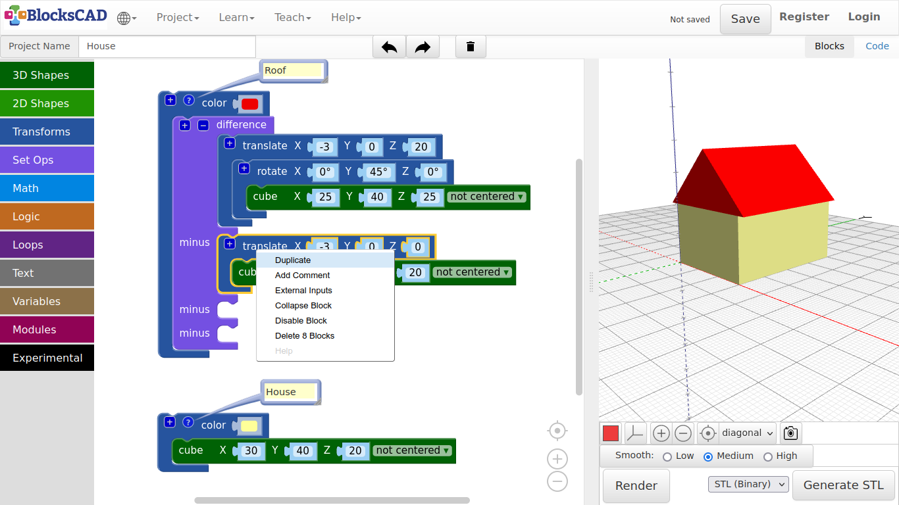
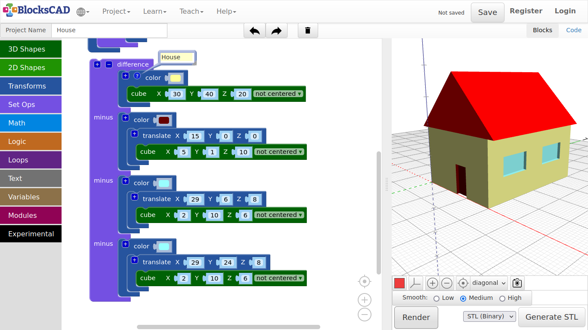

## 3.3. House

1. Lets start with **Project >> New** again.

2. Name this project ***House***.

3. Drag and drop a **cube** from **3D Shapes** onto the workspace.

4. Give it following values ***X = 30, Y = 40, Z = 20***.

5. Press **Render**.

**Now, we want to get a roof on top of our house.**

6. Drag and drop one **cube** from **3D Shapes**, one **translate** and one **rotate** from **Transforms**.

7. Change the values of the new cube to ***X = 25, Y = 40, Z = 25***.

8. Next, plug the **cube** block you just changed into the **rotate** block.

9. Change the rotation of **Y** to ***45*** degree.

**You will see the wheel, that you can turn to 45 degrees along the axis you selected. You also can enter the number directly.**

10. Now plug this **rotate** block into the **translate** block.

11. Change the values of **translate** to ***X = -3, Y = 0, Z = 20***.

12. Press **Render**.

***The roof is on the right place, but there is something wrong!***

**We need to cutout the lower part of the roof cube, so it really looks like a roof.**

13. Drag and drop one **cube** block from **3DShapes**, one **translate** block from **Transforms**, and one **difference** block from **Set Ops** onto your workspace.

14. First change the values of the new **cube** to ***X = 36, Y = 40, and Z = 20***.

15. Then plug it into the new **translate** block and change its values only in **X** to ***-3***.

16. Press **Render**.

**This new cube represents the part we want to cut away from the roof cube. For this we have "difference". It cuts away the 2nd part named "minus" from the 1st part.**

17. Plug the roof **cube** block inclusive **translate** and **rotate** into the first section of **difference**.

18. Then plug the cut out **cube** inclusive its **translate** block into **difference** section named **minus**.

19. Press **Render** again.

***Did it cut away the lower part? Does it look like a roof now?*** ***Now lets give the house and roof a different color!***

20. Drag n drop two **color** blocks from **Transforms** onto your workspace.

21. Plug in the house **cube** and the roof **difference** block each into one **color** block.

22. Click on the little color squares and choose your own color.

24. Press **Render**.

**To keep things in check, you can name each of the blocks.**

25. Select each **color** block, click the right mouse button or use finger touch to open a little pop-up menu.

26. Select **Add comment**. You will see a little question mark afterwards.

27. Click on that, and type in ***House*** and ***Roof***.

***Keep on commenting the parts your create. It is helpful for you and others to understand your designs better, especially when it is going to be more complicated. Commenting is a very important part in programming. It is like a friend, that whispers you the right message when you need it.***

28. Save your project under **Project >> Save Blocks to your computer**.

---

##### **Exercise:**

***Use cube, translate, rotate, and difference to add doors, windows, or a chimney to the house.***

*Tips:*

1. You can use the “+” symbol to add more slots to difference, so it will cut out more boxes at once.\*\*

2. You can use RMB (Right Mouse Button) or finger touch to open the Pop-up-menu and choose “Duplicate” to get copies of your blocks.

***Here an example to help you getting started:***

---
