## 3.4. Cup

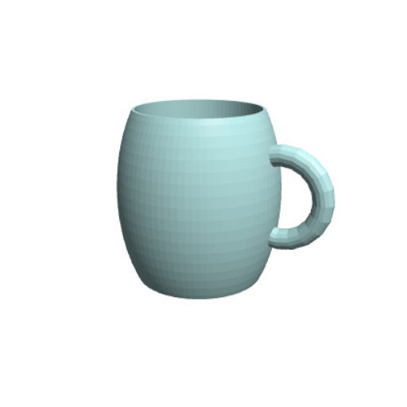

**With this design, I will introduce you to a new method you can use called intersection**

1. Drag and drop one **intersection** block from **Set Ops**, one **translate** and one **scale** block from **Transforms**, one **sphere** block and one **cube** from **3D Shapes**.

2. Lets start with the **sphere** by change the **radius** to ***40***.

3. Plug the **sphere** into **scale** and change the values there to ***X = 0.6, Y = 0.6, Z = 1***.

4. Press **Render**.

**To create a cup, we want to cut off the top and the bottom. While "difference" cuts away the blocks that is represented, "intersection" cuts away anything else but the represented part.**

***Lets build a cube of the area, that will remain after the cut!***

5. Change the values of the **cube** to ***X = 80, Y = 80, Z = 50***.

6. Change the **cube** option **not centered**to ***centered***.

**The block intersection will keep everything, that is covered by the second object under "with".**

7. Plug the **scale** block with the **sphere** into the first position of **intersection**.

8. Then move the **cube** into the second position named **with**.

9. Press **Render**.

***See!? It should look like a barrel now!** **Ok, lets move the barrel up with a translate block.***

10. Connect the **intersection** block with **translate**.

11. Change the **translate** block value **Z** to ***25***.

12. Press **Render**.

**Next we will use a cylinder to cut out the inside of the cup. Now this is a block you already used. What is it? … difference!**

13. Drag and drop one **cylinder** block from **3D Shapes**, one **translate** from **Transforms**, and one **difference** block from **Set Ops** onto your workspace.

14. Change the values of the **cylinder** to ***radius1 = 18***, and ***height = 50***.

15. Plug the **cylinder** into the new **translate** block.

16. Change the **Z** value of **translate** to ***5***.

17. Now take the **translate** block with the **intersection** and plug it into the first position of the **difference** block.

18. Plug the **translate** block with the **cylinder** in the second one called **minus**.

19. Press **Render**.

**Last but not least, we need a handle for our cup.**

20. Drag n drop one **torus** block from **3D Shapes**, one **rotate** and one **translate** block from **Transforms**.

21. Change the values of the **torus** to ***radius1 = 12, radius2 = 3, sides = 40, and faces = 20***.

22. Plug the **torus** into the **rotate** and change its **X** value to ***90*** degrees.

23. Connect this to **translate**, and change its values to ***X = 25, Y = 0, Z = 2***.

24. Press **Render**.

**Ok, you will see the handle on the bottom. The torus goes through the cup, but we want to cut this out as well. We need to implement the torus into the difference block. You can do this by adding a slot in translate of the intersection block.**

25. Press the **+** sign of the **translate** block in the first position of **difference**, and plug in the entire **torus** block inclusive **rotate** and **translate**.

26. Press **Render**.

27. Add a **color** block from **Transforms**, and plug the entire block section into it.

28. Save your project under **Project >> Save Blocks to your computer**.

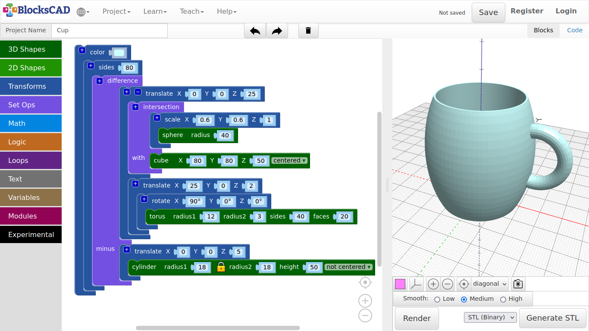

**Before you create your own objects in the next exercise, I want to show you something, that can become very useful. Lets create a new project, do not forget to save your cup project.**

1. Start wit a new project by pressing **Projects >> New**.

2. Drag n drop one **sphere** and one **cylinder** from **3D Shapes**, one **translate** block and two **sides** blocks from **Transforms** onto your workspace.

3. Plug the **sphere** into **translate** and change the **X** value to ***40***.

4. Then plug **translate** with the **sphere** into one of the **sides** block and change its value to ***4***.

5. Press **Render**.

**In geometry you call this shape an Octahedron.**

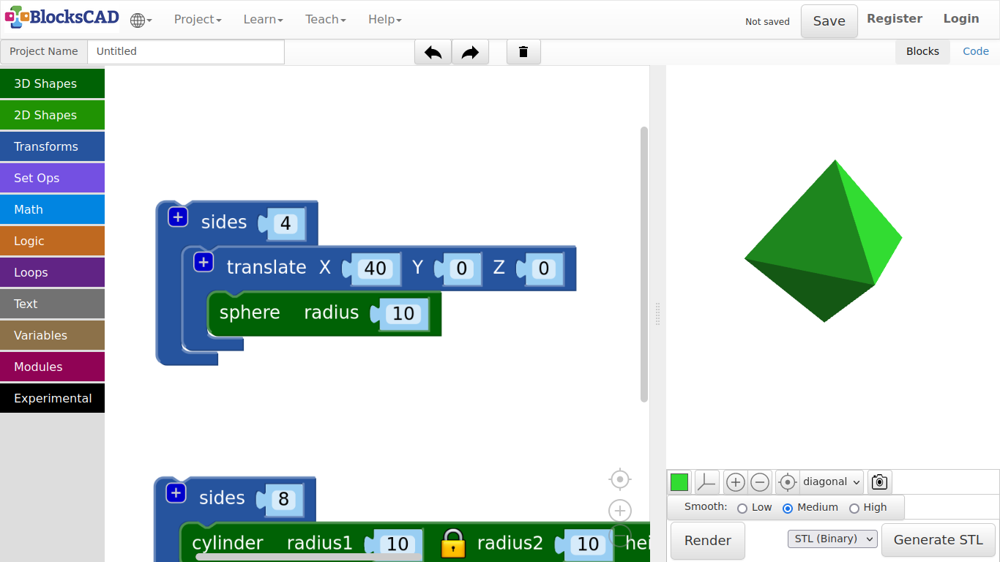

6. Now plug in the **cylinder** into the other **sides**, and change it to ***3***.

7. Press **Render**.

**In geometry you call this shape an Triangular Prism.**

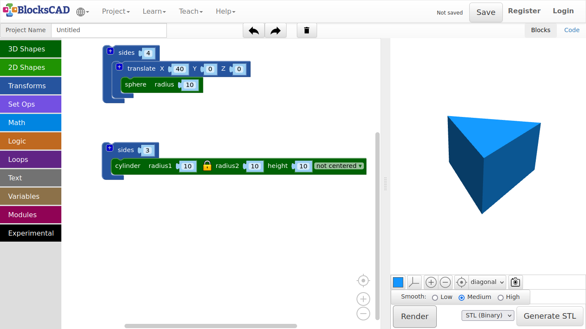

8. Change the value of **sides** to ***5***.

9. Press **Render**.

**In geometry you call this shape an Pentagonal Prism.**

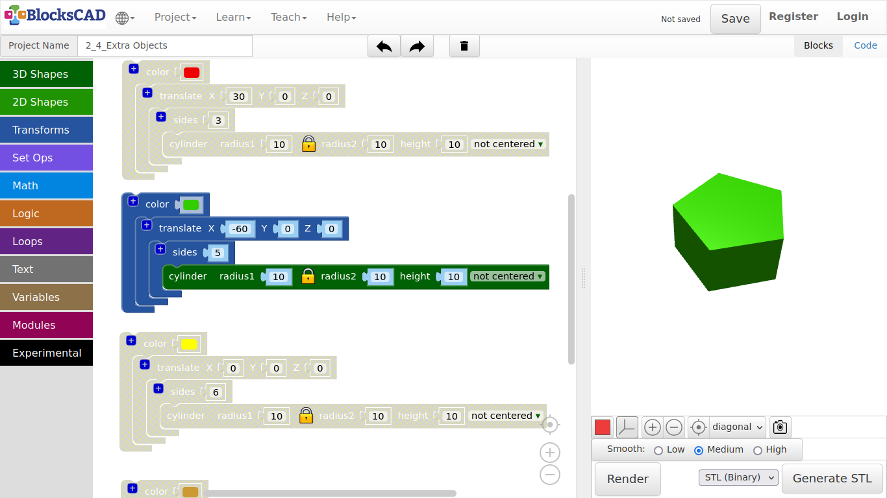

10. Change the value of **sides** to ***7***.

11. Press **Render**.

**In geometry you call this shape an Hexagonal Prism.**

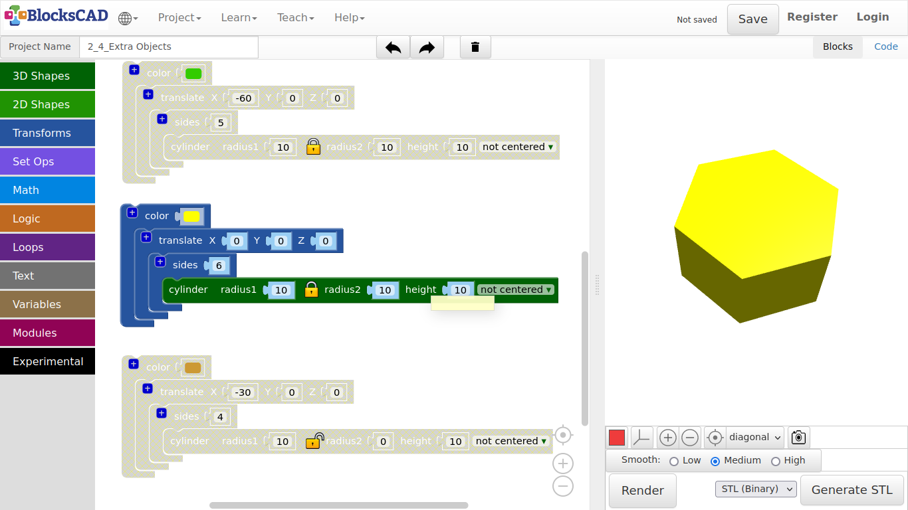

12. Now click on the **Lock icon** of the **cylinder** block and change **radius2** to ***0***.

13. Change the **sides** value to ***4***.

14. Press **Render**.

**In geometry you call this shape a Pyramid.**

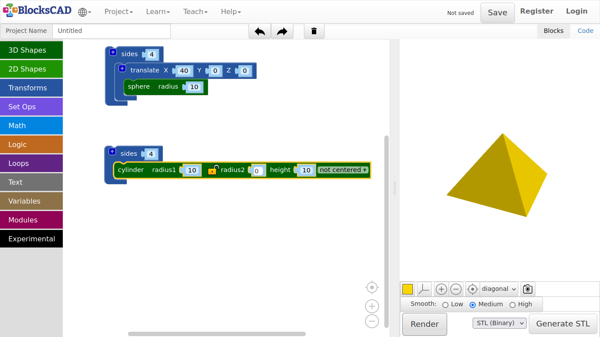

15. Name your project and save under **Project >> Save Blocks to your computer**.

16. Reopen your cup project under **Project >> Load Blocks from your computer**.

---

##### **Exercise:**

**Create a similar object, e.g. a plate, a different cups, a bowl or other items. You can use the sides block to get different looks.**

***Tips:***

1. Use a translate block to move your cup aside.

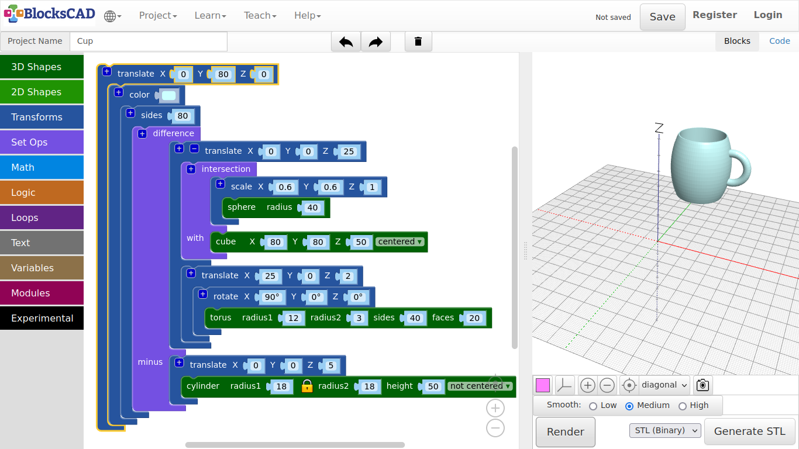

2. The rendering time will increase the more sides or polygons you have in the scene. To speed up the rendering reduce "sides" in this tutorial.

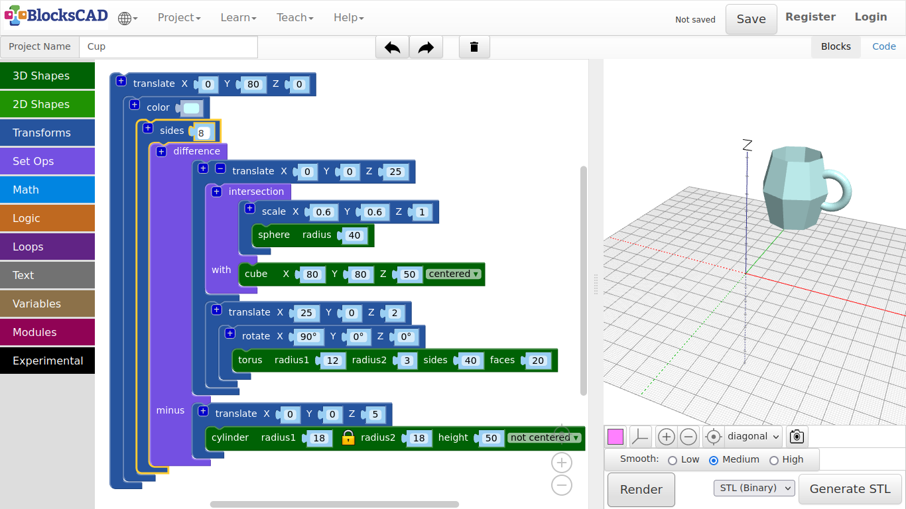

3. What if you do not need the cup, but you want to keep it on your workspace as reference? Just click the RMB or use your 2 finger touch to open the Pop-up menu, then select "Disable Block".

4. You can reverse it the same. It will show "Enable Block".

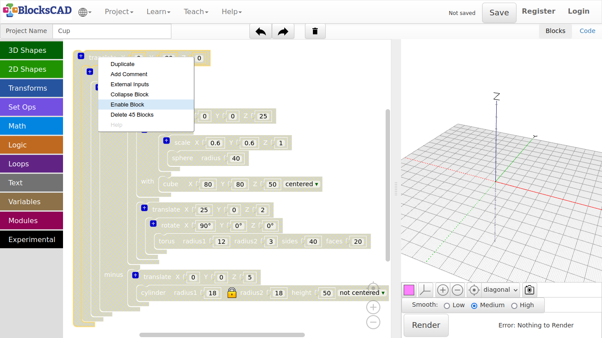

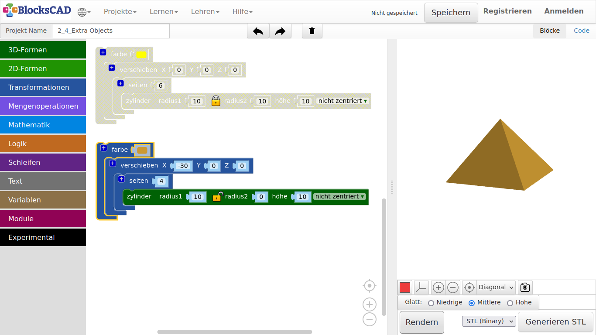

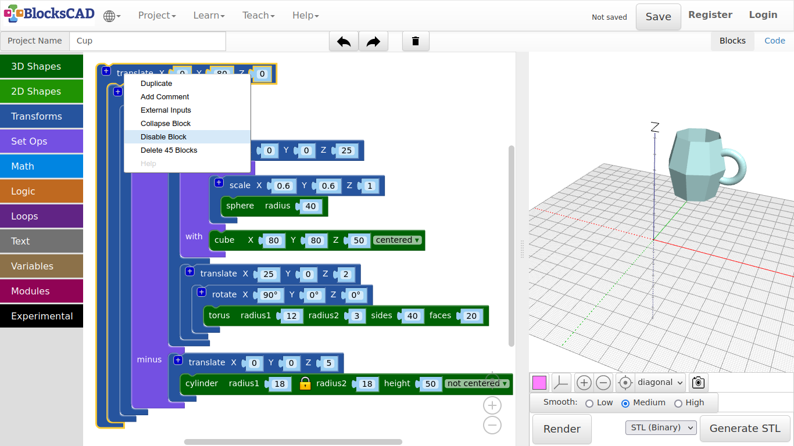

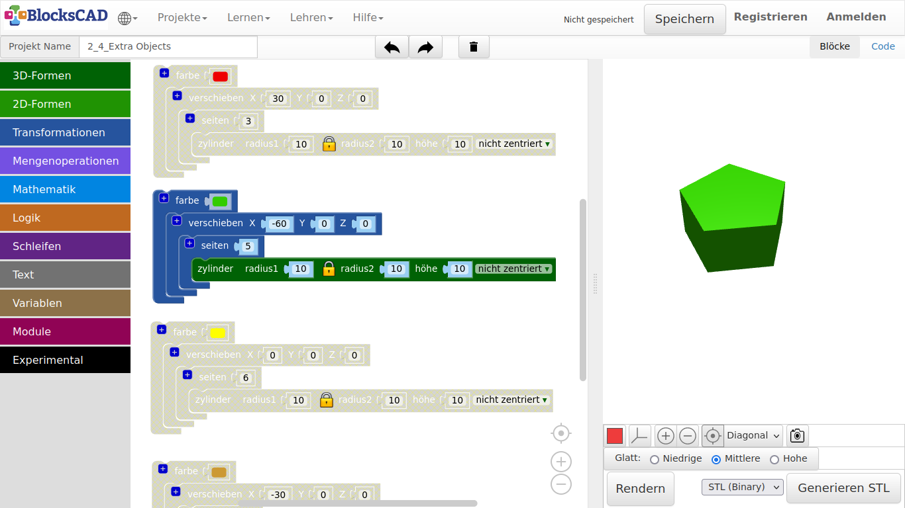

---
