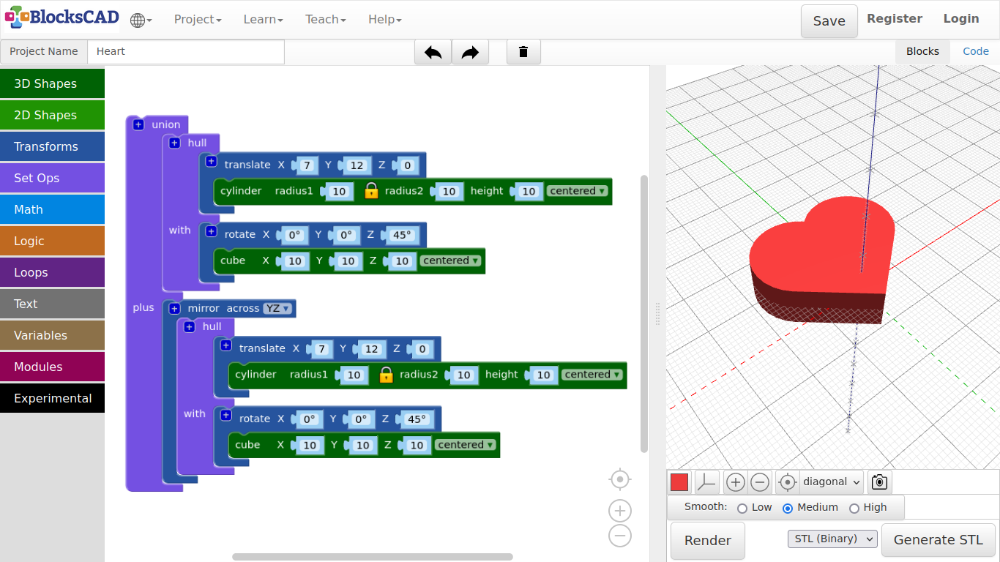

## 3.5. Heart

In this tutorial you will learn 3 new blocks: **union**, **hull**, and **mirror**. ***Lets get started!***

1. Start wit a new project by pressing **Projects >> New**.

2. Drag and drop one **cube** block and one **cylinder** block from **3D Shapes**, one **translate** block and one **rotate** block from **Transforms**, and one **hull** block from **Set Ops** onto your workspace.

3. Change the values of the **cube** to ***X = 10, y = 10, z = 10, centered***, and plug it into the **rotate** block.

4. Change the **Z** value of **rotate** to ***45*** degree, so the cube becomes the edge on the bottom of the heart.

5. Now change the values of the **cylinder** to ***radius1 = 10, height = 10, centered*** and plug it into the **translate** block.

6. Changing the **translate** values to ***X = 7, Y = 12, Z = 0***.

7. Now plug both blocks **cube** with **rotate**, and **cylinder** with **translate** into the **hull** block.

8. Press **Render**.

**But this is only the half of the heart.** ***How are we going to add the second part?***

9. Drag and drop one **mirror across** from **Transforms**, and one **union** block from **Set Ops.**

10. Change in **mirror across** the value from ***XY*** to ***YZ***.

11. Click onto the **hull** block, open the Pop-up menu, and press ***Duplicate***.

12. Then plug the duplicate into the **mirror** block.

13. Now plug both of the main blocks into **union**.

14. Press **Render**

***There you have a full heart!***

15. Name your project and save it.

---
