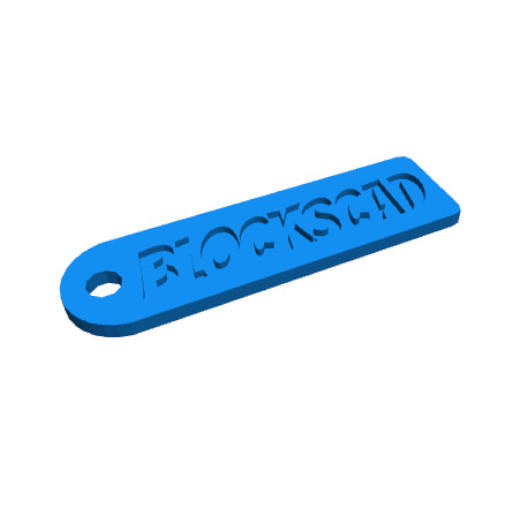
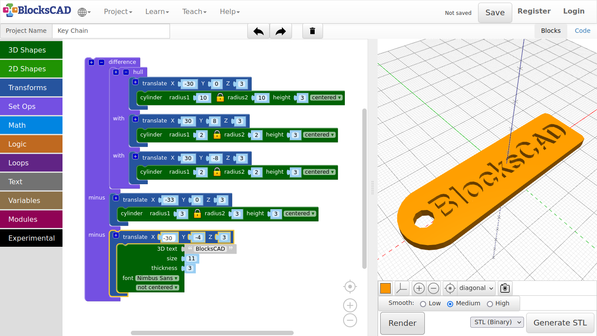
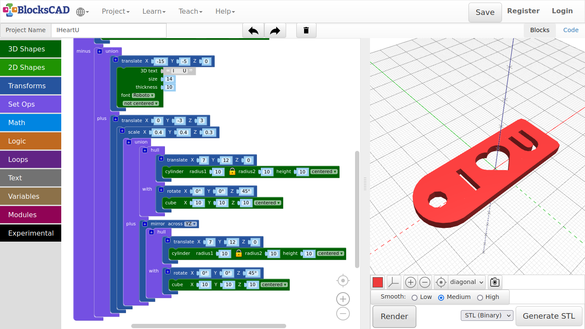

## 3.6. Key chain

**First, we will create the basic plate**

1. Drag and drop three **cylinder** blocks from **3D Shapes**, three **translate** blocks from **Transforms**, and one **hull** from **Set Ops**.

2. Change the values of the first **cylinder** to ***radius = 10, and height = 2, centered***.

3. Plug it into one **translate** and change the **X** value to ***-30***.

4. Change the values of the second and third **cylinder** to ***radius1 = 2, height = 2, centered***.

5. Plug the second **cylinder** into **translate**, and change the **X** value to ***30***, and the **Y** value to ***8***.

6. Plug the third **cylinder** into the last **translate**, and change the **X** value to ***30***, and **Y** value to **-8**.

7. Press **Render**.

**You should see one big disk on one side, and 2 small knobs at the other hand. We want to create one shape from those three objects.**

8. Click on the **+** symbol on **hull**, and plug all three **translate** blocks with each **cylinder** into **hull**.

9. Press **Render**.

***See, this is the basic plate!***

**Now let us add a hole, so we can hook it onto our key ring.**

10. Drag and drop one **cylinder** from **3D Shapes**, one **translate** from **Transforms**, and one **difference** from **Set Ops**.

11. The values for the **cylinder** are ***radius1 = 3, height = 3, centered***.

12. Plug the **cylinder** into the **translate** block, and change the values there to ***X = -33, Y = 0, Z = 3***.

13. Now plug the **translate** block with the **hull** block that contains the other three **cylinder** into the first position of **difference**.

14. Then plug in the **translate** module with the cylinder in the second section of **difference** named **minus**.

15. Press **Render**.

***Now the keychain plate is finished!***

**Now you can add your graphics or names to it. Lets continue with a name.**

16. Drag and drop one **translate** from **Transforms**, and one **3D text** from **Text** onto your workspace.

**In order to cut the name into the plate, we need to add it to difference.**

17. Press the **+** symbol on **difference**.

18. Change the values of **3D text** as follow ***3D text: BlocksCAD, size: 11, thickness: 3, font: Nimbus Sans***.

19. Plug the **3D text** block into **translate** and change those values to **X = -30, Y = -4, Z = 3**.

20. Then plug **translate** with the **3D text** block into the third section of **difference** named **minus**.

21. Press **Render.**

22. Name your project and save it.

**Lets use the heart we modeled previously to create a 2nd keychain.**

1. Reopen the keychain project (if you closed it).

2. Rename it to ***IHeartU***.

3. Unplug the last **translate** with the **3D text** block by dragging it aside onto your workspace.

4. Drag and drop one **union** block from **Set Ops**, one **translate** and one **scale** from **Transforms**.

5. Plug **union** into the third section of **difference** named **minus**.

6. Now drag your **translate** with the **3D text** block into the first section of **union**.

7. Change the values of this **translate** to ***X = -15, Y = -5, Z = 0***\*.

8. Change the values of **3D text** to ***3D text: I U, size: 14, thickness: 10, font: Roboto***.

9. Press **Render**.

**There are 6 empty spaces between I and U in the text. We want to match the heart between I and U.**

10. Plug **scale** into the remaining **translate** on your workspace.

11. Change the values of **scale** to ***X = 0.4, Y = 0.4, Z = 0.3***.

12. Now change the values of **translate** to ***X = 0, Y = -3, Z = 3***.

13. Drag **translate** with the **scale** block into the second section of **union** named plus.

**Now lets import your heart project!**

14. Go to **Projects >> Import Blocks into Current Project**, select your heart project file and press **Open**.

**You might need to zoom out to see the imported block!**

15. Drag the block into **scale**.

16. Press **Render**.

**Your keychain should look like the one in the picture below.**

17. Save your project.

---
