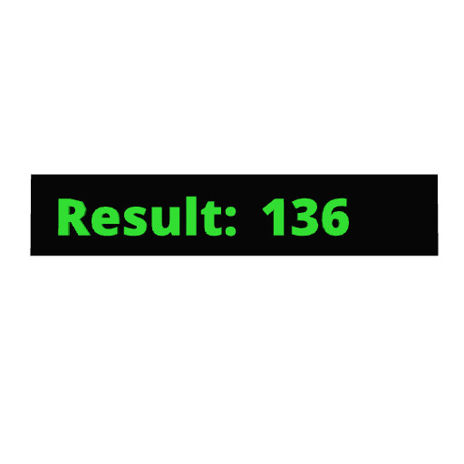
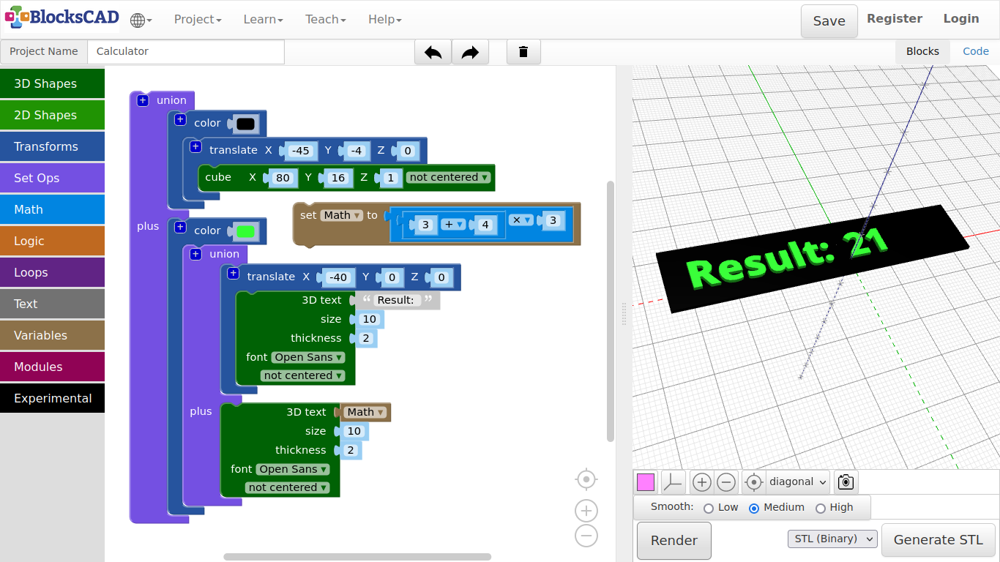
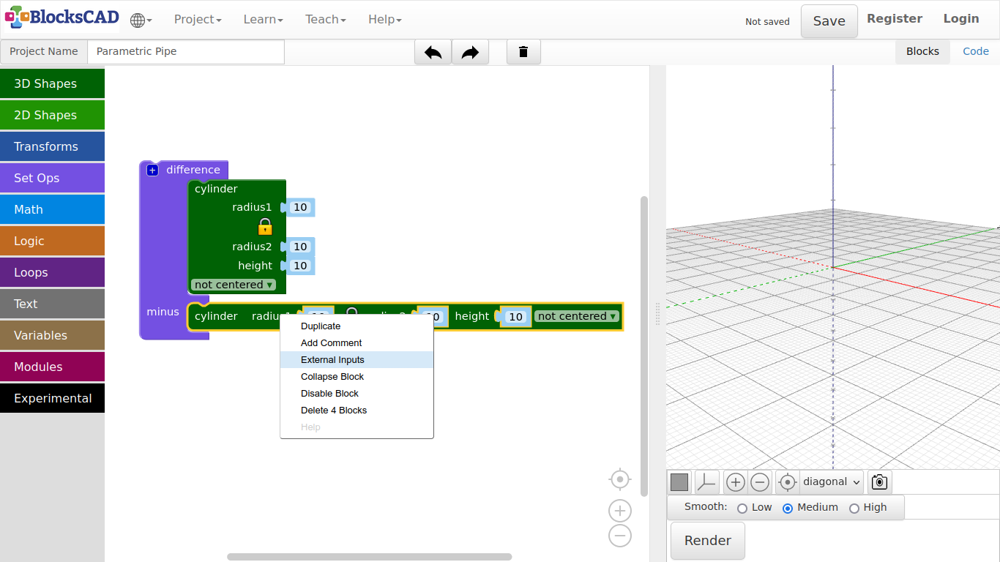
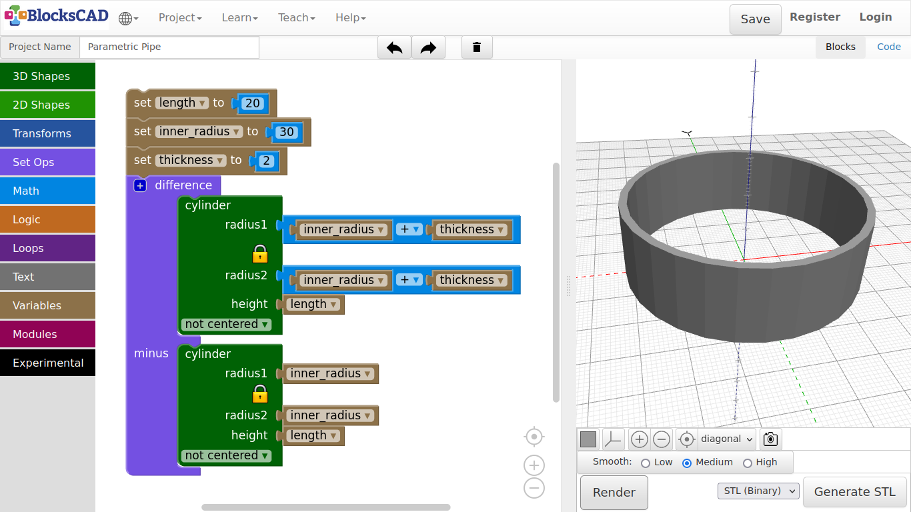

## 3.7. Calculator

Lets create a little calculator in BlocksCAD. You will be able to use all blocks in the math section put together math homework. Well a real calculator might be easier, but you can not make a model out of your result.

***First we build a display background!***

1. Drag n drop one **cube** from **3D Shapes**, one **translate** and **color** from **Transforms**, and one **union** from **Set Ops**.

2. Change the value of **cube** to ***X = 80, Y = 16, Z = 1***.

3. Then plug **cube** into **translate**.

4. Change the values of **translate** to ***X = -45, Y = -4, Z = 0***.

5. Now plug **translate** with **cube** into **color**,and change the color.

6. Press **Render**.

**You should see a small box that looks like a display.** **Now lets put the text "Result: " on top!**

7. Drag and drop one **3D text** from **Text**, one **translate** and one block **color** from **Transforms**, and one **union** from **Set Ops**.

8. Change the values of **3D text** as follow: ***3D text: Result: , size: 10, thickness: 2, font = Open Sans***, and plug it into **translate**.

9. Change the values of **translate** to ***X = -40, Y = 0, Z = 0***.

10. Drag **translate** with **3D text** into the first section of **union**.

11. Now drag this block **union** into **color**. Change the color.

12. Press **Render**.

**The blank calculator unit is ready! Now we need the actual math part!**

13. Drag and drop one **3D text** block from **Text**, two **1 + 1** blocks from **Math**, and one **set item to** block from **Variables**.

14. Plug one **1 + 1** into the first number place of the second **1 + 1** block, which results in ***1 + 1 + 1***.

**You can change number, operators or replace blocks with other blocks from Math. This depends on what you want to calculate!**

15. Now drag this math block part into **set item to** block.

16. Click on **item** and choose from the Drop-down menu **Rename**.

17. Rename it to ***Math***.

18. Now take the **3D text** block and plug it into the second part of **union** named **plus**.

19. Drag n drop the new **Math** block under **Variables** onto the first value of **3D text**, where the text suppose to go.

**Each time you create a new variable, BlocksCAD generates its own blocks "set YOUR\_NAME to" and "YOUR\_NAME". This is very important for parametric design.**

**We actually will now do our first parametric design.**

20. Change the rest of values of **3D text** as follows ***size: 10, thickness: 2, font: Open Sans***.

21. Press **Render**.

**You should see 3 now as the result of 1 + 1 + 1. Play a bit around with the numbers and operators to see the results, after you rendered the preview.**

**And this is what parametric design all about. You can change the numbers in the variable, and the program will adjust the new numbers.**

**Lets do another little example, so you understand parametric modeling a bit better.**

***Lets create a pipe that we can change easy!***

1. Start a new project.

2. Name it ***Parametric pipe.***

3. Drag n drop two **cylinder** from **3D shapes**, one **difference** from **Set Ops** to your workspace.

4. Plug in both **cylinder** into **difference**.

5. Use you right mouse button or finger touch to open the Pop-up window and choose ***External inputs***.

**This will change the way the block is displayed. As we use variables soon, it would become a very long block. This way, it will easier to work with.**

6. Drag and drop three **set item to** blocks from **Variables**, two **1 + 1** blocks and three **0** blocks from **Math**.

7. Plug in one **0** block in each **set item to** block.

8. Use the Drop-Down menu of each **set item to**, select **New Variable ...**, and use following names ***length, inner\_radius, thickness***.

9. Change the value in **0** of **set length to** to ***20***.

10. Change the value in **0** of ***set inner\_radius to*** to ***30***.

11. Then change the value in **0** of **set thickness to** to ***2***.

12. Now plug in one **1 + 1** block into the **cylinder** for **radius1** of the **cylinder** in the first section of **difference**.

13. In the same **cylinder** plug in the second **1 + 1** block for **radius2**.

14. Drag and drop four **inner\_radius** blocks, two **thickness** blocks, and two **length** blocks from **Variables** onto your workspace.

15. Plug in one **inner\_radius** block into each first position of **1 + 1** of **radius1** and **radius2** of the **cylinder** in the first section of **difference**.

16. Plug in the remaining two **inner\_radius** blocks as **radius1** and **radius2** of the **cylinder** in the second section of **difference** named **minus**.

17. Plug in one **thickness** block into each second position of **1 + 1** of **radius1** and **radius2** of the **cylinder** in the first section of **difference**.

18. Finally, plug in one **length** block for the **height** value of each cylinder.

19. Press **Render**.

**Now you create a fully parametric design for a pipe!**

Change the values of ***length***, ***inner\_radius***, and ***thickness***, while pressing **Render** after the change to see the different outcomes.

---

