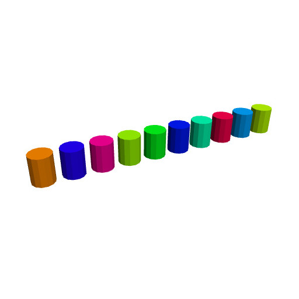
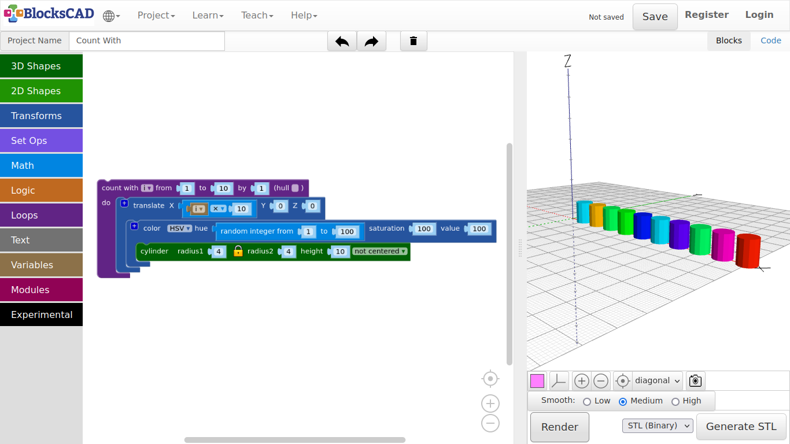
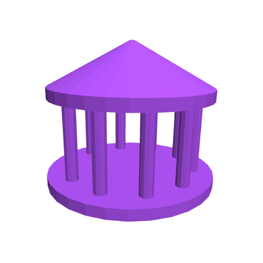
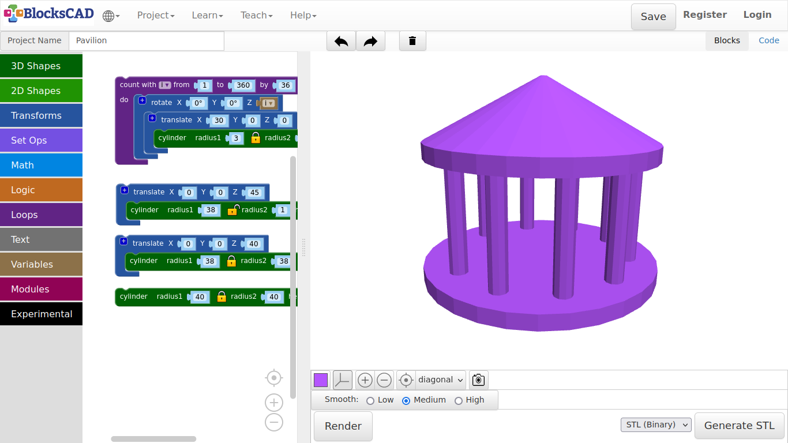

## 3.8. Pavilion

Before we go and model the Pavilion, I will introduce you to the use of loops in modeling. Loops are essential in programming. The loop repeats a certain task till it the program reaches a specified condition.

**In the following example, we will create 10 cylinders positioned side by side through a loop.**

1. Drag n drop one **count with** from **Loops**, one **translate** from **Transforms**, one **1 + 1** from **Math**, and **cylinder** from **3D Shapes** onto your workspace.

2. Change the values of **cylinder** to ***radius1: 4*** and ***height: 10***, and plug it into **translate**.

3. Drag n drop **i** from **Variables** onto the workspace, then plug it into the first position of **1 + 1** instead of **1**.

4. Change the **+** sign to **x**, and change the second **1** to **10**.

5. Now plug the **i x 10** block into **X** of **translate**.

6. Plug **translate** into **count with**.

7. Press **Render**.

**The loop counts from 1 to 10 by 1. i is the variable, that contains the current number of the count. Each step the loop creates a cylinder and moves it along the x axis by 10. There are 10 cylinders with a distance of 10 mm along the x axis. *Lets add some colors to the cylinder randomly!***

8. Drag out **cylinder** out of **translate**.

9. Drag and drop one **color HSV** block from **Transforms**, and one **random integer** from **Math** onto the workspace.

10. Plug **random integer** into **hue** of the **color HSV** block, and plug this one into **translate**.

11. Now plug in the **cylinder** block into **color HSV**.

12. Press **Render**.

**Every time you press Render, the cylinders will be recreated with different colors!**

---

**Now lets model a pavilion.**

1. Drag n drop three **cylinder** from **3D Shapes**, and two **translate** blocks from **Transforms**.

2. Change the value of the first **cylinder** to ***radius1 = 40, height = 5***.

3. Press **Render**.

**This is the foundation! Now lets build the roof with the other cylinders.**

4. Change the values of the second **cylinder** to ***radius1 = 38, height = 5***, and plug it into the first **translate**. Then change the values of this **translate** to ***X = 0, Y = 0, Z = 40***.

5. Like in with the umbrella example, click on the **lock symbol** of the third **cylinder** to unlock the 2nd radius.

6. Change the values of this **cylinder** to ***radius1 = 38, radius2 = 1, and height = 20***.

7. Then plug it into the second **translate** block and change its **Z** value to ***45***.

8. Press **Render**.

***See! The empty space between the foundation and the roof are going to be filled with columns that circles around near the outer edge!***

**To avoid modeling of each column, we will use a loop, like in the starting example to create all of them at once. Each cycle of the loop will create one column, and apply a translation and rotation to it.**

9. Drag and drop one **cylinder** from **3D Shape**, one **translate** block and one **rotate** block from **Transforms**, one **count with** from **Loops**, and the just created block **i** in **Variables**.

10. Change the values of the **cylinder** to ***radius1 = 3, height = 40***, and plug it into the **translate** module.

11. Then enter ***30*** as **X** value in the **translate** block.

12. Now we plug this into the **rotate** block, and use the variable block **i** as **Z** of **rotation**.

13. Press Render.

***As you see, there is the first column!***

**i is a variable that represent a number. We want to build 10 columns, that is going to be positioned near the outer edge. To do this, we need to rotate it with each loop, so the 10 columns get distributed all around the outer edge.**

**We will do this with the “count with” block. It is already using “i”, so we do not need to change this. The counter will start with 1 and end with 360, which is one full turn. As we want to create 10 columns, we will increase the value “i” by 36 each loop.**

14. Change the values of **count with** to ***from: 1 to: 360 by: 36***.

15. Now plug in the **rotate** block with **translate** and the **cylinder** into the **count with** block.

16. Press **Render**.

---

##### **Exercise:**

**Create a little model and multiply it with “count with”. You can use translate in all directions, or different rotations.**

---
