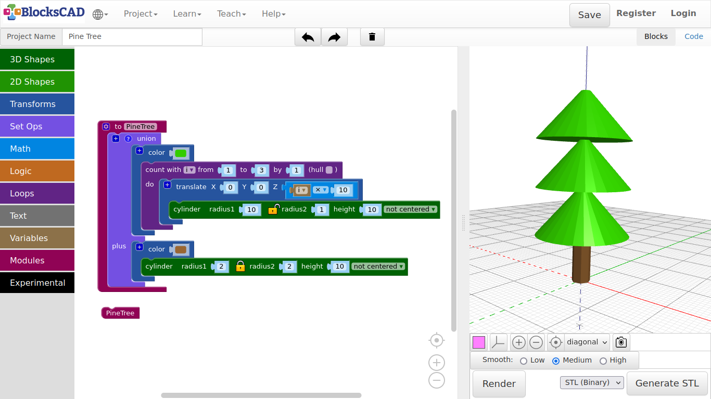

## 3.9. Pine tree

**We will now create a tree, that can be later used to build a forest.**

**With this you will be introduced to the functionality of modules. Modules are like a block box, that contains many many blocks at once. This block box is then represented by a single block.**

***Lets build first the trunk, then the rest with the module we just learned about!***

1. Drag n drop one **cylinder** from **3D Shapes**, and one **color** from **Transforms**.

2. Change the value of the cylinder to **radius1 = 2, height = 10**.

3. Plug it into the **color** block, and change the **color** to brown.

4. Press **Render**.

**Now lets do the tree top or pines in an easy form.**

5. Drag and drop one **cylinder** from **3D Shape**, one **translate** and one **color** from **Transforms**, one **count with** from **Loops**, one **1 + 1** block from **Math**, and the generated **i** block from **Variables** onto the workspace.

6. Change the value of **cylinder** to ***radius1 = 10, radius2 = 1, height = 10***, then plug it into **translate**.

7. Add the **i** variable into the first position of the **1 + 1** block.

8. Change the operator symbol **+** to **x**, and the second number to ***10***.

9. Now plug it into the **Z** value of **translate**, so with each loop the next object created will move up by 10.

10. Now we plug all into the **count with** block.

**We want to create 3 parts, so we will do 3 loops.**

11. Change the values **count with** to ***from: 1 to: 3 by: 1***.

12. Next plug the whole block you just created into the **color** block, and change **color** to green.

13. Press **Render**.

***You should see a nice pine tree now!***

**But it is just one tree. What is to do to use the same tree many times, but not duplicate the tree each time for a new one.**

**All blocks you can choose in BlocksCAD are actually modules, that you used to create your objects. However, you can create your own modules to create customized blocks.**

**That is why I show you this with the pine tree. We will build a forest, that will use the pine tree module as block.**

14. Drag and drop one **To do something** block from **Modules**, and one **union** block from **Set Ops** onto your workspace.

15. Plug the trunk **color** block inclusive all embedded blocks, and the tree top **color** block with all blocks into the **union** block.

16. Change the **To do something** blocks name **do something** into **Pine Tree**, and plug the **union** block into it.

17. Press **Render**.

***What!? Nothing to see? That is right, as the Pine Tree is a module now.***

**As all other blocks, you will need to drag and drop it first onto your workspace.**

18. Drag and drop **Pine Tree** from **Modules** onto your workspace.

19. Press **Render**.

**The tree should re-emerged again.**

***Save this project and name it, so you can use it in our next project.***

20. Now delete the **Pine Tree** block you just dragged in.

21. Name the project after the name of your module ***Pine Tree*** and save it.

---

##### **Exercise:**

**Create similar modules, e.g. flowers, stones, or similar things you find in a forest. Save each separately. Do not forget to erase the module representing block with the module name, before saving.**

***Tip: Create first the object without plugging it into "To do something" block. Only plug it in, before you finished as last step before saving!***

---
