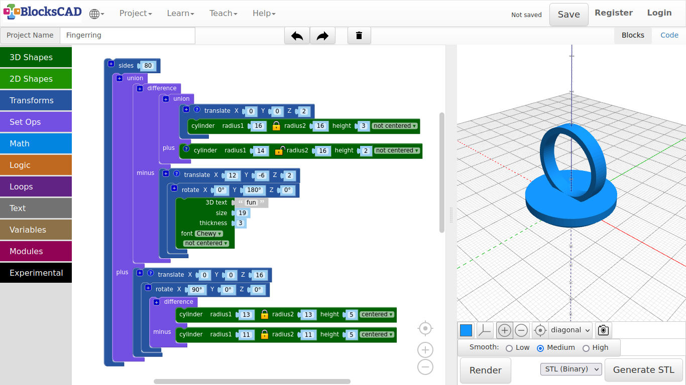

## 4.1. Finger Ring

**Our first object, that you can print is going to be a finger ring. You can use ruler to measure your finger diameter. It is even easier, if you have got a ring already.**

***Lets get started!***

1. As always, lets create a new project and name it ***Fingerring***.

***First, lets create be ring base!***

2. Drag and drop two **cylinders** from **3D Shapes**, one **translate** from **Transforms**, and one **union** from **Set Ops** onto your workspace.

3. Plug one **cylinder** into **translate**.

4. Change the values of **cylinder** to ***radius1: 16, height: 3***.

5. Change the values of **translate** to ***X: 0, Y: 0, Z: 2***.

6. Now plug the **translate** block with the embedded **cylinder** into the first section of **union**.

7. Plug the second **cylinder** into the second section of **union** named **plus**.

8. Click on the lock icon of this **cylinder** to disconnect **radius2** from **radius1**.

9. Change the values of this **cylinder** to ***radius1: 14, radius2: 16, height: 2***.

10. Press **Render**.

**You should now see the base of the ring. Lets carve out the word "fun". But it also can be a graphic like the heart we modeled.**

11. Drag and drop one **3D text** from **Text**, one **translate** block and one **rotate** block from **Transforms**, and one **difference** block from **Set Ops**.

12. Plug in the **3D text** block into **rotate**.

13. Change the values of **3D text** to ***text: fun, size: 19, font: Chewy, thickness: 3***.

**As you might already recognized, the base of the ring is upside down. This is because of the printing guide. Start with the side, that has the biggest flat surface.**

**Therefore, we need to turn the text 180 degrees.**

14. Change the **Y** value of **rotate** to ***180*** degrees.

15. To get the text into the center of the base change the values of the **translate** block to ***X: 12, Y: -6, Z: 2***.

16. Press **Render**.

***It is fun on the base!***

**Now lets create the actual ring. This is very similar to the previous parametric pipe example.**

17. Drag and drop two **cylinder** from **3D Shapes**, one **translate** and one **rotate** from **Transforms**, and one **difference** from **Set Ops** onto your workspace.

18. Plug in a **cylinder** into the first section of **difference**, and change its value to ***radius1: 13, height: 5***.

19. Plug in the second **cylinder** into the second section of **difference** named **minus**, and change its values to ***radius: 11, height: 3***.

20. Plug **difference** into **rotate** and change the value of **X** to ***90***.

21. Now move **rotate** into **translate** and change the **Z** value of **translate** to ***16***. This is the height of the rotated ring.

22. Press **Render**.

You should see the ring now with base and carved text. However, the edges are still rough.

***Lets add smoothness to it!***

23. Drag and drop one **sides** block from **Transforms**, and one **union** block from **Set Ops** onto your workspace.

24. Plug in the base part into the first section of **union**, then the ring part into the second section named **plus**.

25. Now drag the entire union block into **sides**. Change the value to ***80***.

26. Press **Render**.

27. Name your project and save it to your computer.

---

##### **Exercise:**

1. Change the ring inner radius to the variable size and change the outer ring accordingly. This must be connected to the height of the ring as well, which is "Z" of "translate".
2. Change the text, font size and font in 3D Text, adjust translate() of the text, so it it is in the center of your button. You might want to try other shapes, or mix of shapes instead of letters.

---

##### **A printed example**

---

