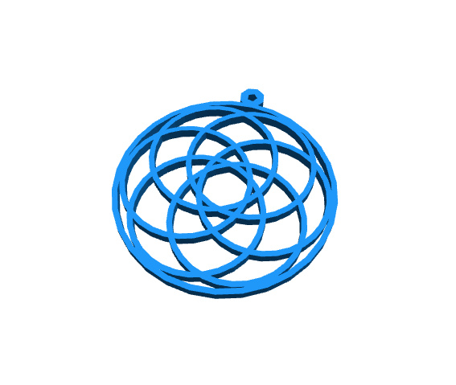
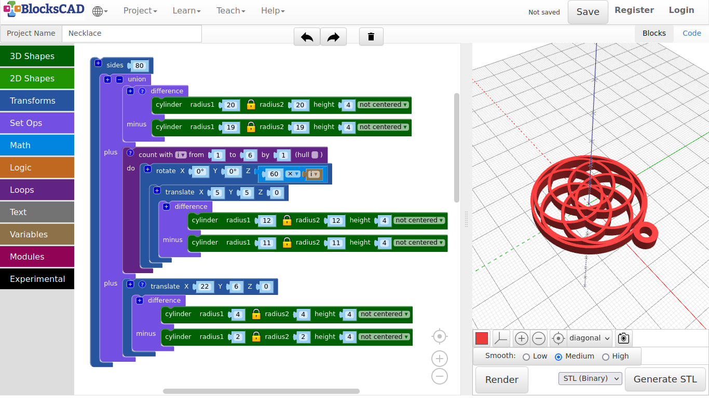
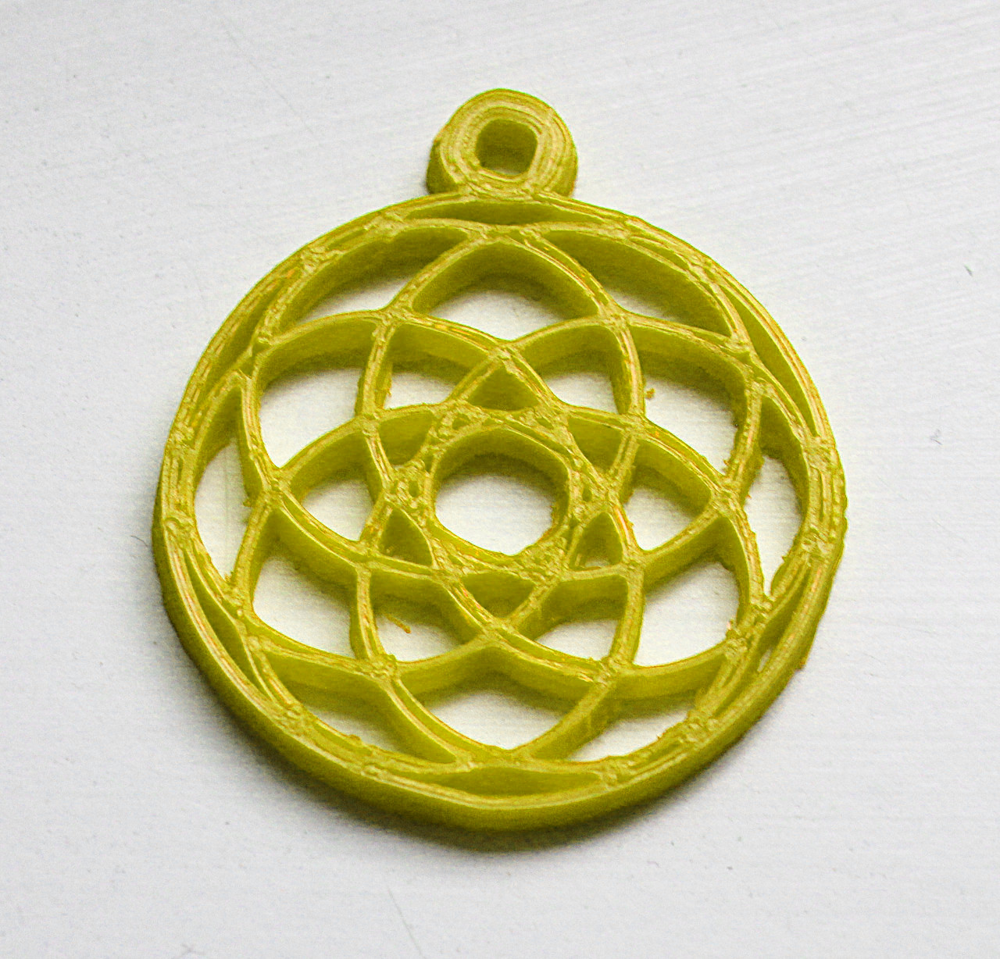
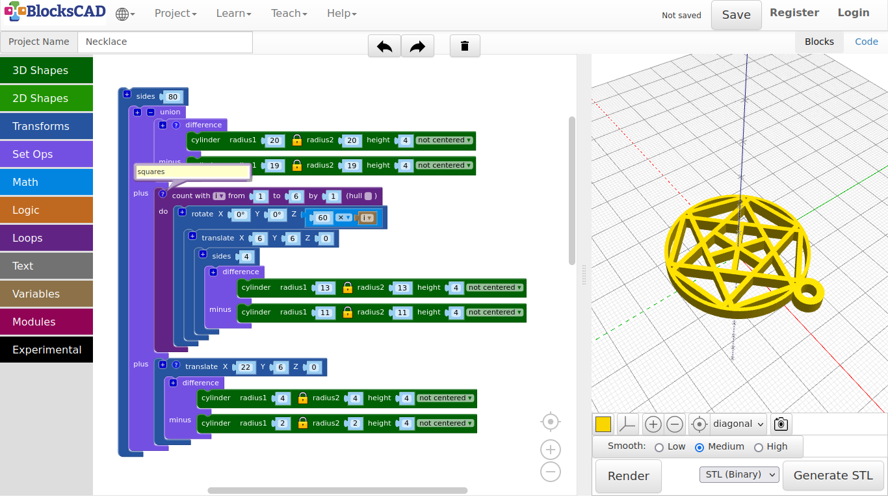
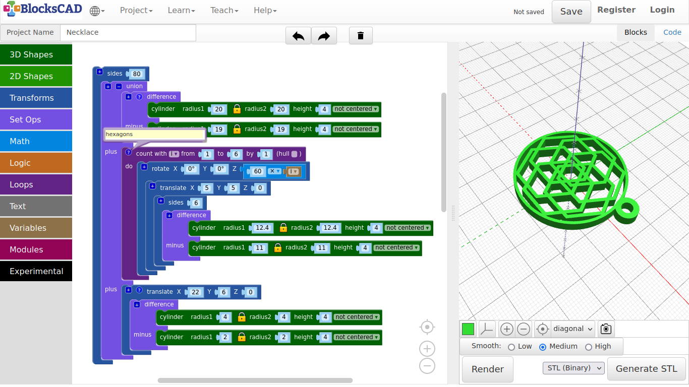
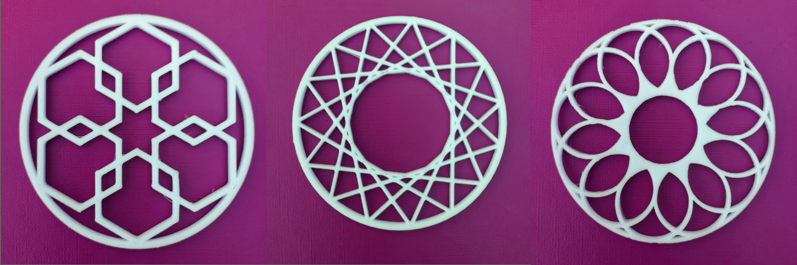

## 4.2. Necklace

**In this examples we will use loop again to create nice geometric patterns, that we will use to create necklaces.**

1. First, lets create a new project.

2. Drag and drop two **cylinder** from **3D Shapes**, and one **difference** block from **Set Ops** onto your workspace.

3. Plug in both **cylinder** into **difference**.

4. Change the values of the first **cylinder** to ***radius: 20, height: 4***, and the values of the **cylinder** below to ***radius: 19, height: 4***.

5. Press **Render**.

**You now should see a nice ring. Well, not really, however we will smooth the edges later. Now lets add shapes within this outer ring! We start with rings.**

6. Repeat 2. and 3.

7. Now change the values of the first **cylinder** to ***radius: 12, height: 4***, and the values of the second **cylinder** to ***radius: 11, height: 4***.

8. Press **Render**.

**You should see a smaller ring within the bigger ring.**

9. Drag and drop one **translate** and one **rotate** from **Transforms** onto your workspace.

10. Plug in the **difference** block into **translate**, and change the **X** and **Y** value of **translate** both to ***5***.

**You should see the ring lining up with the outer ring, while set a bit off.**

11. Now plug this entire block into **rotate**.

12. Change the **Z** value with different numbers, press **Render** each time.

**The inner ring should now "roll" around the outer ring. This is what we want to do, but moving around each ring to a different position.**

13. Drag and drop a **count with** block from **Loops**, a **1 + 1** block from **Math**, and the new variable **i** generated in **Variables** onto your workspace.

**We will do something similar, that we did by building the pavilion.**

**So what do we want to do? We want to create one ring and rotate each around the center. For 6 rings, each ring needs to rotate: 360 / 6 = 60 degrees.**

14. Plug in the **i** variable into the second position of the **1 + 1** block, and change the values to make it look like **60 x i**.

15. Now plug the entire block **rotate** into **count with**, and change the values as follows >> **from: 1 to: 6 by: 1**.

16. Press **Render**.

***See!? A nice flowery pattern.***

**But how do we attach it to the chain? We need another ring on top of the outer ring.**

17. Go to any of the **difference**, select it, then use your right mouse button or hold your finger on it. Choose **Duplicate** from the Pop-up menu options.

18. Move it down to the bottom of the entire blocks.

19. Drag and drop in a **translate** block from **Transforms**. Change the values to ***X: 22, Y: 6, Z: 0***.

20. Then plug the duplicated **difference** block into **translate**. Change the values of the first **cylinder** to ***radius1: 4, height: 4***, and the values of the second **cylinder** to ***radius: 2, height: 4***.

21. Press **Render**.

**You should see now a ring on the outer edge of the big ring.**

***Now lets smoothed the edges again!***

22. Drag and drop one **union** block from **Set Ops**, and one **sides** from **Transforms** onto your workspace.

23. Press the **+** icon on the **union** block to add one more slot.

24. Plug all three block entities **difference**, **count with**, and **translate** one in each slot of **union**.

25. Then plug this **union** block into **sides**, and change the number to ***80***.

26. Press **Render**.

***Finished!***

**Ready to print. It should looks similar to the image below.**

27. Like always, name and save your project.

---

##### **Printed example:**

---

##### **Exercise:**

**Duplicate your “Count with” block, and disable the original block via RMB/Finger touch “Disable block”. Move the duplicated version below and start experimenting. Try different shapes.**

*Tip:*

1. Use sides() between translate() and difference() with 3, 4, 6 in order to create different shapes easy. Change the values in translate() to get different results.
2. Increase or reduce "to" in "count with", and degrees in "rotate" beneath, to change to outcome of the patterns.
3. Again, reduce the number of entire sides (from 80 down to 20 or even lower), when you experiment with shapes. Otherwise, it takes more time to render, and you have to wait longer. Once you are satisfied with your design, increase the sides number.

---

##### **Squares example:**

---

##### **Hexagons example:**

---

##### **Exercise**

***Can you make these?!***

---

