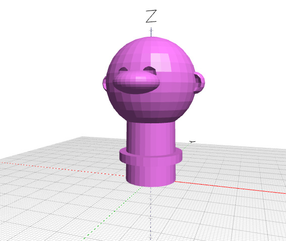
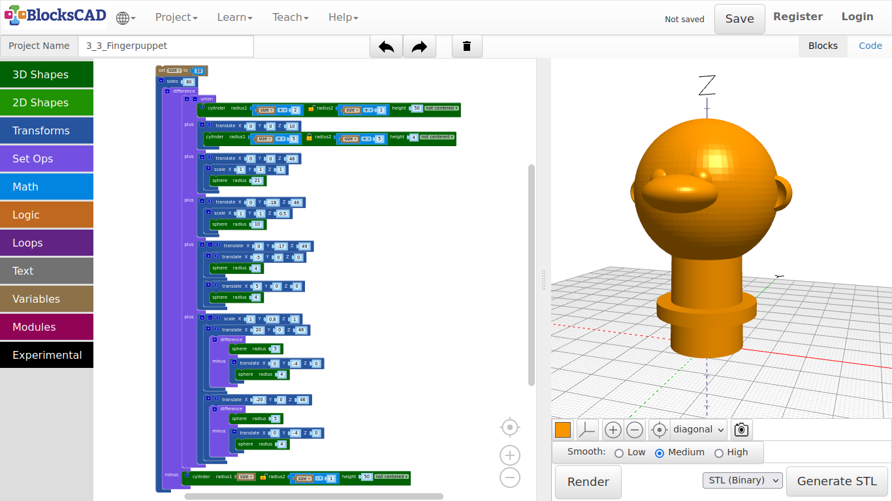
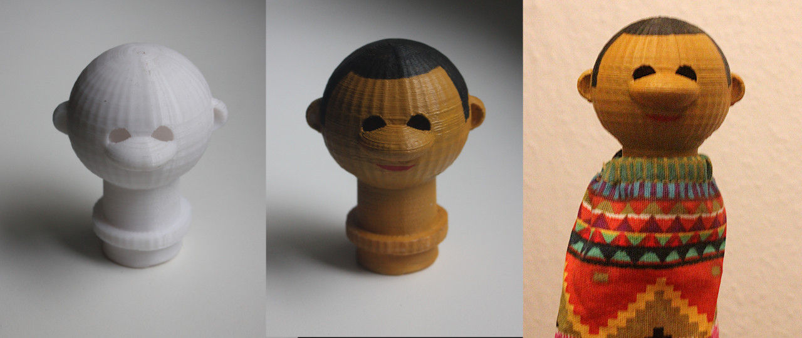
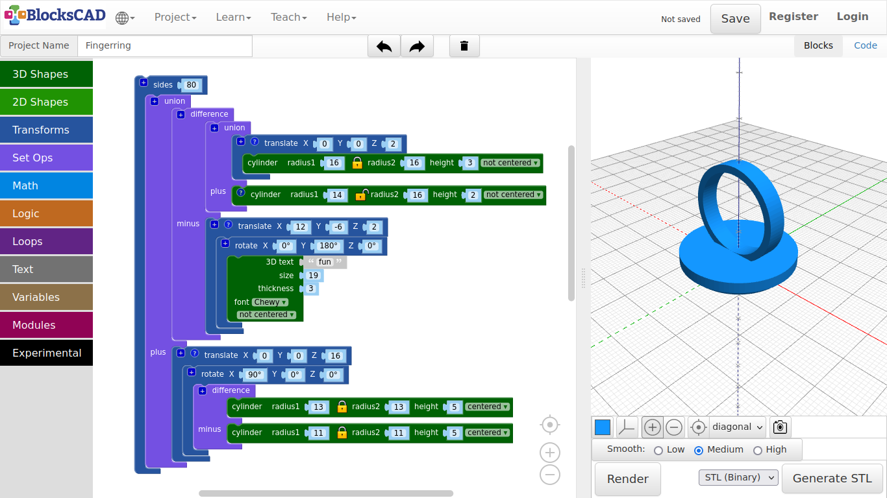

## 4.3. Finger Puppet

**First, we need to measure our index finger to know, what each of us need to put into the values later. For that use your ruler and write down the diameter of your index finger just above the second joint. Measure from front and side and take the bigger number.**

**If there is no ruler around right now, just use the basic values in this tutorial. We are going to model the neck parametric, so you can change it easier later.**

1. First, create a new project.

2. Drag and drop three **cylinder** from **3D Shapes**, one **difference** and one **union** block from **Set Ops**, and one **translate** from **Transforms**.

3. Plug in **union** into the first section of **difference**.

4. Then plug in the **translate** block into the second section of **union** named **plus**, and change the values to ***X: 0, Y: 0, Z: 10***.

5. Now plug in one **cylinder** into the first section of **union**, the second **cylinder** in the **translate** block in the second section of **union**, and one **cylinder** in the second section of **difference** named **minus**.

***Now lets prepare the neck of your finger puppet to be parametric!***

6. Drag and drop one **set item to** from **Variables**, one **0** block and one **1 + 1** block from **Math** onto your workplace.

7. Click on **item** of the **set item to** and rename it to ***size***.

8. Now drag in the new block named **size** from **Variables** onto your workspace.

9. Plug in **0** into **set size to**, and change it to ***10***.

10. Now duplicate the **size** block once by right clicking or holding your finger on the block till the Pop-up menu opens, so you can select **Duplicate**.

11. Take this duplicate **size** block and plug it into **radius1** of **cylinder** in the second section of **difference** called **minus**.

12. Click on the Lock icon in the same **cylinder**.

13. Then plug in the remaining **size** block into **1 + 1** as first number. Change the rest so it looks like **size - 1**.

14. Now plug **size - 1** into **radius2** of **cylinder** and change **height** to ***50***.

15. Select the **size - 1** in **radius2** of the **cylinder** block.

16. Duplicate it four times, and plug those 4 for each **radius1** and **radius2** of the remaining two **cylinder**.

17. Click on the Lock icon of the **cylinder** in the first section of **union**. Change to values till it looks like **radius1: size + 2, radius2: size + 1, height: 50**.

18. Now change the values of the **cylinder** of the second section of **union** named **plus** to look like ***radius1: size + 5, radius2: size + 5, height: 4***.

19. Press **Render**.

**You should have a cylinder looking similar like the pipe example, except there is an extra collar cylinder. Try a different number in "size", and press "Render" to see the changes. This is where you finger will be. The collar is the part, that holds your puppet clothing in place. Now we will continue with the head. Follow the instructions, but you can start from here again, if you would like to create your own head.**

20. Press the **+** icon of **union** four time to create four extra slots, which will result in six slots in total.

**First and second is already used by the neck and the collar. The third is for the head shape, the fourth for the nose, the fifth for the eyes, and the sixth for the ears.**

***Lets start with the head!***

21. Drag and drop one **sphere** from **3D Shapes**, one **translate** block and one **scale** block from **Transforms** onto your workspace.

22. Change number in **sphere** to ***21***, and plug it into **scale**.

23. Keep **scale** at is ***1, 1, 1***, and plug it into **translate**.

24. Change the values of **translate** to ***X: 0, Y: 0, Z: 46*** and plug it into the third slot of **union**.

25. Press **Render**.

***Super....Charlie Browns soccer ball head!*** ***Next the nose!***

26. Select **translate** of the head sphere, and click the right mouse button or hold your finger till the Pop-up menu appears.

27. Choose **Duplicate**, and plug the whole block into the fourth slot of **union**.

28. Now change the values of **sphere** to ***21***, of **translate** to ***X: 0, Y: -18, Z: 46***, and of **scale** to ***X: 1, Y: 1, Z: 0.5***.

29. This **translate** block with both duplicates goes into the fourth slot of **union**.

30. Press **Render**.

***Do not be so nosy...the nose is not the only thing! Lets carry on with the eyes!***

31. Drag and drop two **sphere** from **3D Shapes**, and three **translate** from **Transforms** onto your workspace.

32. Now plug each **sphere** in one **translate**, then both **translate** blocks with their **sphere** into the remaining **translate**.

33. Press **+** to add one slot to the main **translate**, so both **translate** fit in.

34. Change the value of both **sphere** to ***4***.

35. Then change **X** value of both **translate** above to ***5*** and ***-5*** accordingly.

36. Change the values of the main **translate** to ***X: 0, Y: -17, Z: 49***.

37. This **translate** block goes now into the fifth slot of **union**.

38. Press **Render**.

**Both eyes should appear. The spheres are identical, except translate is positive 5 and negative 5 for each eye.**

**Encapsulating blocks is very useful so you can keep it in relation with each other, while being able to use these block as a group.**

**In this example we can now move around the both eyes with the main "translate" block.**

***Lets continue with the ears!***

39. Drag and drop two **spheres** blocks from **3D Shapes**, two **translate** block and one **scale** block from **Transforms**, and one **difference** from **Set Ops** onto your workspace.

40. Plug one **sphere** into one **translate** block, and change the value to ***4***.

41. Take this **translate** block with the **sphere** and drag it into the second section of **difference** named **minus**. Change the value **Y** of **translate** to ***-4***.

42. Now plug in the second **sphere** into the first section of **difference**, and change the value to ***5***.

43. Plug this **difference** block now into the remaining **translate** block, and change the values of **translate** to ***X:20, Y:0, Z:46***.

44. Select this **translate** block and duplicate it.

45. In the duplicate, only change the values of the **translate** block on top to ***X:-20, Y:0, Z:46***.

46. Now plug both of these **translate** blocks with their content into **scale** and change the **Y** value of **scale** to ***0.8***.

47. The **scale** block finally can go into the sixth slot of **union**.

48. Press **Render**.

***Ok, so far so good!***

***But all is a little minecraft. Lets smooth it up a little again!***

***What block did we used last time?***

49. Drag and drop one **sides** from **Transforms** into the scene.

50. Take now the entire **difference** block and plug it into **sides**.

51. Change its value to ***80***.

**You can use a different number, if you like. Remember, the higher the number, the more squares and triangles in the scene, the longer it will take to render.**

52. Press **Render**.

53. Name the project and save it.

---

##### **Exercise:**

**Create your own head. Start by naming the project differently, so you keep everything we did in this project so far.**

***Tip:***

1. Draw a doodle of a head first, so you can see in front of you, what you want to create.
2. Create only one side of eyes and ears first, then duplicate those parts later on.

---
