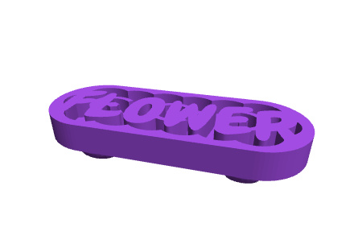
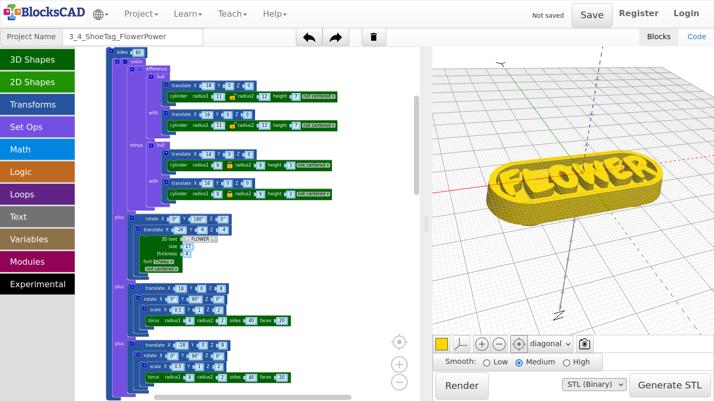
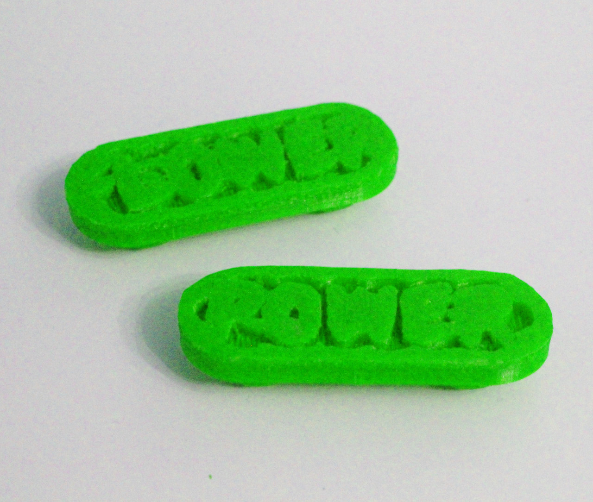

## 4.4. Shoe Tag

**The shoe tag has holes to thread your shoe laces. So you can wear it with your shoes.**

1. As usually, lets start with a new project.

2. Name it ***Shoe Tag***.

***Like the finger ring, we will create the base first!***

**Also this time, we will build it upside down, as it is better to print it that way. Lets start with the base. We are going to use "hull", that creates an objects from all objects within this block.**

3. Drag and drop one **cylinder** from **3D Shapes**, one **translate** from **Transforms**, and one **hull** block from **Set Ops** onto your workspace.

4. Click the lock icon on **cylinder** to unlock the connection between **radius1** and **radius2**, and change the values to ***radius1: 11, radius2: 12, height: 7***.

5. Now plug the **cylinder** into the **translate** block, and change its **X** value to ***-18***.

6. Select the **translate** block and duplicate it.

7. Plug in both **translate** blocks into **hull**.

8. Press **Render**.

**"hull" combined both cylinders to one element. The different radius gives it a little slop. Now we will cut out a part to make space for a word.**

9. Drag and drop one **difference** block from **Set Ops** onto your workspace.

10. Select the **hull** block group and duplicate it.

11. Plug both **hull** groups into **difference**.

12. Change the values of **cylinder** in the second section of **difference** named **minus** to ***radius1: 9, radius2: 9, height: 3***.

13. Press **Render**.

**Now you should see an area that is cut out of the base. Lets add the word "Flower" to it.**

14. Drag and drop one **3D text** block from **Text**, one **translate** and one **rotate** from **Transforms**, and one **union** from **Set Ops** onto your workspace.

15. First lets get **union** ready for all block groups by using the **+** sign to add two more slots, so we have four slots.

16. Plug in the base block group into the first slot.

17. Next, plug in the **3D Text** block into **translate** and change the values to ***3D text: FLOWER, size: 17, thickness: 4, font: Chewy***.

18. Drag this **translate** block with the text into **rotate**, and change the values of **translate** to ***X: -26, Y: -6, Z: -4***.

19. Change the **Y** value of **rotate** to ***180***.

20. Plug the **rotate** block group into the second slot of **union**.

21. Press **Render**.

**Now the word is in place! But there is nothing, we can attach it to our shoe laces yet.**

***Lets do that now!***

22. Drag and drop one **torus** from **3D Shapes**, one **scale** block + one **translate** block + one **rotate** block from **Transforms** onto your workspace.

23. Plug the **torus** block into **scale**, and change its values to ***radius1: 8, radius2: 2, sides: 40, faces: 20***.

24. Drag **scale** with **torus** into **rotate**, and change the values of **scale** to ***X: 0.5, Y: 1, Z: 2***.

25. As next take this **rotate** block and plug it into **translate**.

26. Change the **Y** value of **rotate** to ***90***.

27. Finally change the values of **translate** to ***X: 18, Y: 0, Z: 8***.

28. Press **Render**.

We created one side of the lace hole. Before we continue with the second hole, change the positions of "translate", "rotate", and "scale" within the block group. Render it, after you changed it.

***Can you see!?***

**Order matters in this case. The program will start with the lowest instance, which is the "torus", then it does the next action above, up and up as many of those are in on encapsulated group. Get back the original order, but keep this in mind when you model your own designs.**

**Back to the second hole for our show laces.**

29. Select the **translate** block group we worked on, and duplicate it.

30. As all stays the same, but the position, change the **Y** value of one **translate** block to ***-18***.

31. Plug both **translate** block groups into the third and fourth slot of **union**.

**Before we do a final render, lets increase the smoothness through more squares used to create the model.**

32. Drag and drop one **sides** from **Transforms** into your workspace.

33. Plug the entire block group **union** into **sides**, then change its value to ***80***.

34. Press ***Render***.

---

##### **Printed example:**

---

##### **Exercise:**

***Add your own words to the shoe tag, or use other shapes to build a graphic!***

---
