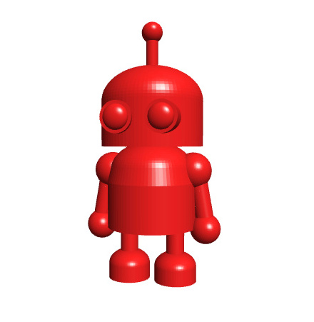
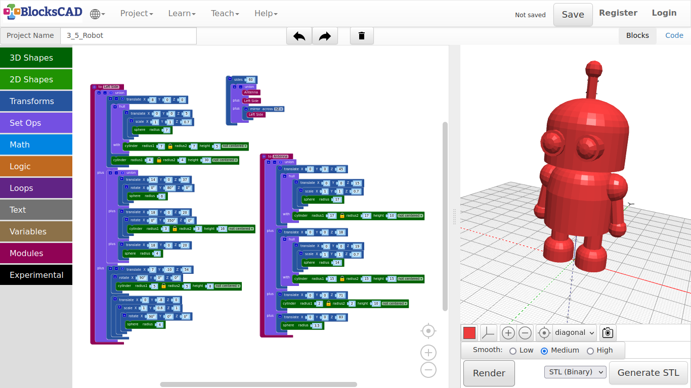
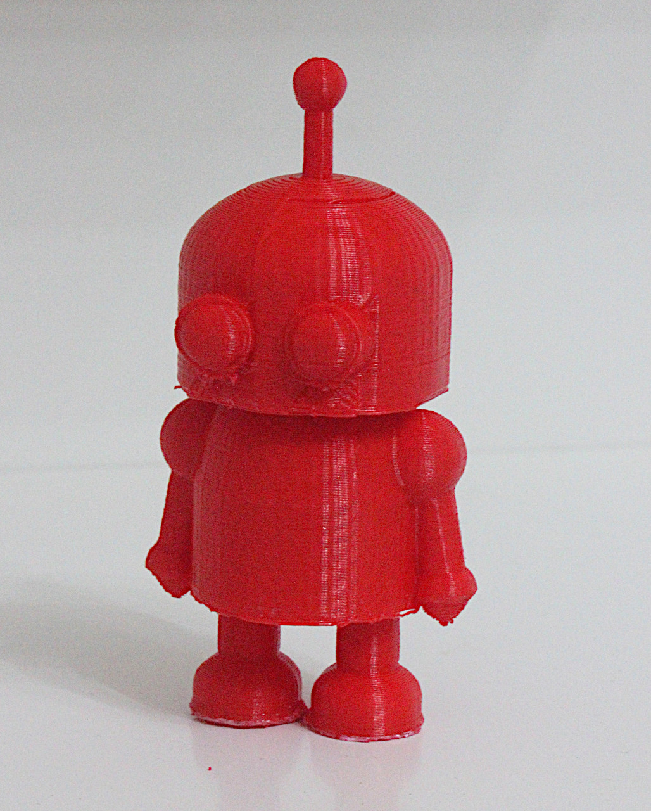

## 4.5. Robot 1

**This robot has the most parts of all the other models we did together. I will show you, how to make things simpler, if you think first, after you made you sketch of a new thing you want to create.**

***So, lets get started!***

1. First open a new project and name it ***Robot***.

**We will do the body and head, including the antenna**.

***Lets start with Head of Robby!***

2. Drag and drop one **cylinder** and one **sphere** from **3D Shapes**, one **scale** and two **translate** blocks from **Transforms** and one **hull** form **Set Opts** onto your workspace.

**We will use hull() to create one shape from a sphere and a cylinder.**

3. Add following values to the **cylinder**: ***radius1 = 17, height = 10***.

4. The **sphere** block has a radius of ***17*** as well.

5. Plug the **sphere** into **scale**, and change the value of **Z** to ***0.7***.

6. Plug the **scale** block into one **translate** block.

7. Change the values of **Z** to ***15***.

8. Render it!

**So, this are the 2 object we want to combine to one.**

9. Plug **translate** with the sphere in it into the first position of **hull**.

10. Then place the **cylinder** block in the second position called **with**.

11. Render again! See!?

12. Now plug the **hull** block into the second **translate**, so we can put the head in place.

13. Change the **Z** value of **translate** to ***45***.

**As next, we create the body by duplicating the entire block.**

14. Duplicate the entire block you just created.

**Start to change the values of the copy from up to down.**

15. Change the **Z** value of the top **translate** to **18**.

16. Change the **Z** value of the **translate** block in first position of the **hull** block to ***19***.

17. Change the radius of the **sphere** to ***14***.

18. Change **radius1** of the **cylinder** in the second slot of **hull** to ***15***, and the **height** to ***15*** as well.

19. Press **Render**!

**Now you should see the body and head!** **Next we will create the antenna on top of the head, and group all together.**

20. Drag and drop on **union** from **Set Opts**, one **cylinder** and one **sphere** from **3D Shapes**, and two **translate** from **Transforms** onto your workspace.

21. Change the values of **cylinder** to ***radius1 = 2, height = 10***.

22. Now plug it into one **translate** and change the **Z** axis to ***71***.

23. Continue with the **sphere** by changing the radius to ***3.5***.

24. Plug it in the second **translate** block, and change its **Z** value to ***83***.

25. Lets group all 4 blocks to one by creating 4 free slots in **union** using the **+** symbol two times.

26. Plug all parts in.

27. Press **Render**.

**Now you should see an antenna on the head on its torso. Lets create a module from this entire \*union\* block.**

28. Drag and drop one **to do something** from **Modules** onto your workspace.

29. Now, plug the entire **union** block into the **to do something** block.

30. Rename **to do something** into ***to head***.

31. Now drag and drop the new block called **head** from **Modules** onto your workspace.

32. Render it!

**Now we will create the leg, the arm and the eye on one side, starting with the leg. As it will look similar to the body and head, you can again create a duplicate of either by clicking on the *to head* module including the *translate* and *hull* blocks.**

33. Change **to head** into **to left side**.

34. Change the values of **translate** to ***X = 8, Y = 0, Z = 0***.

35. In the second **translate**, change the values to ***X = 0, Y = 0, Z = 5***.

36. The radius of the **sphere** block becomes ***7***, as well as the **cylinder** **radius1** with a **height** of ***5***.

37. Render it!

**This is the foot, so we need to add the rest of the leg.**

38. Drag and drop one **cylinder** from **3D Shapes** onto your workspace.

39. Change the values of **cylinder** to ***radius1 = 3***, and ***height = 30***.

40. Now, use the **+** symbol of the foots first **translate** block to get another slot for the leg.

41. Plug in the **cylinder** block.

42. Press **Render**!

**You should see now the leg with the foot connected to the body.**

***Lets continue with the arm!***

37. Drag and drop two **sphere** and one **cylinder** from **3D Shapes**, two **translate** from **Transforms**, one **rotate** block from **Transforms**, and one **union** from **Set Opts** onto your work spaces.

***Let start with the shoulder!***

38. Change to radius of one **sphere** to ***6***, then plug it into **rotate**.

39. Change the **Y** Axis to ***80*** degrees.

**You need to write it in, as the wheel does not have 80 degree to set.**

40. Next, plug the **rotate** block into a **translate** block, and change to values there to ***X = 14, Y = 0, Z = 37***.

41. For the rest of the arm, take the other **translate** and use **+** symbol to add a second slot.

42. Change the values of that **translate** module to ***X = 18, Y = 0, and Z = 20***.

43. Take the second **sphere** and change its radius to ***5***, then plug it into one slot of that **translate** block with 2 slots.

44. Now change the values of **cylinder** to ***radius1 = 3, and height = 16***.

45. Then plug it into the second **rotate** block. The **Y** Axis here needs to be ***350*** degrees.

46. Now plug in the **rotate** block with the **cylinder** into the second free **translate** slot.

47. Then group the shoulder and arm with hand together by plugging it all into the **union** block. Add one slot for **union** using **+**.

***Now we create the eye on that side!***

48. Drag and drop one **sphere** and one **cylinder** block from **3D Shapes**, two **translate** + two **rotate** + one **scale** from **Transforms** onto the workspace.

49. Lets start with changing the **cylinder** values to ***radius1 = 5, height = 8***.

50. Plug the **cylinder** block into one **rotate** block.

51. Change the **X** rotation to ***90*** degrees.

52. Then plug it into one **translate** block, and change that values to ***X = 7, Y = -10, Z = 54***.

53. Add another slot to this **translate** block by using the **+** symbol.

**We will build now the other block, that is going to plugged in there**.

54. Change the radius of **sphere** to ***4***, then plug it into the second **rotate** block.

55. Change the **X** rotation to ***90*** degrees, and plug this into the **scale** block.

56. The **scale** value of **Y** needs to be change into ***0.6***.

57. Plug this module containing the **sphere** into the second **translate** block.

58. Change there the **Y** value to ***-8***.

59. This block goes now into the free slot of the first **translate** block.

60. Now lets group the leg, the arm, and the eye using the leftover **union** block. You need to add one free slot.

61. Drag and drop the new block **Left side** from **Modules** onto the workspace.

62. Now press **Render**.

**Now you should see the eye as well with all other parts on one side. We do not need to model everything again for the other side.**

63. Just drag and drop one **Mirror across XY** from **Transforms** into the workspace.

64. Click on **XY** and change it into ***YZ***.

65. Then make a duplicate of the **Left Side** block.

66. Plug it into the **mirror** block.

67. Render it!

***The robot is finished!***

**But hold on, we want to have the robot a bit smoother. So we group all together and use sides again!**

68. Drag and drop one **union** from **Set Opts**, and one **side** from **Transforms** into the space.

69. Use the **+** button to add one slot and add all 3 module blocks **head**, **Left side** and **mirror** with **Left side** into **union**.

70. Now plug the **union** block into **sides**, and change the value to ***40***.

71. Render it!

***A voila!***

---

***Printed example:***

---

