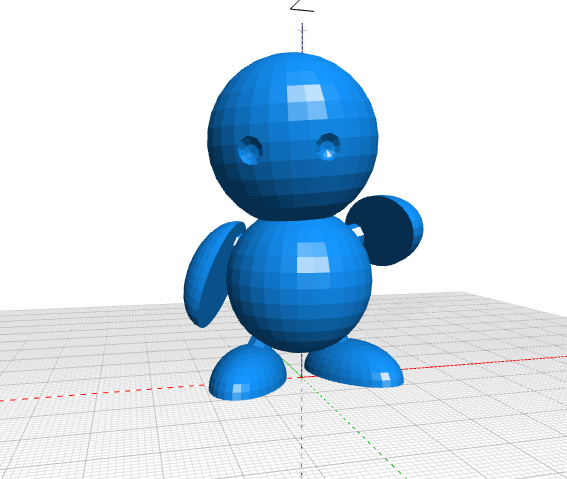
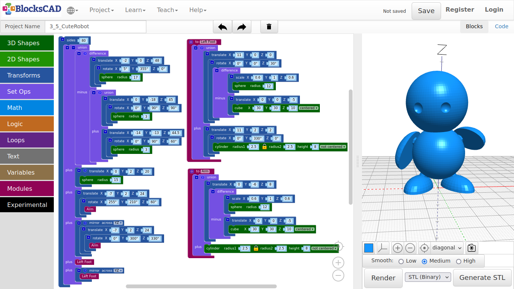
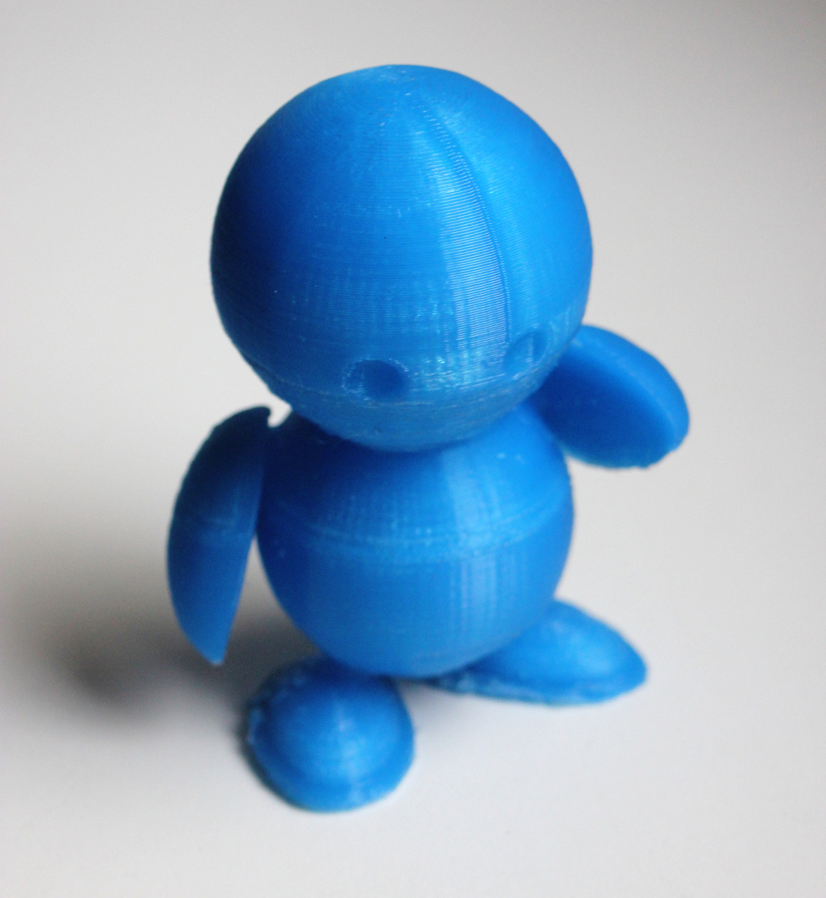

## 4.6. Robot 2

**Here is a second robot, that looks a bit like the robot Marvin from "Hitchhiker's Guide To The Galaxy".**

***Lets start with the head!***

1. Drag n drop one **sphere** from **3D Shapes**, one **translate** and one **rotate** from **Transforms** onto your workspace.

2. Set the value of **sphere** to ***17***, and plug it into **rotate**.

3. Change the values of **rotate** to ***X: 5, Y: 355, Z: 0***, and plug it into **translate**.

4. Change the values of **translate** to ***X: -2, Y: 0, Z: 48***.

5. Press **Render**.

**Now lets create the eyes.**

6. Duplicate the entire block you just created for the head.

7. Change the values as follow: **sphere** to ***3***, **rotate** to ***X: 0, Y: 90, Z: 90***, and **translate** to ***X: 0, Y: -18, Z: 45***.

8. Duplicate this entire block again, keep the **sphere** value, while changing the values of **rotate** to ***X: 0, Y: 90, Z: 60***, and **translate** to ***X: -14, Y: -13, Z: 44.5***.

9. Now drag and drop one **union** block and one **difference** block from **Set Ups** into your workspace.

10. Plug both eye **sphere** blocks into the **union** block.

11. Then plug in this **union** block into the second slot of **difference** called **minus**.

12. Plug the head **translate** block into the first slot of **difference**.

13. Press **Render**.

***This is the head that has now two eyes carved into it!** **Let us continue with the torso sphere!***

14. Drag and drop one **sphere** from **3D Shapes**, and one **translate** from **Transforms** onto your workspace.

15. Set the value of **sphere** to ***15***, and plug it into the **translate** block.

16. Change the values of **translate** to ***X: 0, Y: 2, Z:20***.

17. Press **Render**.

***Now lets create the foot of our little robot, starting with the leg!***

**Again, we will later use \*mirror\* for the second leg.**

18. Drag and drop one **cylinder** from **3D Shapes**, one **rotate** and one **translate** block from **Transforms** onto your workspace.

19. Change the value of **cylinder** to ***radius1: 2.5, height:8***, and plug it into **rotate**.

20. Change those values to ***X: 0, Y: 330, Z: 0***.

21. Then plug **rotate** into **translate** and change the values of **translate** to ***X: 11, Y: 2, Z: 2***.

22. Press **Render**.

**The leg is done. Now we will create a foot by using a sphere and cutting it into half.**

23. Drag and drop one **sphere** as well as one **cube** from **3D Shapes**, two **translate** blocks + one **rotate** block + one **scale** block from **Transforms**, and one **difference** block from **Set Ops** onto your workplace.

24. Change the value of **sphere** to ***12***, and plug it into **scale**.

25. Change the values of **scale** to ***X: 0.6, Y: 1, Z: 0.6***, and plug it into the first slot of **difference**.

26. Take the **cube** block, change the values to ***X: 30, Y: 30, Z: 10, centered***, and plug it into the second slot of **difference**.

27. Plug in the entire **difference** block into **rotate**.

28. Change the **Z** value of **rotate** to ***30***.

29. Then plug **rotate** with **difference** into **translate**, and change the **X** value of **translate** to ***11***.

30. Press **Render**.

**Now you should see one leg and foot on one side.**

***Lets build a module of the leg and mirror it!***

31. Drag and drop one **union** block from **Set Ops**, and one **to do something** block from **Modules** onto the workspace.

32. Rename the **to do something** block to **to Leg**, and drag in the new generated **Leg** block from **Modules** onto your workspace.

33. Now plug the block collection **translate** of the foot, and **translate** of the leg into **union**, then **union** into **to Leg**.

34. Press **Render**.

**Now the leg is ready to get mirrored. If you can not see the leg, then your forgot to drag in the "Leg" block from "Modules"!**

35. Now duplicate **Leg** one time, and drag and drop **mirror across** from **Transforms** onto the your workplace.

36. Change the value of **mirror across** to ***YZ***, and plug one **Leg** into it.

37. Press **Render**.

**You should see now 2 legs with feet on the right positions. Ready to create another module for the arm?**

***Lets go!***

38. Drag and drop one **cylinder**, one **cube**, and one **sphere** from **3D Shapes** onto your workplace.

39. Furthermore, drag and drop one **scale**, two **translate**, and two **rotate** blocks from **Transforms** into your space.

40. Finally drag and drop one **union** and one **difference** block from **Set Ops** + one **to do something** block from **Modules** onto your workspace.

41. Rename **to do something** to ***to Arm***, and plug in **union**.

42. Change the values of **cylinder** to ***radius1: 2.5, height: 8***, and plug it into the second slot of **union**.

**Now lets create something similar to the foot. This time we will use it as arm.**

43. Change the value of **sphere** to ***12***, and plug it into **scale**.

44. Set the values of **scale** to ***X: 0.6, Y: 1, Z: 0.6***, and plug it into the first slot of **difference**.

45. Now change the values of **cube** to ***X: 30, Y: 30, Z: 10, centered***, and plug it into **translate**.

46. Change the value **Z** of **translate** to ***-5***, and plug this one in the second slot of **difference** called **minus**.

**We need to move the arm up a bit, as the center of the arm will be the bottom of the cylinder.**

47. Plug **difference** into the last **translate**, and change those values to ***X: 0, Y: -6, Z: 8***.

48. Now plug in **translate** block into the first slot of **union**.

49. Drag and drop the **Arm** block that got generated from **Modules** onto your workspace.

50. Press **Render**.

***Well, that looks odd! Does it not? Lets move the arm to a nice position!***

51. Drag and drop one **translate** block and one **rotate** block from **Transforms** onto your workplace.

52. Take the **Arm** block, and plug it into **rotate**.

53. Change the values of **rotate** to ***X: 255, Y: 210, Z: 24***, and plug it into **translate**.

54. Now change those values to ***X: -7, Y: 2, Z: 24***.

55. Press **Render**.

**See!? Now lets use the module "Arm" for the other side, but lets change the position a bit to make it look a bit more interesting.**

56. Duplicate the **translate** block including **rotate** and **Arm**.

57. Drag and drop **mirror across** from **Transforms** into the workspace, and change the value to ***YZ***.

58. Plug in the arms duplicate, and change the **rotate** values to ***X: 0, Y: 300, Z: 330***.

59. Press **Render**.

**Well, there is Marvin. But hey, lets smooth the surface for it. The print will look much better!**

60. Drag and drop one **union** block from **Set Ops**, and one **sides** block from **Transforms** onto your workspace.

61. Use the **+** symbol to add four more slots to **union**.

62. Plug in the head, torso, both arms and both legs into the **union** block.

63. Then plug in the entire **union** block into **sides**, and change its value to ***80***.

64. Press **Render**.

**Be patient, this are lot of faces BlocksCAD needs to render.**

***If you want to work on the pose of your robot, change the "sides" value down to 12 or so!** **This will shorten the render time tremendously!***

---

##### **Printed example:**

---

