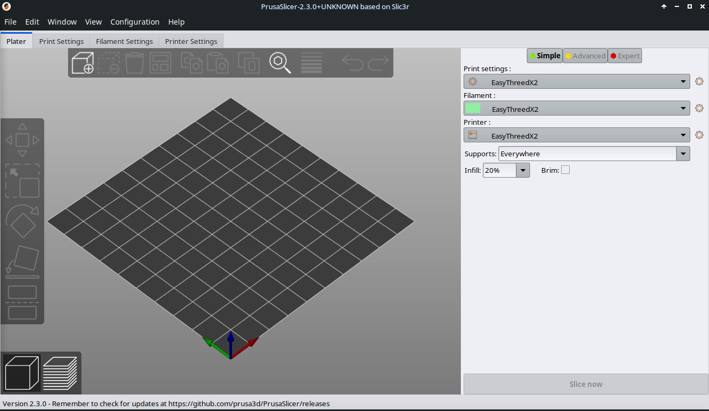
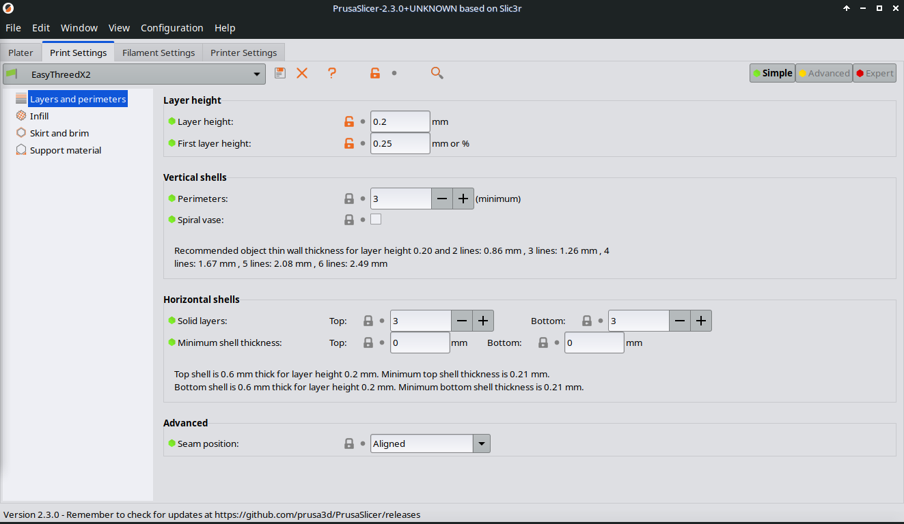
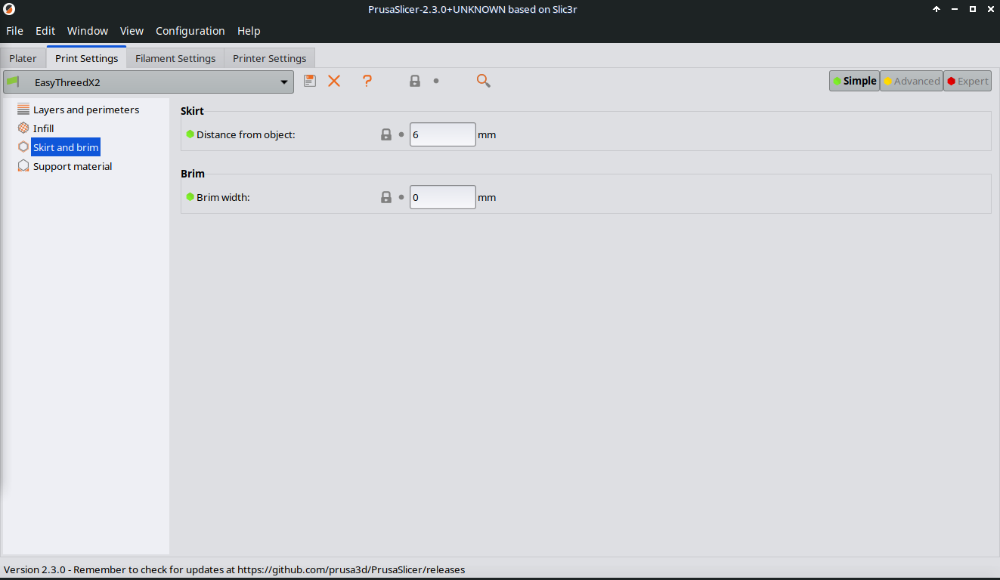
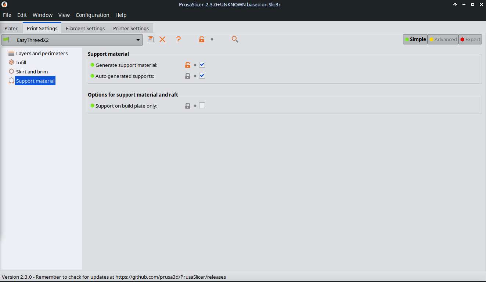
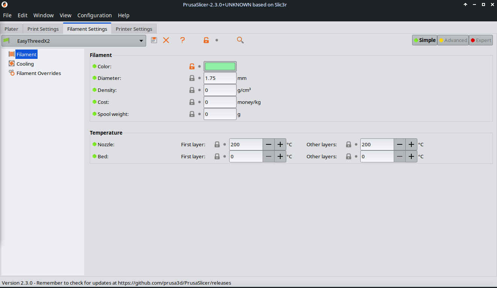
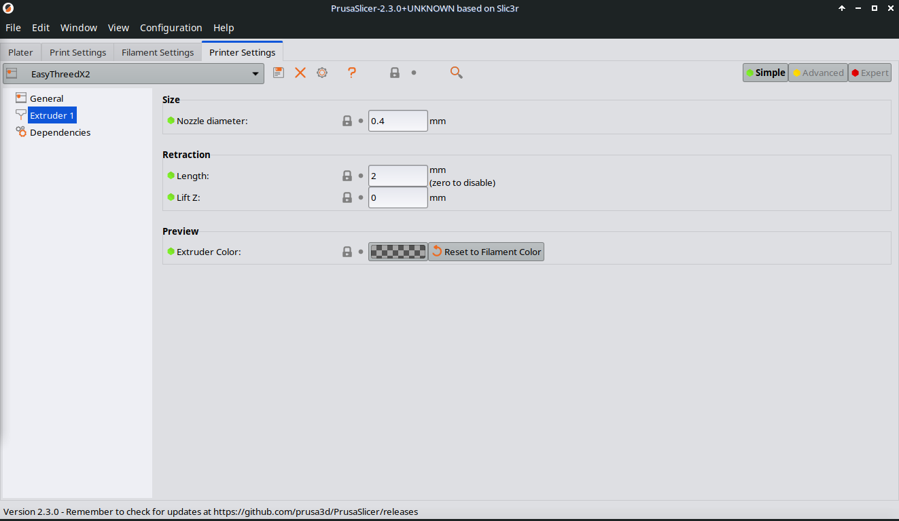
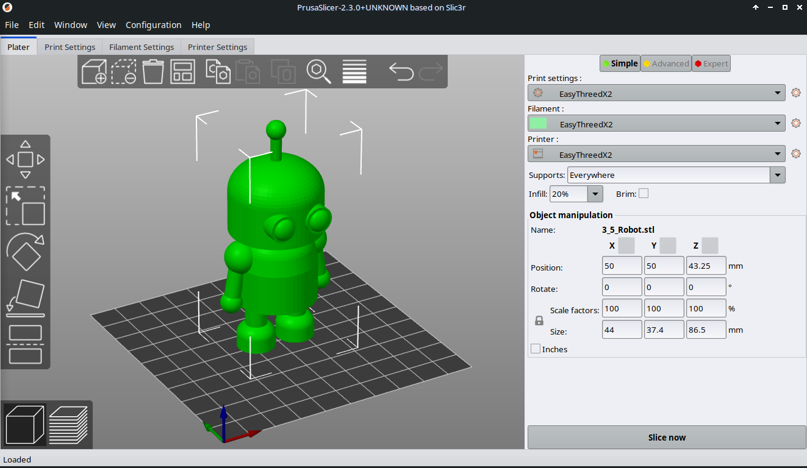
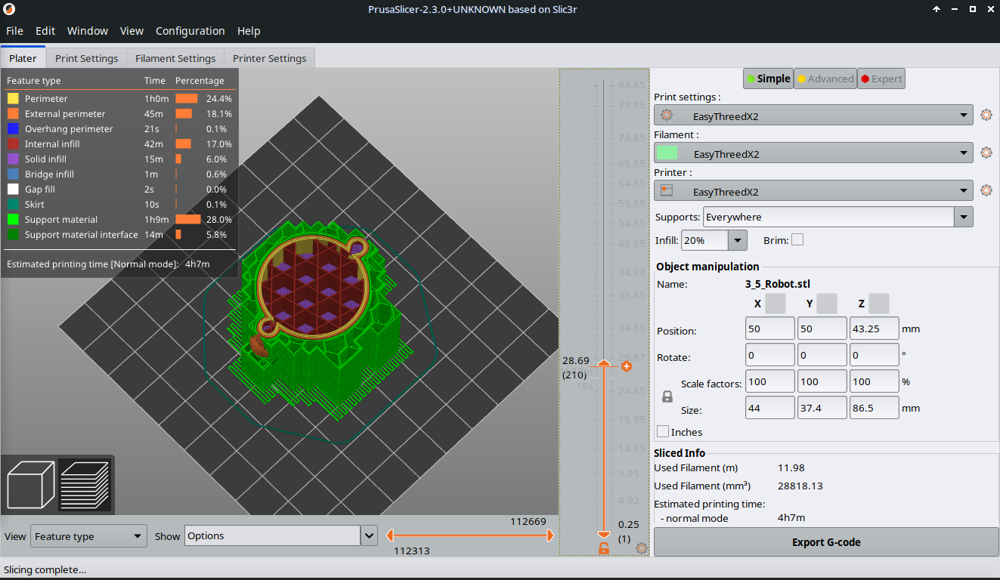

## 5.2. Slice with Prusa Slicer (Linux, Win, Mac)

If you have a PC or Laptop, you can use Prusa Slicer to prepare your exported 3D object for 3D printing.

Download **[Prusa Slicer](https://www.prusa3d.com/page/prusaslicer_424/)**

The Moodle offline server Linux Distribution has it installed and configured already.

Go to **Menu >> Education >> Prusa Slicer**

---

##### **Import the configuration file for your EasyThreedX2 printer (only once)**

1. Open Prusa Slicer  
2. Import the configuration file [EasyThreedX2.ini](files/EasyThreedX2.ini) by choosing **File >> Import >> Import Config...**

3. Now you should see the configuration in the right side panel of Prusa Slicer.

**Lets go through the most important settings. I will point you at settings, that you can change. This will be mostly in "Print settings".**

***If you use a different printer, you might need to change the settings and build your own configuration profile!***

4. Click on **Print settings**:

* This is the **How to print** section
* Most important are the first 4 subsections **Layers and perimeters**, **Infill**, **Skirt and brim**, and **Support material**.
* Layers and perimeters:
  + Layer height >> Indicates thickness of each layer printed (0.2)
  + First layer height >> Thickness of the first layer, that is often thicker than all other layers (0.25).
  + The lower the layer height the finer your print result, but the higher the printing time.

* Infill:
  + **Fill density >**> Sets the density of the material within the printed object (20 %)
  + 0 % density will keep the object hollow, thus only print the walls.
  + 100 % density will print the object as a full solid.

* Skirt and Brim:
  + **Distance from object** >> is the distance between skirt and objects
  + Brim is a method to prevent wrapping of printed material when cooling down.
  + **Brim width** >> how many mm width should go around the objects bottom layer

* Support material:
  + **Generate support material** >> on / off activation

* Speed (not visible with **Simple**):
  + Do not go over 40 mm/s in printing speed. This is the maximum the EasyThreedX2 can do!
  + Travel speed is ok to be the double.

   5. Click on **Filament Settings**

* Filament:
  + Filament thickness will stay 1.75 mm with EasyThreedX2.
  + If there are problems with printing you can try to change temperature, as the optimum is depend on the filament quality of PLA.

* Cooling:
  + Also here, best is to leave it.
  + But sometimes it is better to switch off the cooling fan, or to keep it going all the time.

6. Click on **Printer Settings**

* General
  + Bed shape stays the same with 10 x 10 cm.
* Extruder 1
  + Settings stay the same for EasyThreedX2

7. Each time you change a value in all 3 main sections, the name will be automatically to **name(modified)**.  
8. Click the **floppy disk** symbol to save the changed version.

**This comes handy, if you want to use a version with different fillings, with or without support materials s.o.**

9. Rename it before you save, so you know, what has changed.

The configuration is saved, and will be called each time you start **Prusa Slicer**.

---

##### **Slice your model in Prusa Slicer**

1. Open Prusa Slicer  
2. Press the **Add** button and choose your .stl file and open it.

**Make sure you have all 3 parts of the EasyThreedX2 configuration set.**

3. Press **Preview** button to see settings executed on your object, or press **Slice now** button.

5. Use the vertical slider to move through each layer. Check if there are impossible print situations (like the printer starts printing in middle of nowhere)  
6. If everything looks good (also check, if you need support or not), the press **Export G-code** button.

7. Save it.

**That's it! Next we will go through the possible ways to control the printer making it print the object using the gcode file.**

---
