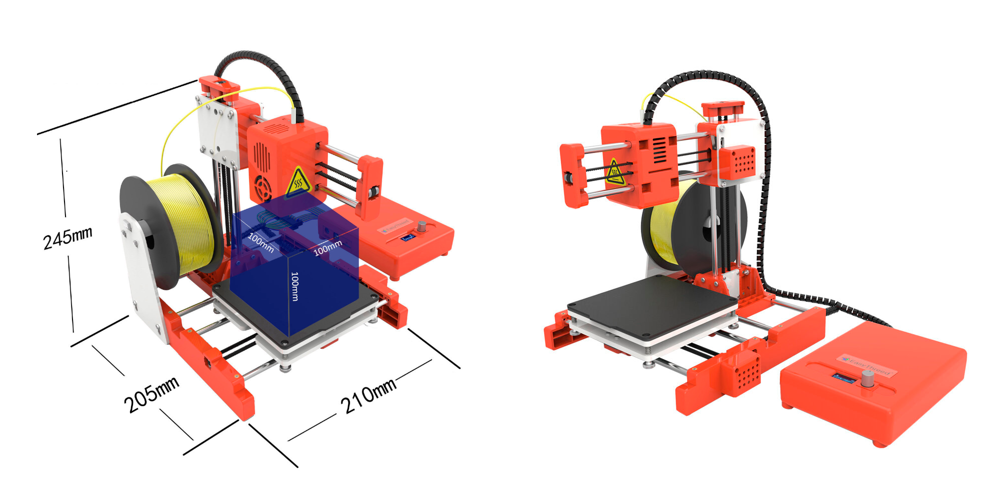
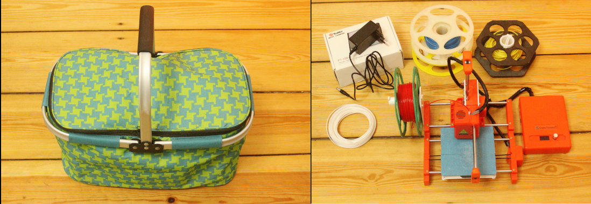
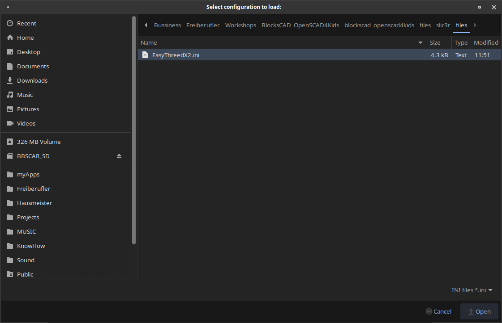

## 6.1. My 3D Printer

The chosen printer is as a beginners printer perfect for kids. It is the EasyThreedX2, which is available already around 100 Euro.

* The printer is easy to use and has pretty good reviews.
* It is a little printer, that has a 10 x 10 x 10 cm printing space and uses only 30 Watt of energy consumption. It has amazing printing results for its low price.
* If something is not working, it is easy to fix (out of my own experience).
* It is for PLA Plastic, a starch based Bio-plastic.
* With its light-weight and small size, it fits in bags to take it to school or friends.

---