## 6.2. Prepare for printing

Checklist for the printer:

* Do you have enough filament on your spool?
* Did you replace the blue tape, that can not be reused?
* Is the print head releasing plastic when preheating?
* Is your print plate clean?

---

##### **First things first**

No matter which way you will control the printer, it is good to know how to do the basic procedures with the EasyThreeD X1/2 printer.

This procedures are often use with other printers as well...except the printer does it automatically (e.g. auto leveling).

**The following occasional steps do not need to be done with each print. *However, check on it!***

1. Use blue tape (or other paper tape) to protect your magnetic print bed surface.

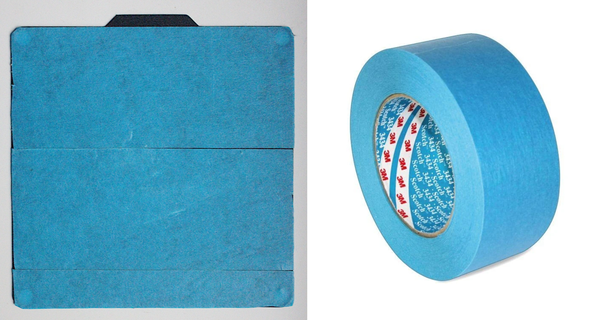

2. Level your bed to prevent the nozzle scratching into the print bed, or distance too far from the print bed.

* Take a piece of printing paper, and put it onto your printers printing bed. You might cut the A4 paper in half.
* Go in the menu to **>> Prepare >> Auto home**. The printer head is going into the starting position.

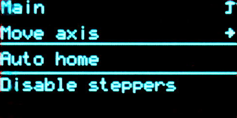

* Then move one down in the menu and press **>> Disable Steppers** to be able to move the print bed and printer head around with your hands.

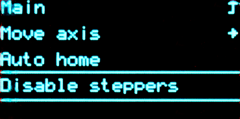

**Start with the screw underneath the starting position, so you do not need to move anything for now.**

**Try to move the piece of printing paper. You should feel a soft resistance when moving the paper. You can use both hands holding both ends of the paper to make it easier to move.**

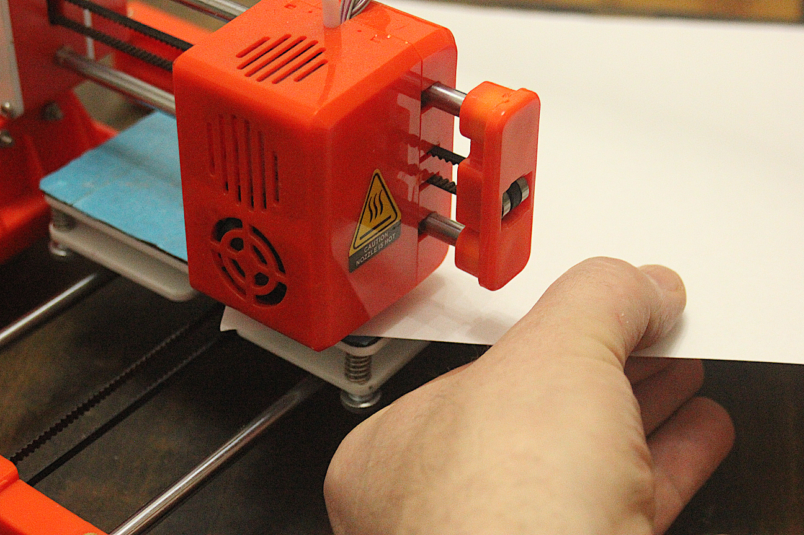

* Turn the screw in one or the other direction, if you can not move the paper or it is super easy to move.

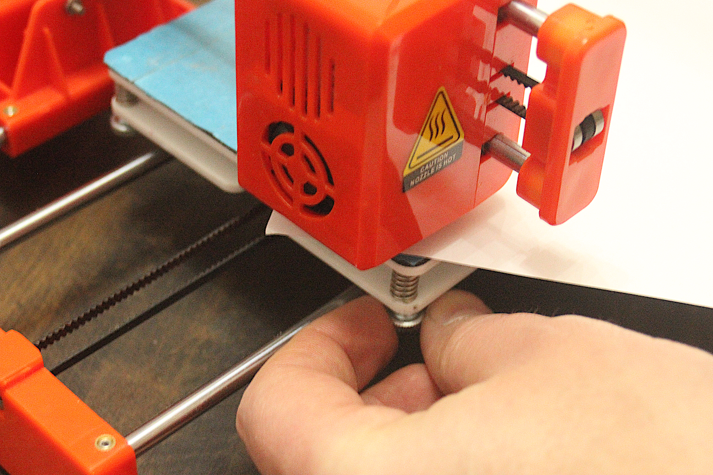

* Go through the next 3 corners and do the same thing.

**Be careful, be gentle when moving the print bed and printers head, even if it is not so easy to move. After you did the leveling once, you barely need to repeat the procedure. It will be necessary once in a while depend on room temperature, or after you renewed the blue tape.**

***Blue tape set? Printer filament ready? Lets go!***

---

##### **Ok, lets feed your printer with filament!**

**First, we want to move the printing head up so we can see the incoming filament and protect the printing bed from overheating.**

The first screen you will see, after you start the printer is called **Info Screen**.

1. Click once to open the main menu, using the knob that has an embedded button. You can turn the knob and press it.  
2. Click through following path: **>> Prepare >> Move Axis >> Move Z >> Move 10 mm >>**.

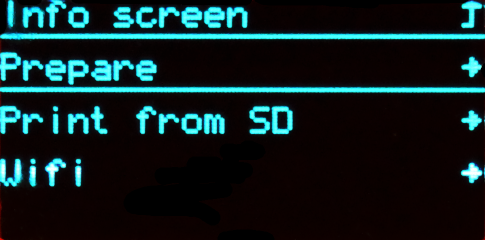

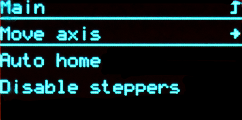

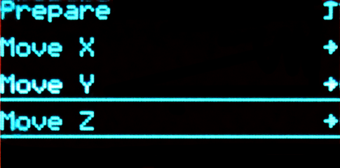

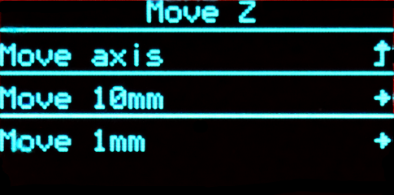

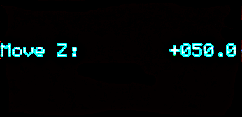

3. Now turn the wheel clock-wise 2 - 3 steps.

**The head will move up 20 - 30 mm. This should be enough.**

4. Go up to the first option in the sub menu and click to move back up in to the main menu.

**If you wait for a while, the menu will reset automatically. Next, we want to add, or replace the filament.**

5. Go to **>> Prepare >> In/Out Filament >>**.

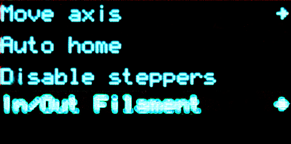

**As soon your press In/Out Filament the printer will start heating up its printer head to 200 degree Celsius. *Do not touch the nozzle!***

6. Now choose the option you want to do:

**In Filament** >> The extruder of the printer head will move the filament towards the nozzle, as soon 200 Degree Celsius is reached.

**Out Filament** >> The extruder of the printer head will move the filament away from the nozzle, as soon 200 Degree Celsius is reached.

**Stop In/Out Filament** >> Stops the extruder motor and the heater, thus cooling down the nozzle.

**As soon you press In Filament or Out Filament you will see the temperature on top of the display.**

7. When the nozzle temperature reaches 200 degree Celsius, and you hear the extruder motor moving:

**Push a bit the filament till you feel it gets drawn in.**

**On the other hand pull it a bit when removing the filament till it releases it from the extruder.**

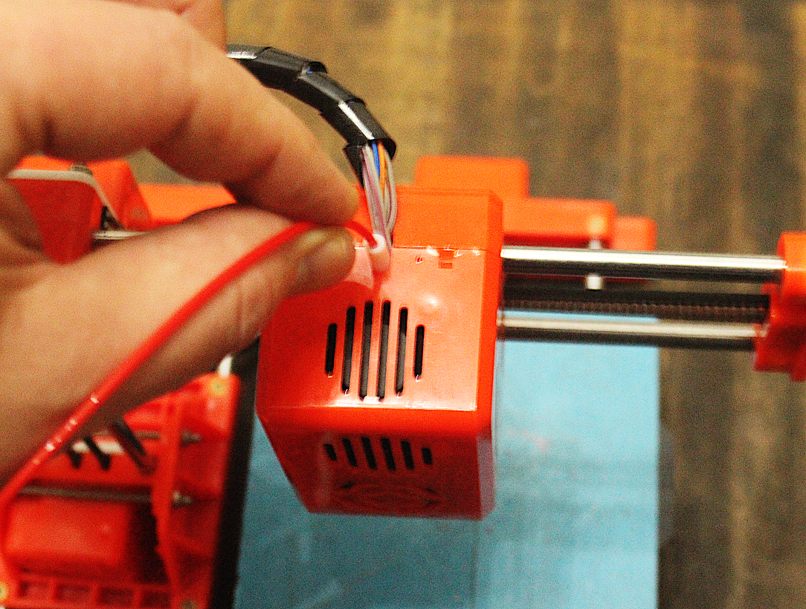

8. Press Stop In/Out Filament as soon the filament comes out of the nozzle, or the filament is released from the extruder.

**Make sure the nozzle is clean and no filament is sticking out, before you offset the printer head to X: 0, Y: 0, Z: 0 by choosing *Auto home*.**

**Use a piece of paper or a tweezers to remove any filament that sticks out. Do it before it cools down, as it will be more difficult to remove it by then.**

***Now that the filament is in, and the printing bed is leveled, lets print!***

---
